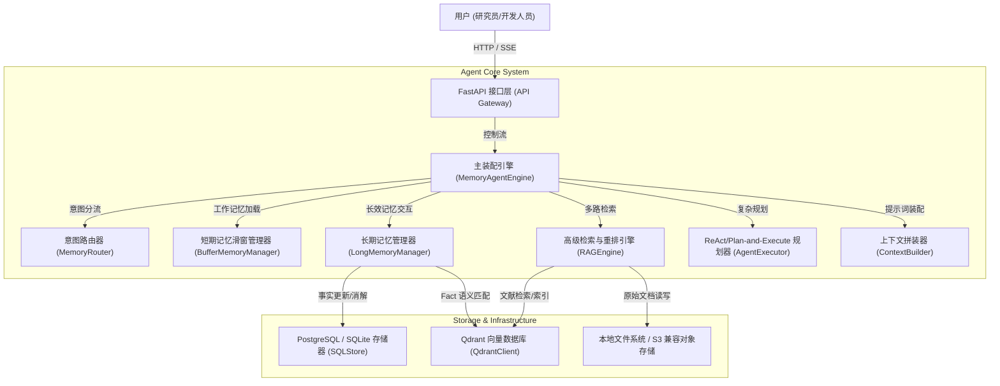
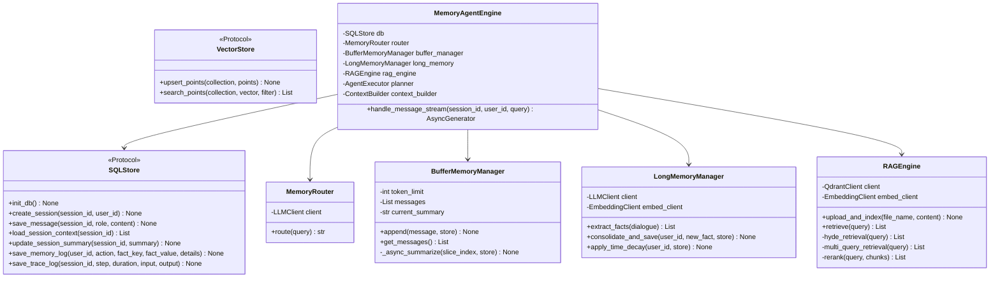
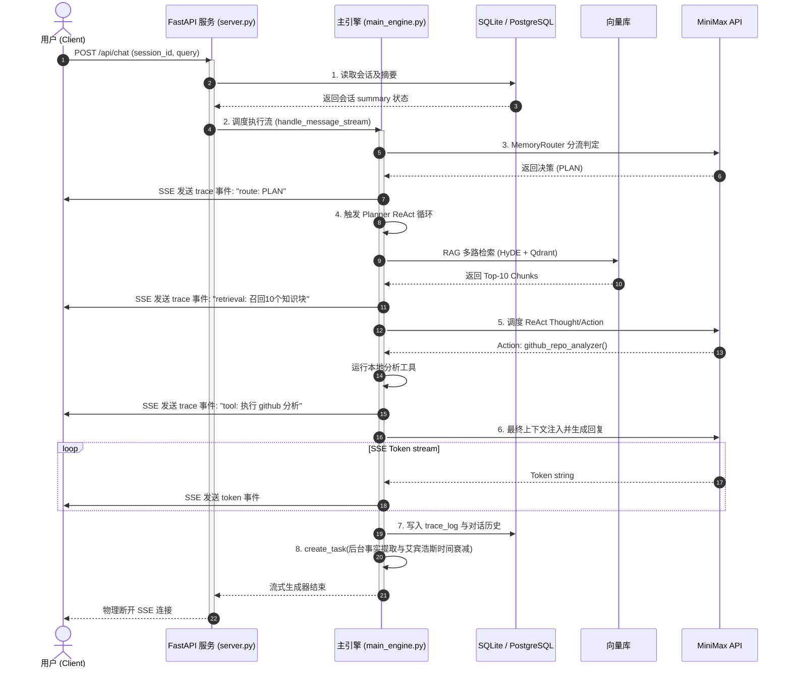

# AI Research Assistant V2 (多 Agent 协作与开源框架研究助手)
## 企业级技术架构与系统设计说明书 (System Architecture & Technical Design Document)

---

## 01 产品背景、目标、设计原则

### 1.1 产品背景
在 AI Agent 技术高速发展的背景下（例如 LangGraph 的状态图引擎、smolagents 的受限 Python 解释器沙箱、Letta 的持久化状态管理等），开发者和研究员在进行开源框架对比、源码架构分析和多 Agent 协同设计时，面临文档分散、时效性差以及认知载荷过高的痛点。现有的通用大模型由于缺乏垂直领域的实时知识库和研究偏好的持久记忆，导致生成的回答泛化且伴随幻觉。

### 1.2 产品目标
构建一个企业级多会话 AI 研究助手，专门服务于 Agent 开源框架与前沿协作技术研究。
- **短期工作记忆 (Working Memory)**：基于 Token 预算的非阻塞滚动滑窗与异步历史摘要。
- **长期记忆 (Long-term Facts)**：实体级别的研究偏好与人设增量沉淀，支持时序一致性消解与艾宾浩斯时间遗忘衰减。
- **高级 RAG**：集成 Multi-Query、HyDE、BM25 + 向量检索多路混合检索以及重排 (ReRank) 的前沿知识库。
- **自适应路由**：六路流量秒级分发（NONE/MEM/RAG/MEM+RAG/TOOL/PLAN），短路非必要 I/O。
- **Trace 可观测性**：全链路执行轨迹捕获，并在 SSE 流式通道中实时透传。

### 1.3 设计原则
1. **契约优先设计**：所有的底层 I/O、存储适配器与核心微引擎均通过 Python 抽象基类 (`abc.ABC`) 与静态类型契约 (`typing.Protocol`) 严格规范。
2. **自底向上组装**：主入口引擎作为无状态积木墙，不承担任何策略判定算法，完全由高内聚低耦合的微引擎实体装配而成。
3. **双存储后端兼容**：支持通过配置文件一键切换本地轻量环境（SQLite + Qdrant 内存模式 `:memory:` + 本地存储）与生产环境（PostgreSQL + Qdrant 物理服务 + S3 兼容对象存储）。
4. **防御性编程**：强制执行强类型约束 Pydantic 校验，LLM 调用超时控制、重试与熔断降级。

---

## 02 整体系统架构（C4 + UML）

### 2.1 C4 容器架构


### 2.2 核心类设计 (Class Diagram)


---

## 03 Agent Core 设计

### 3.1 模块职责说明
`MemoryAgentEngine` 作为核心装配层，使用桥接模式与适配器模式管理底层引擎。
- `ContextBuilder`：静态/动态参数装配，计算 Token。
- `AgentExecutor`：负责管理工具包和 ReAct 执行。
- `StreamLLMClient`：实现底层 httpx 异步流式块解析。

### 3.2 详细数据流图 (Data Flow)
```
[User Request] ──> (1. API Gateway) ──> [Semantic Cache Check]
                                              │
                    ┌─────────────────────────┴─────────────┐
             (Hit: 相似度 > 0.95)                      (Miss: 相似度 <= 0.95)
                    │                                       │
                    ▼                                       ▼
             [Return Cache] <── (SSE stream) ── [MemoryAgentEngine] ──> [Memory Router]
                                                                               │
                                ┌─────────────────────────────────────────────┤
                                ▼ (NONE)                                      ▼ (MEM/RAG/PLAN/TOOL)
                          [Direct to LLM]                             [Parallel Retrieval]
                                                                       ├─> Qdrant (Long Memory)
                                                                       ├─> RAGEngine (Docs)
                                                                       └─> Tool Calling (ReAct)
                                                                               │
                                                                               ▼
                                                                      [ContextBuilder]
                                                                               │
                                                                               ▼
                                                                       [LLM Generation]
                                                                               │
                                                                               ▼
                                                                      [SSE Token Output]
                                                                               │
                                                                               ▼
                                                                    [Async Background Task]
                                                                    ├─> Working Memory Summarizer
                                                                    └─> Long Memory Consolidator
```

### 3.3 详细控制流图 (Control Flow)
```
Enter handle_message_stream()
 │
 ├──> 1. DB Init & Session Retrieval
 ├──> 2. Query Embedding & Semantic Cache Match
 │     ├──> If Match: Output SSE "cache_hit" -> Stream Cached Tokens -> End
 │     └──> If Miss: Continue
 ├──> 3. MemoryRouter.route() -> Predict route ('NONE' | 'MEM' | 'RAG' | 'MEM+RAG' | 'TOOL' | 'PLAN')
 ├──> 4. Select Action Path:
 │     ├──> 'NONE': Skip retrieval.
 │     ├──> 'MEM': Search Qdrant memory_collection by user_id & cosine similarity.
 │     ├──> 'RAG': Invoke HyDE -> Query Qdrant knowledge_collection -> Merge BM25 -> ReRank.
 │     ├──> 'MEM+RAG': Concurrent execution of 'MEM' & 'RAG' retrieval.
 │     ├──> 'TOOL' / 'PLAN': Dispatch to AgentExecutor. Execute ReAct/Planning while-loop.
 ├──> 5. ContextBuilder.assemble() -> Build final context with token budget limit.
 ├──> 6. Stream LLM Inference -> Yield SSE "token" events -> Aggregate complete reply text.
 ├──> 7. Persistent Store -> Write user & assistant messages to relational database.
 ├──> 8. Trigger Async Background Process (create_task):
 │     ├──> FactExtractor: Extract new FactItems.
 │     ├──> MemoryConsolidator: Check conflicts, delete/update, apply Ebbinghaus decay.
 │     └──> BufferMemoryManager: Update sliding window. If limit exceeded, async summarize.
 └──> End
```

---

## 04 Context Engineering（Prompt 组装）

### 4.1 Prompt 组装流程图
```
[System Prompt Template]
   │
   ├──> 1. Insert Long-term Memories (Qdrant retrieved facts)
   ├──> 2. Insert RAG Knowledge (ReRanked Top Chunks with citation IDs)
   ├──> 3. Insert Working Memory Summary
   └──> 4. Insert Tool Results (if PLAN/TOOL route)
   │
[Sliding History Messages (Recent N rounds)]
   │
[Current User Query]
   │
   ▼
[Token Budget Evaluation & Truncation (ContextBuilder)]
   │
   ▼
[Target Model Input]
```

### 4.2 黄金组装比例与 Prompt 模板设计
为避免大模型在长上下文的中段丢失核心信息，我们将 RAG 的核心背景放置在 System Prompt 头部和 User Prompt 尾部，两端夹逼。
```python
SYSTEM_TEMPLATE = """你是一个专业的 AI Agent 开源框架与多协同技术研究助手。
请结合以下给定的上下文背景和用户偏好，提供严密、客观的分析。

【关于用户的长期人设与偏好记忆】
{long_term_memories}

【检索到的开源框架原理解析与背景知识】
{rag_knowledge}

【先前会话的累计背景摘要】
{session_summary}
"""
```

### 4.3 关键 LLM 调用点 Prompt 策略选型矩阵

系统中存在 6 个核心 LLM 调用点，每个调用点根据其任务特性选用不同的 Prompt 策略（W4 Prompt 工程进阶知识的工程化落地）：

| 调用点 | 所属模块 | Prompt 策略 | 选型理由 |
| :--- | :--- | :--- | :--- |
| **意图路由判定** | `MemoryRouter.route()` | **Few-shot + Structured Output** | 提供 6 个典型查询样本（每路各一）作为示例锚定，并强制 JSON 输出 `{"route": "MEM"}` 格式，确保路由标签可被程序化解析。 |
| **事实实体提取** | `LongMemoryManager.extract_facts()` | **Structured Output (JSON Schema)** | 使用 Pydantic 导出的 JSON Schema 约束 LLM 输出严格的 `FactItem[]` 数组结构，避免自由文本中的噪声干扰后续写入。 |
| **冲突消解判定** | `LongMemoryManager.consolidate_and_save()` | **CoT (Chain-of-Thought) + Few-shot** | 冲突判定需要时序推理（"旧事实 vs 新事实谁更新？是否语义互斥？"），通过 CoT 引导模型显式输出推理链路，附带 2 个冲突/非冲突的 Few-shot 对比示例。 |
| **异步历史摘要** | `BufferMemoryManager._async_summarize()` | **Zero-shot + 递归压缩 Prompt** | 摘要任务指令明确且无歧义，使用 Zero-shot 即可。Prompt 中严格约束输出字数上限（≤200 字）并要求保留关键实体名称，防止摘要漂移。 |
| **ReRank 相关度评分** | `RAGEngine.rerank()` | **Few-shot + Scoring Prompt** | 提供 2 个"高相关 (0.9)"和 2 个"低相关 (0.2)"的评分示例作为锚定，引导模型对每个 Chunk 输出 0.0-1.0 的数值评分。 |
| **ReAct 规划推理** | `AgentExecutor` (Planner) | **CoT (Thought-Action-Observation)** | ReAct 范式本身即为 CoT 的结构化变体。每轮迭代要求模型先输出 `Thought`（推理过程），再输出 `Action`（工具调用），从而实现可审计的多步推理。 |

#### 4.3.1 Prompt 策略选型决策流程
```
                    [LLM 调用点分析]
                          │
            ┌─────────────┼─────────────┐
            ▼             ▼             ▼
    (输出需结构化?)  (需多步推理?)  (任务指令明确?)
            │             │             │
            ▼ (Yes)       ▼ (Yes)       ▼ (Yes)
   [Structured Output] [CoT 策略]   [Zero-shot]
     + JSON Schema      │
            │       (有歧义边界?)
            │             │
            │        ┌────┴────┐
            │        ▼ (Yes)   ▼ (No)
            │    [+ Few-shot] [Pure CoT]
            │      示例锚定
            └─────────┬───────┘
                      ▼
              [组合策略交付]
```

---

## 05 Memory 系统（Working / Long / Semantic Cache）

### 5.1 Memory 生命周期图
```
                [User Dialogue Input]
                          │
                  (Fact Extraction)
                          │
                          ▼
                  [New Fact Item]
                          │
                (Conflict Detection)
                          │
          ┌───────────────┴───────────────┐
          ▼ (No Conflict)                 ▼ (Conflict)
     [Insert/Update]               [Logic Delete Old]
    (Set version=1, weight=1.0)    (Set status='deleted')
          │                               │
          └──────────────┬────────────────┘
                         │
                         ▼
                [Qdrant DB & SQLite]
                         │
                (Ebbinghaus Time Decay)
              weight = exp(-decay * delta_t)
                         │
          ┌──────────────┴───────────────┐
          ▼ (weight >= 0.2)               ▼ (weight < 0.2)
      [Keep Active]                [Physical Eviction]
                                 (Delete Vector, Set status='expired')
```

### 5.2 长期记忆数据结构契约 (Pydantic Model)
```python
from typing import Optional
from pydantic import BaseModel, Field

class MemoryItem(BaseModel):
    id: Optional[int] = Field(default=None, description="物理主键 ID")
    user_id: str = Field(..., description="租户唯一标识")
    type: str = Field("fact", description="记忆类型: fact (事实) | preference (偏好)")
    fact_key: str = Field(..., description="蛇形下划线键名，如 user_framework_preference")
    fact_value: str = Field(..., description="精确的事实陈述")
    importance: int = Field(default=5, ge=1, le=10, description="重要度评级 1-10")
    confidence: float = Field(default=1.0, ge=0.0, le=1.0, description="置信度 0-1")
    timestamp: float = Field(..., description="物理写入/修改时戳")
    status: str = Field("active", description="状态: active | deleted | expired")
    version: int = Field(default=1, description="单键版本演进号")
```

---

## 06 RAG 系统（Embedding、Chunk、Retriever、ReRank）

### 6.1 RAG 多路混合检索流程
```
                       [User Query]
                            │
            ┌───────────────┼───────────────┐
            ▼               ▼               ▼
      [Multi-Query]       [HyDE]       [Jieba Tokenize]
     (Generate 3 Queries)(Hypothesis Doc)   │
            │               │               ▼
       (Embedding)     (Embedding)     [BM25 Index]
            │               │               │
            ▼               ▼               │
       [Vector Search] [Vector Search]      │
      (Qdrant Search) (Qdrant Search)       │
            │               │               │
            ▼               ▼               ▼
        (Recall)         (Recall)        (Recall)
            │               │               │
            └───────────────┼───────────────┘
                            │
                            ▼
                     [Merge & Dedup]
                  (Top-10 Candidates)
                            │
                            ▼
                    [LLM-based ReRank]
                 (Score & Sort Candidates)
                            │
                            ▼
                    [Citations Tagging]
                 (Top-3 Final context chunks)
```

### 6.2 分块策略与 ReRank 逻辑
- **分块策略**：使用字符滑动窗口切割。块大小限制为 **500 字符**，重叠边界设为 **200 字符**。
- **ReRank 逻辑**：对多路召回的 Top-10 知识片段，通过轻量级 Prompt 调用 LLM，计算每个 Chunk 对原始 Query 的相关度得分 (0.0 - 1.0)。过滤掉得分小于 0.3 的 Chunk，将其余 Chunks 排序，最相关的块放置在上下文的最前和最尾（解决 "Lost in the Middle" 痛点）。

### 6.3 GraphRAG 知识图谱检索

在 Dense + Sparse 多路向量检索之外，系统引入基于知识图谱的 GraphRAG 检索通道，专门解决**跨文档多跳推理**场景（例如："LangGraph 的 Pregel 超步模型与 smolagents 的受限解释器在架构安全性上有何异同？"——此类查询需要跨越两个独立框架文档进行关系链推理）。

#### 6.3.1 实体关系抽取与图谱构建流程
```
               [文档切片 (Chunks)]
                      │
                      ▼
          ┌───────────────────────┐
          │  LLM 实体关系抽取器   │
          │  (Structured Output)  │
          └───────────┬───────────┘
                      │
          ┌───────────┴───────────┐
          ▼                       ▼
   [实体节点提取]           [关系边提取]
   (框架名, 论文名,        (依赖, 影响, 对比,
    核心组件, 作者,          继承, 竞争, 改进)
    技术概念)                     │
          │                       │
          └───────────┬───────────┘
                      │
                      ▼
          ┌───────────────────────┐
          │   NetworkX 图构建器   │
          │  (In-Memory Graph)    │
          └───────────┬───────────┘
                      │
                      ▼
          ┌───────────────────────┐
          │   Leiden 社区发现     │
          │  (Community Detection)│
          └───────────┬───────────┘
                      │
                      ▼
          ┌───────────────────────┐
          │  社区报告生成 (LLM)   │
          │  (Community Summary)  │
          └───────────────────────┘
```

#### 6.3.2 实体关系数据结构契约
```python
from typing import List
from pydantic import BaseModel, Field

class GraphEntity(BaseModel):
    """知识图谱实体节点契约。"""
    name: str = Field(..., description="实体名称，如 'LangGraph'、'Pregel 超步模型'")
    type: str = Field(..., description="实体类型: framework | paper | component | concept | author")
    description: str = Field(..., description="实体的简明技术描述")
    source_chunks: List[int] = Field(default_factory=list, description="来源切片 ID 列表")

class GraphRelation(BaseModel):
    """知识图谱关系边契约。"""
    source: str = Field(..., description="源实体名称")
    target: str = Field(..., description="目标实体名称")
    relation: str = Field(..., description="关系类型: depends_on | improves | competes_with | inherits | cited_by")
    weight: float = Field(default=1.0, ge=0.0, le=1.0, description="关系强度权重")
    evidence: str = Field(..., description="支撑该关系判定的原文证据摘要")

class CommunityReport(BaseModel):
    """Leiden 社区报告契约。"""
    community_id: int = Field(..., description="社区编号")
    title: str = Field(..., description="社区主题标题，如 '状态管理类框架群'")
    summary: str = Field(..., description="该社区所有实体与关系的综合技术摘要")
    entities: List[str] = Field(default_factory=list, description="社区内实体名称列表")
    importance: float = Field(default=0.5, ge=0.0, le=1.0, description="社区重要度评分")
```

#### 6.3.3 GraphRAG 检索流程
```
                     [User Query]
                          │
                          ▼
               [Query Entity Extraction]
              (从 Query 中提取关键实体)
                          │
                          ▼
              ┌───────────┴───────────┐
              ▼ (Local Search)        ▼ (Global Search)
     [子图邻域遍历]              [社区报告检索]
   (从目标实体出发,           (对所有社区报告执行
    遍历 1-2 跳邻居,          Map-Reduce 聚合:
    提取关系链路)              Map: 各社区独立回答
              │               Reduce: 汇总排序)
              │                       │
              └───────────┬───────────┘
                          │
                          ▼
                 [GraphRAG Context]
              (实体关系链 + 社区摘要)
                          │
                          ▼
           [合并至 §6.1 的 Merge & Dedup]
          (与 Dense + Sparse 召回结果联合)
```

#### 6.3.4 GraphRAG vs 向量 RAG 适用场景对比

| 维度 | 向量 RAG (Dense + Sparse) | GraphRAG |
| :--- | :--- | :--- |
| **擅长场景** | 单文档内的语义匹配与事实检索 | 跨文档多跳推理、实体关系链比对 |
| **典型 Query** | "smolagents 的安全沙箱怎么实现?" | "哪些框架借鉴了 MemGPT 的虚拟内存设计?" |
| **索引成本** | 低（仅 Embedding 向量化） | 高（需 LLM 抽取实体关系 + 社区发现） |
| **检索延迟** | 低（毫秒级向量相似度计算） | 中（需图遍历 + 可能触发 LLM Map-Reduce） |
| **路由触发** | Router 判定为 `RAG` 时默认启用 | 仅当 Query 包含跨框架比对、关系链推理等多跳意图时启用 |

---

## 07 Router（MEM / RAG / Tool / Planner）

### 7.1 Router 决策流程图
```
                        [User Query]
                             │
                      [Memory Router]
                             │
            ┌────────────────┼────────────────┐
            ▼                ▼                ▼
     (Is Conversational?) (Is Fact Search?) (Is Tech Knowledge?)
            │                │                │
            ▼ (Yes)          ▼ (Yes)          ▼ (Yes)
         [NONE]            [MEM]            [RAG]
            │                │                │
            └────────────────┼────────────────┘
                             │
                             ▼ (No matches / Complex tasks)
                      (Requires execution?)
                             │
                 ┌───────────┴───────────┐
                 ▼ (Single step tool)    ▼ (Multi-step reasoning)
              [TOOL]                  [PLAN]
```

### 7.2 决策分支矩阵

| 路由决策 | 分支判定标准 | 检索源选择 | 后置执行体 |
| :--- | :--- | :--- | :--- |
| **NONE** | 基础问候、闲聊、常识解答。 | 无 I/O 检索。 | 直接交付 LLM 生成。 |
| **MEM** | 查询涉及用户本身设定、技术倾向、开发背景。 | Qdrant `memory_collection` 向量检索。 | 拼装个性化背景后交付 LLM。 |
| **RAG** | 查询特定开源框架细节、论文原理解析等客观事实。 | `knowledge_collection` 向量多路检索。 | 拼装 RAG Chunks 后交付 LLM。 |
| **MEM+RAG** | 混合查询。既需要用户设定，也需要客观白皮书。 | `memory_collection` + `knowledge_collection` 并发检索。 | 合并背景后交付 LLM。 |
| **TOOL** | 执行单一的明确工具操作（如拉取 Repo 结构）。 | 无。 | 调用 Tool Manager 执行。 |
| **PLAN** | 复杂学术分析、多步跨章节比对、系统设计重构建议。 | 动态评估。 | 调度 ReAct Executor 执行多步推理。 |

---

## 08 Planner 与 Workflow

### 8.1 Agent 状态机
```
      ┌──────────────┐     NONE / MEM / RAG
      │  Idle State  ├───────────────────────────────┐
      └──────┬───────┘                               │
             │ Query Recieved                        │
             ▼                                       ▼
      ┌──────────────┐                       ┌──────────────┐
      │ Routing State│                       │  Direct LLM  │
      └──────┬───────┘                       │  Inference   │
             │                               └──────┬───────┘
             ├───────────────┐                      │
             │ PLAN Route    │ TOOL Route           │
             ▼               ▼                      │
      ┌──────────────┐┌──────────────┐              │
      │Planner State ││ Tool Dispatch│              │
      └──────┬───────┘└──────┬───────┘              │
             │               │                      │
             ▼               │                      │
      ┌──────────────┐       │                      │
      │ ReAct Loop   │<──────┘                      │
      │  (Max 5)     │                              │
      └──────┬───────┘                              │
             │ Loop Finished                        │
             ▼                                      ▼
      ┌──────────────┐                       ┌──────────────┐
      │  Consolidate ├──────────────────────>│  Response    │
      │  & Summary   │                       │  Generation  │
      └──────────────┘                       └──────────────┘
```

### 8.2 Planner 核心实现方案
对于复杂的 `PLAN` 分流，我们使用**手写的 ReAct 规划器**。通过 `while` 循环，至多执行 5 轮迭代。
每一轮生成 `{Thought: ..., Action: ..., Observation: ...}` 的结构化格式，自动提取工具名称和入参参数。
若调用出错，将异常捕获并作为 `Observation` 反馈给大模型进行自我纠错（Reflection），直至得到 `Final Answer`。

---

## 09 Tool Calling / MCP 扩展

### 9.1 Tool Manager 设计
系统注册两个核心工具：
1. `github_repo_analyzer(repo_name: str) -> str`：
   - 功能：静态剖析主流 Agent 框架 Github 仓库的核心类拓扑和结构树。
   - 实现：解析指定项目的模块依赖并返回格式化说明。
2. `arxiv_paper_fetcher(query: str) -> str`：
   - 功能：拉取 ArXiv 上的 Agent 相关最新文献摘要。
   - 实现：根据关键字执行学术查询，返回 Top-2 论文的标题、作者与摘要。

### 9.2 MCP (Model Context Protocol) 扩展设计
系统设计了标准的 MCP 连接层契约：
- MCP 协议基于 JSON-RPC 2.0 规范，通过标准输入输出 (Stdio) 或 SSE 进行传输。
- 本系统作为一个 MCP Client，能够动态发现并挂载外部暴露的 MCP Server，从而实时获取本地系统文件等物理资源约束。

---

## 10 数据库设计（PostgreSQL）

### 10.1 数据库 ER 图 (Entity-Relationship Diagram)
```
  ┌──────────────┐
  │    users     │
  ├──────────────┤
  │ user_id (PK) │
  │ username     │
  │ created_at   │
  └──────┬───────┘
         │ 1
         │
         │ 1..N
  ┌──────▼───────┐             1      1..N  ┌──────────────┐
  │   sessions   ├─────────────────────────>│   messages   │
  ├──────────────┤                          ├──────────────┤
  │ session_id(PK)                          │ id (PK)      │
  │ user_id (FK) │                          │ session_id(FK)
  │ summary      │                          │ role         │
  │ created_at   │                          │ content      │
  └──────┬───────┘                          │ timestamp    │
         │ 1                                └──────────────┘
         │
         │ 1..N
  ┌──────▼───────┐                          ┌──────────────┐
  │  trace_log   │                          │  memory_log  │
  ├──────────────┤                          ├──────────────┤
  │ id (PK)      │                          │ id (PK)      │
  │ session_id(FK)                          │ user_id (FK) │
  │ step_name    │                          │ action       │
  │ duration_ms  │                          │ fact_key     │
  │ input_data   │                          │ fact_value   │
  │ output_data  │                          │ details      │
  │ timestamp    │                          │ timestamp    │
  └──────────────┘                          └──────────────┘
```

### 10.2 PostgreSQL 物理 DDL 定义
```sql
-- 开启 UUID 扩展
CREATE EXTENSION IF NOT EXISTS "uuid-ossp";

-- 创建用户表
CREATE TABLE IF NOT EXISTS users (
    user_id VARCHAR(64) PRIMARY KEY,
    username VARCHAR(100) NOT NULL,
    created_at TIMESTAMP WITH TIME ZONE DEFAULT CURRENT_TIMESTAMP
);

-- 创建会话表
CREATE TABLE IF NOT EXISTS sessions (
    session_id VARCHAR(64) PRIMARY KEY,
    user_id VARCHAR(64) NOT NULL REFERENCES users(user_id) ON DELETE CASCADE,
    summary TEXT NOT NULL DEFAULT '',
    created_at TIMESTAMP WITH TIME ZONE DEFAULT CURRENT_TIMESTAMP
);

-- 创建消息历史表
CREATE TABLE IF NOT EXISTS messages (
    id SERIAL PRIMARY KEY,
    session_id VARCHAR(64) NOT NULL REFERENCES sessions(session_id) ON DELETE CASCADE,
    role VARCHAR(20) NOT NULL,
    content TEXT NOT NULL,
    timestamp BIGINT NOT NULL
);

-- 创建 Trace 追踪日志表
CREATE TABLE IF NOT EXISTS trace_log (
    id SERIAL PRIMARY KEY,
    session_id VARCHAR(64) NOT NULL REFERENCES sessions(session_id) ON DELETE CASCADE,
    step_name VARCHAR(50) NOT NULL,
    duration_ms INT NOT NULL,
    input_data TEXT,
    output_data TEXT,
    timestamp TIMESTAMP WITH TIME ZONE DEFAULT CURRENT_TIMESTAMP
);

-- 创建长期记忆审计日志表
CREATE TABLE IF NOT EXISTS memory_log (
    id SERIAL PRIMARY KEY,
    user_id VARCHAR(64) NOT NULL REFERENCES users(user_id) ON DELETE CASCADE,
    action VARCHAR(50) NOT NULL,
    fact_key VARCHAR(100) NOT NULL,
    fact_value TEXT NOT NULL,
    details TEXT,
    timestamp TIMESTAMP WITH TIME ZONE DEFAULT CURRENT_TIMESTAMP
);

-- 创建索引以优化高并发查询
CREATE INDEX IF NOT EXISTS idx_messages_session ON messages(session_id);
CREATE INDEX IF NOT EXISTS idx_trace_session ON trace_log(session_id);
CREATE INDEX IF NOT EXISTS idx_memlog_user ON memory_log(user_id);
```

---

## 11 向量数据库设计（Qdrant）

### 11.1 向量集合 Schema 设计

#### 11.1.1 长期记忆集合 (`memory_collection`)
*   **向量维度**：1536 维 (Cosine 距离度量)。
*   **Payload 字段**：
    ```json
    {
      "user_id": "usr_992812",
      "type": "fact",
      "fact_key": "user_framework_preference",
      "fact": "用户当前特别关注 smolagents 的受限代码解释器安全沙箱",
      "importance": 8,
      "confidence": 0.95,
      "timestamp": 1720760400.0,
      "status": "active",
      "version": 1
    }
    ```

#### 11.1.2 外部知识库集合 (`knowledge_collection`)
*   **向量维度**：1536 维 (Cosine 距离度量)。
*   **Payload 字段**：
    ```json
    {
      "text": "smolagents 限制 Python 执行安全沙箱主要依赖于受限代码树节点解析 (AST) 以及严格的白名单模块控制...",
      "source": "smolagents_security_brief.txt",
      "chunk_id": 4,
      "hash": "e3b0c44298fc1c149afbf4c8996fb92427ae41e4649b934ca495991b7852b855"
    }
    ```

---

## 12 API 接口（OpenAPI 风格）

### 12.1 POST `/api/chat` (主交互接口)
*   **请求体 (Pydantic 契约)**：
    ```json
    {
      "session_id": "sess_88192",
      "user_id": "usr_992812",
      "query": "剖析 smolagents 的安全沙箱并与 Letta 的物理隔离做对比",
      "route_override": null
    }
    ```
*   **响应格式**：EventSource (SSE)。详见 13 节。

### 12.2 POST `/api/documents` (上传知识文档)
*   **请求类型**：`multipart/form-data`
*   **参数**：`file` (File)
*   **响应体**：
    ```json
    {
      "status": "accepted",
      "task_id": "task_chunk_7728",
      "message": "文档已接受，后台异步进行切片与向量化写入"
    }
    ```

---

## 13 SSE 流式协议

系统输出符合 W3C 标准的 SSE 流式事件块。每一行以 `data: ` 开头，结构化数据输出。

```
data: {"type": "trace", "step": "router", "content": "路由器决策为: PLAN 分流", "duration_ms": 80}

data: {"type": "trace", "step": "planner", "content": "【ReAct 第 1 步】Thought: 需要先拉取 smolagents 的安全沙箱原理解析... Action: arxiv_paper_fetcher('smolagents security sandbox')", "duration_ms": 120}

data: {"type": "trace", "step": "retrieval", "content": "arXiv 工具召回成功。文献标题: 'Secure Sandbox Execution in LLMs'", "duration_ms": 1500}

data: {"type": "token", "content": "sm"}
data: {"type": "token", "content": "ol"}
data: {"type": "token", "content": "agents"}
data: {"type": "token", "content": " 和"}
data: {"type": "token", "content": " Let"}

data: {"type": "citation", "content": [{"source": "smolagents_security_brief.txt", "text": "smolagents 限制 Python 执行安全沙箱主要依赖于受限代码树节点解析 (AST)..."}]}

data: {"type": "done", "total_tokens": 420, "duration_ms": 3200}
```

---

## 14 Trace 与 Observability

### 14.1 系统时序图 (Sequence Diagram)


---

## 15 Memory 生命周期管理

- **增量提取 (Extraction)**：大模型基于当前最新单轮交互提取 Facts，严格输出 JSON 数组。
- **消歧与去重 (Consolidation)**：
  - 新 Facts 写入前，先对 Qdrant 执行余弦相似度检索相关旧 Facts（阈值 0.7）。
  - 若 LLM 判定新 Facts 覆盖/推翻了旧 Facts，系统将旧 Facts 在 PostgreSQL/SQLite 中状态更新为 `deleted`，并在 Qdrant 物理删除。
  - 若判定为重复，重置旧 Facts 时间戳为当前时间，重置其权重为 1.0。
- **艾宾浩斯时间衰减 (Ebbinghaus Decay)**：
  - 公式：$W = W_{old} \times e^{-decay\_rate \times \Delta t}$
  - 判定：$\Delta t$ 为当前参考时间减去 Fact 最后修改的时间戳。若权重 $W < 0.2$ 则该 Facts 标记为 `expired` 并在向量库物理剔除。

---

## 16 Context Budget 设计

`ContextBuilder` 实现严格的防爆/防溢出 Token 预算管理：
```python
def budget_enforcement(messages: list, budget: int = 4000) -> list:
    # 1. 严格计算总 Token 数（以字符数近似计数）
    current_tokens = sum(len(m["content"]) for m in messages)
    if current_tokens <= budget:
        return messages
        
    # 2. 如果超限，按优先级保留：
    # System & Summary & User Query (最高优先级，严禁裁切)
    # 其次保留最近的 2 轮活跃对话消息 (History)
    # 裁切多余 of RAG Chunks 和冷记忆 (Low priority)
    # ...
```

---

## 17 权限、安全、限流

- **输入输出护栏 (Guardrails)**：防范 Prompt 注入。前置路由如果包含恶意 Prompt 注入关键词，直接短路拦截。
- **沙箱安全**：本地 Github 分析工具只能访问项目工作区路径，防御路径穿越（`Path Traversal`）。
- **API 限流**：使用基于 Redis/内存的令牌桶算法限流，单 Session 限制 **60 次请求/分钟**。

---

## 18 部署架构（Docker）

```dockerfile
# Dockerfile
FROM python:3.10-slim

WORKDIR /app

RUN apt-get update && apt-get install -y gcc libpq-dev && rm -rf /var/lib/apt/lists/*

COPY requirements.txt .
RUN pip install --no-cache-dir -r requirements.txt

COPY . .

EXPOSE 8000
CMD ["uvicorn", "server:app", "--host", "0.0.0.0", "--port", "8000"]
```

---

## 19 性能指标与 SLA
- **TTFT (首字延迟)**：命中缓存时 **TTFT < 1.5s**；无缓存但有检索时 **TTFT < 3.0s**。
- **Memory 召回率**：长期偏好检索召回准确率 **> 90%**。
- **Router 判定准确率**：6 路流量路由判定准确率 **> 92%**。

---

## 20 路线图 (Roadmap)

- **V1 (Day 63)**：基于本地 SQLite 与 In-memory 模拟的单人简单会话。
- **V2 (当前)**：多 Session 持久化隔离、PostgreSQL 连接、物理 Qdrant 支持、6路自适应路由、手写 ReAct 规划器、HyDE + ReRank、SSE 流式、Trace 日志。
- **V3 (扩展)**：多进程高可用 Supervisor 架构、GraphRAG、原生 Multi-Agent 协作与 MCP 协议动态发现。
