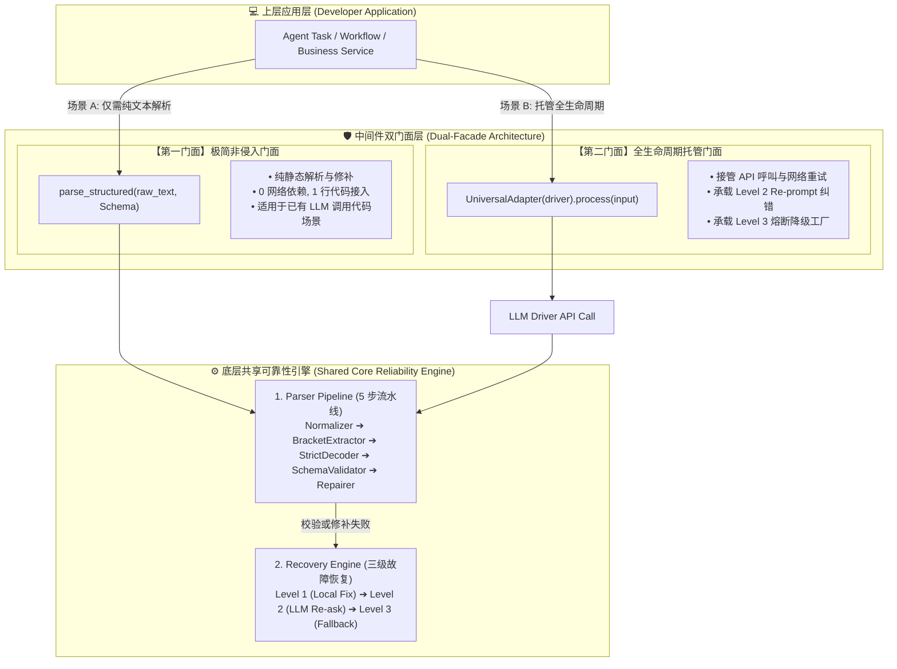

# Universal LLM Reliability Adapter

`llm_reliability_adapter` 是一个专门解决大语言模型（LLM）输出随机性、格式破损、思考链污染以及结构化数据提取失败问题的工业级可靠性中间件。

---

## 🎯 本中间件解决了哪些核心痛点问题？

在真实工业级 Agent 和 LLM 业务开发中，大模型生成的输出具有极高的**概率性与不确定性**。如果没有本中间件防御，系统会频繁遇到以下 6 大典型崩溃场景：

### 痛点 1：推理型模型（DeepSeek-R1 / Qwen-Reasoner）的“思考链污染”崩溃
* **真实场景**：DeepSeek-R1 等推理模型会在输出开头强行插入 `<think>Thinking step by step...</think>`，有时甚至在外层再套一层 ` ```json ... ``` ` 代码块。
* **无中间件后果**：直接调用 `json.loads(text)` 会立即抛出 `JSONDecodeError` 崩溃；手写 split 切分代码块在模型遗漏反引号时会触发 `IndexError` 索引越界。
* **中间件解决方式**：**`Normalizer` 节点**通过正则与标签引擎物理剥离 `<think>` 思考过程和多层 Markdown 包裹，无论外层包裹多少杂质，均能提纯出纯净的候选 JSON 文本。

---

### 痛点 2：传统正则匹配（`re.search(r"\{.*\}")`）在复杂场景下的“贪婪塌陷”
* **真实场景**：
  1. **嵌套字典塌陷**：当 JSON 中包含深度嵌套对象（如 `{"critique": {"score": 90}}`）时，贪婪正则极易截断边界。
  2. **字段值花括号冲突**：当生成的属性值内部包含花括号占位符（如 `"critique_feedback": "Welcome {username}"`）时，传统正则会将内部的 `{username}` 误判为 JSON 字典的起止边界。
* **无中间件后果**：正则截取出来的字符串两端括号不匹配，导致解析失败或丢失关键字段。
* **中间件解决方式**：**`BracketExtractor` 节点**抛弃贪婪正则，采用 O(N) 时间复杂度的**字符栈与平衡计数算法 (Stack Balance Counter)**。该算法能智能识别转义斜杠 `\` 与双引号 `"` 作用域，确保 100% 抓取到最外层闭合的 JSON 对象。

---

### 痛点 3：LLM 生成随机微小语法瑕疵（尾随逗号、单引号、未闭合大括号）
* **真实场景**：大模型生成 JSON 时经常带有 JS 习惯的尾随逗号（如 `{"a": 1,}`）、使用非标准单引号（`'key': 'val'`），或者因 Max Tokens 限制在末尾截断（如 `{"decision": "REJECT", "score": 50` 缺失右大括号）。
* **无中间件后果**：Python 原生 `json.loads` 是严格语法解码器，遇到尾随逗号或单引号会直接崩溃中断业务流程。
* **中间件解决方式**：**`DeterministicRepairer` 节点**作为 Level 1 本地修复器，在 **0 Token 消耗、0 毫秒延迟**下自动擦除尾随逗号、规整双引号，并利用栈平衡算法逆序补齐末尾缺失的 `"` 和 `}`。

---

### 痛点 4：数据“看起来是 JSON，但类型错配或缺少必填字段”
* **真实场景**：大模型输出了合法的 JSON `{"score": "ninety"}`，但业务期望的是整数 `score: 90`；或者遗漏了核心的 `critique_feedback` 必填字段。
* **无中间件后果**：纯文本解析器无法感知类型错误，下游业务代码在调用 `data["score"] + 1` 或访问缺失 Key 时抛出 `TypeError` 或 `KeyError` 发生静默崩溃。
* **中间件解决方式**：**`SchemaValidator` 节点**结合 Pydantic BaseModel 进行强类型拦截，确保从中间件吐出的对象 100% 符合类型安全。

---

### 痛点 5：解析失败后只能崩溃或手写猜字段，缺少自动“自愈闭环”
* **真实场景**：当大模型输出严重破坏、本地规则无法修补时，传统的系统要么直接崩溃抛出异常，要么丢弃这轮对话。
* **无中间件后果**：白白浪费大模型已消耗的 Token，丢失了模型输出的宝贵审查意见，破坏了 Agent 的自动化闭环。
* **中间件解决方式**：**`RecoveryEngine` (Level 2 Re-prompt)** 遵循 LangChain `RetryWithError` 范式，自动向大模型补发包含 **`Original Prompt` (原始需求)、`Faulty Completion` (错误输出)、`Detailed Validation Error` (精细错误堆栈)** 三元组上下文的 Re-prompt 提示词，引导模型自我纠错重新生成。

---

### 痛点 6：开发者防范代码侵入性高、维护成本巨大
* **真实场景**：每一个业务接口都需要开发者手写数十行包含 try-except、正则截取、字符串替换、类型转换的防御逻辑。
* **无中间件后果**：业务代码中充斥着大量的“防御胶水代码”，可读性极差且难以复用。
* **中间件解决方式**：采用**双层门面架构 (Dual-Facade Architecture)**，提供 `parse_structured()` 极简高层门面函数。开发者只需 **1 行代码**，即可自动享有上述所有管道提纯与本地修复能力！

---

## 📋 痛点与解决方案对照表

| 生产问题 (LLM Failure Modes) | 无中间件的痛苦表现 | 本中间件的工程解决方案 |
| :--- | :--- | :--- |
| **思考链 / Markdown 污染** | `JSONDecodeError` / `IndexError` 崩溃 | `Normalizer` 物理剥离思考链与代码块包裹 |
| **花括号占位符 `{user}` 冲突** | 正则匹配截断、丢失右半部分 JSON | `BracketExtractor` 字符栈平衡计数提取 |
| **尾随逗号 / 单引号 / 截断** | `json.loads` 严格解码直接报错 | `DeterministicRepairer` 0 延迟本地自动修补 |
| **类型错配 / 字段缺失** | 下游代码抛出 `TypeError` / `KeyError` | `SchemaValidator` Pydantic 强类型拦截 |
| **不可修复严重错误** | 抛出异常中断 Agent 执行流程 | `RecoveryEngine` (Level 2) 构造三元组 Re-prompt 引导自愈 |
| **胶水代码冗长侵入** | 每个调用点写 30+ 行正则表达式 | `parse_structured()` 1 行代码开箱即用 |

---

## 🏛️ 核心设计模式：双层门面架构 (Dual-Facade Architecture)

中间件针对不同控制粒度的应用场景，同时对外暴露**极简非侵入门面**与**全生命周期托管门面**：



---

## ⚡ 快速上手与接入示例

### 场景 A：使用【第一门面】`parse_structured()` (推荐：已有 LLM 呼叫代码)

如果你的业务代码中已经写好了 API 调用逻辑，仅需中间件协助完成结构化提纯与 0 延迟本地修复：

```python
from pydantic import BaseModel
from middlewares.llm_reliability_adapter import parse_structured

# 1. 定义目标 Pydantic Schema 契约
class CriticResult(BaseModel):
    decision: str
    score: int
    feedback: str

# 2. 模拟 LLM 返回包含思考链与尾随逗号的脏文本
raw_llm_text = """
<think>Thinking chain step by step...</think>
{
    "decision": "PASS", 
    "score": 90, 
    "feedback": "Good job",
}
"""

# 3. 1 行代码一键提纯、字符栈匹配、解码、Pydantic 校验与尾随逗号修补！
result = parse_structured(raw_llm_text, CriticResult)

print(result.decision)  # 输出: "PASS"
print(result.score)     # 输出: 90
```

---

### 场景 B：使用【第二门面】`UniversalAdapter` (全生命周期托管与重试)

如果你需要中间件接管包含“重新发起 API 呼叫 (Re-prompt)”在内的全生命周期与熔断降级：

```python
from pydantic import BaseModel
from middlewares.llm_reliability_adapter import (
    UniversalAdapter, AdapterInput, ReliabilityConfig, BaseLLMDriver
)

# 1. 实现 BaseLLMDriver 接口
class RealLLMDriver(BaseLLMDriver):
    def generate(self, prompt: str, system_instruction: str = None, context: dict = None) -> str:
        return llm_client.one_off_chat(prompt=prompt, system_prompt=system_instruction)

# 2. 实例化适配器并处理请求
adapter = UniversalAdapter(driver=RealLLMDriver())
input_contract = AdapterInput(
    prompt="请审查合同...",
    response_model=CriticResult,
    config=ReliabilityConfig(max_retries=3, enable_local_repair=True)
)

output = adapter.process(input_contract)
if output.success:
    print(output.data)  # 成功获取强类型 CriticResult 对象
    print("恢复轨迹记录:", [step.action for step in output.recovery_path])
```

---

## 🔧 五步解析管道与三级恢复机制详解

### 1. 五步解析管道 (5-Step Parser Pipeline)
* **`Normalizer`**：清理 `<think>`、`<thought>` 思考过程及 Markdown 代码块。
* **`BracketExtractor`**：基于字符栈平衡计数抽取最外层 JSON，解决嵌套与文本花括号冲突。
* **`StrictDecoder`**：严格解码，失败时抛出包含精细行列号 (line, col) 与前后 30 字符上下文的 `JSONDecodeCustomError`。
* **`SchemaValidator`**：基于 Pydantic 模型的类型与字段强校验。
* **`DeterministicRepairer`**：0 Token 消耗的确定性修补（修补尾随逗号、单引号及未闭合大括号）。

### 2. 三级阶梯式恢复引擎 (3-Level Recovery Engine)
* **Level 1 (Local Fix)**：0 延迟本地确定性修补（修补常规语法错）。
* **Level 2 (LLM Contextual Re-ask)**：根据 LangChain `RetryWithError` 范式，携带 `(Original Prompt, Faulty Completion, Validation Error)` 三元组向 LLM 发起精准纠错 Prompt。
* **Level 3 (Circuit Breaker Degrade)**：重试耗尽后，触发预设 `fallback_factory` 熔断降级。

---

## 🧪 单元测试

在项目根目录下运行全套真实破坏场景断言：

```bash
PYTHONPATH=. python -m unittest discover -s middlewares/llm_reliability_adapter/tests
```
