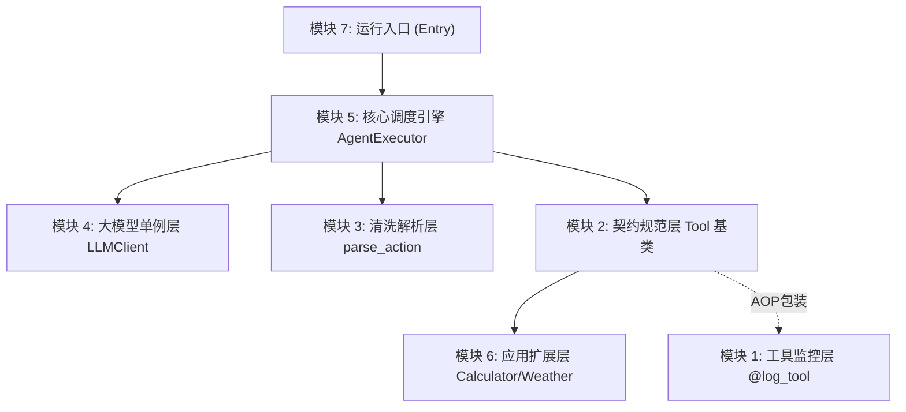

# Day 6 & Day 7 综合实战：微型 Agent 执行框架原型 (Chain-like)

这是一个基于 Python 基础、函数进阶与面向对象设计实现的微型 Agent 执行引擎原型。它的执行流完全契合主流大模型 Agent 框架中的 ReAct (Reason-Action) 环。

---

## 🎯 全景目标：我们要解决什么？
在实际应用中，单靠大模型往往无法解决复杂的数学运算或需要时效性的数据查询。我们需要构建一个“Agent 调度大脑（Executor）”，让它具备：
1. **意图识别与决策**：观察用户的请求并生成下一步行动（Action）。
2. **动态工具调用**：动态发现并调用本地注册的工具（如 Calculator, Weather）去执行这些行动。
3. **输出结构化解析与清洗**：捕获并清洗大模型不标准的输出（如稍微损坏的 JSON 块）。
4. **沙箱异常保护**：捕获工具调用中的任何错误，防止整个程序崩溃，并能将报错作为反馈让大模型在下一步自我纠正（ReAct 容错闭环）。
5. **性能监控**：提供详细清晰的工具执行日志与耗时监控。

---

## 🧩 模块拆解与知识点融合

我们将整个系统拆解为以下 **7 个核心模块**。在动手实践时，您将以“自顶向下 / 从整体到分解”的开发流程模块完成开发，并清晰看到前 5 天的知识点是如何在这条调用流中发生化学反应的：



### 1. 模块 5：调度与反射引擎层 (`AgentExecutor`)
*   **任务说明**：将单例客户端与注册的工具包联合起来，维护一个 `history` 对话历史。启动核心的 ReAct 循环流，根据解析出的 Action 字符串，**动态反射**调用对应的工具并执行参数解包。
*   **🎯 关联知识点：Day 5 动态反射 & Day 3 参数解包**
    - 使用 `getattr(tool, "__call__")` 动态反射获取工具的可调用函数。
    - 使用 `**action_args` 字典关键字参数解包，动态分发参数。

### 2. 模块 4：大模型通讯与单例层 (`LLMClient`)
*   **任务说明**：设计一个 LLM 通讯客户端模拟器。在单轮对话到多轮对话交互中，为了避免全局内存和网络资源浪费，我们需要确保它是一个并发安全的全局单例。
*   **🎯 关联知识点：Day 5 设计模式（线程安全单例与 DCL 锁）**
    - 重写魔法方法 `__new__` 拦截实例化。
    - 利用 `threading.Lock()` 与双重检查锁定 (DCL) 机制保障多线程下的线程安全。
    - 避开 `__init__` 重复调用的单例覆写大坑。

### 3. 模块 3：输出清洗与解析层 (`parse_action` / `_validate_action_payload`)
*   **任务说明**：模拟真实大模型多变的输出（包含 Markdown 和 JSON），编写一个强大的文本解析器。提取其中的 Action 和 Arguments，对其进行安全性类型校验，并在遇到格式略微损坏的 JSON（如多了一个尾部逗号）时，提供清洗与自动修复机制。
*   **🎯 关联知识点：Day 2 正则匹配与 JSON 容错 & Day 1 嵌套字典提取**
    - 使用 `re.search` 正则提取 ```json\n...\n```。
    - 使用 `try-except` 捕获 `json.JSONDecodeError`，并利用正则清洗实现尾部多余逗号的智能容错。
    - 使用 `dict.get(key, default)` 深度安全提取字典字段，避开 `KeyError`。

### 4. 模块 1：通用工具监控层 (`@log_tool` 装饰器)
*   **任务说明**：编写一个装饰器，以无侵入的方式为所有工具附加调用前参数打印、调用后结果打印、执行耗时监控以及**异常安全捕获**。
*   **🎯 关联知识点：Day 3 函数进阶与装饰器**
    - 闭包与装饰器语法糖。
    - `functools.wraps` 保留被装饰方法的元数据（如 `__name__`）。
    - 使用 `*args` 和 `**kwargs` 实现通用参数接收。

### 5. 模块 2：接口定义与抽象层 (`Tool` 基类)
*   **任务说明**：定义所有工具的抽象基类。要求约束子类必须实现 `execute` 接口，同时基于魔法方法将实例改造为可调用对象。
*   **🎯 关联知识点：Day 5 抽象基类 & Day 4 OOP 魔法方法**
    - `abc.ABC` 与 `@abc.abstractmethod` 强约束。
    - 魔法方法 `__call__` 的定义，使得 `tool_instance(*args, **kwargs)` 能像函数一样直接调用，并在其上挂载 `@log_tool` 实现“一次声明，所有子类自动增强”。
    - 魔法方法 `__repr__` 美化控制台打印。

### 6. 模块 6：应用扩展层 (具体工具子类实现)
*   **任务说明**：继承自 `Tool` 抽象基类，实现具体的工具（`CalculatorTool` 与 `WeatherTool`）。
*   **🎯 关联知识点：面向对象继承**
    - 继承 `Tool` 基类并重写 `execute` 核心方法。

### 7. 模块 7：全流程拼装与运行入口 (`__main__`)
*   **任务说明**：在 `__main__` 中注册工具，实例化引擎，传入复杂提示词启动全链路。
*   **🎯 关联知识点：模块拼装与全流程调用**

---

## 🛠️ 运行与练习方法

项目提供了两个核心实现文件：
1. **[agent_framework.py](file:///Users/zhouyi/03.AI/03.freshManStart/weekly/w01_python_basics/day_exercises/day6_7_agent_framework/agent_framework.py)**: 已经全部实现的完整工业级参考代码。
2. **[practice.py](file:///Users/zhouyi/03.AI/03.freshManStart/weekly/w01_python_basics/day_exercises/day6_7_agent_framework/practice.py)**: 为您特制的空白练习模板，里面包含了详细的 `TODO` 指引，需要您动手完成实现。

### ✍️ 自我动手练习
1. 打开 **[practice.py](file:///Users/zhouyi/03.AI/03.freshManStart/weekly/w01_python_basics/day_exercises/day6_7_agent_framework/practice.py)**，按照里面的 `TODO` 注释逐步编写代码。
2. 打开 **[test_agent_framework.py](file:///Users/zhouyi/03.AI/03.freshManStart/weekly/w01_python_basics/day_exercises/day6_7_agent_framework/test_agent_framework.py)**，将文件头部的：
   ```python
   from agent_framework import (
   ```
   修改为：
   ```python
   from practice import (
   ```
3. 在当前目录下运行单元测试，以验证您的代码是否完全正确：
   ```bash
   pytest test_agent_framework.py -v
   ```

### 运行完整演示
运行您自己实现的或者参考答案的 Agent 交互：
```bash
python practice.py
# 或
python agent_framework.py
```

---

## 💡 工业级高阶扩展：并发安全单例与上下文管理器

在 `LLMClient` 的实现中，我们针对真实高并发生产环境引入了 **双重检查锁定 (DCL)** 与 **线程锁 (Lock)** 机制。

### 1. 多线程并发下的“单例穿透”问题
在单线程中，下面的写法是安全的：
```python
if cls._instance is None:
    cls._instance = super().__new__(cls)
```
但在多线程高并发环境下，如果两个线程同时执行到第一行，它们同时判断 `_instance is None` 为真，则都会进入该代码块。这会导致全局生成**两个不同的 LLMClient 实例**，破坏了单例模式的全局唯一性。

### 2. 线程安全解决方案：双重检查锁定 (Double-Checked Locking)
为了保证绝对唯一性且兼顾运行效率，我们引入了 `threading.Lock()` 线程锁：
```python
_instance = None
_lock = threading.Lock()

def __new__(cls, *args, **kwargs):
    if cls._instance is None:           # 第一重检查：过滤已实例化情况（避免每次都加锁导致性能下降）
        with cls._lock:                 # 加锁：只允许一个线程进入
            if cls._instance is None:   # 第二重检查：抢到锁的线程进入后，再次确认是否已被前一个抢到锁的线程实例化
                cls._instance = super().__new__(cls)
                cls._instance._init_mock_responses()
    return cls._instance
```

### 3. 上下文管理器 `with cls._lock` 的安全魔法
加锁必须要及时释放，否则会导致其他线程永久等待从而引发**死锁（Deadlock）**。

在 Python 中，`with cls._lock` 语句代表了 **上下文管理器协议**（利用了类的魔法方法 `__enter__` 和 `__exit__`）：
- **进入缩进块时**：自动触发 `cls._lock.__enter__()`，即隐式调用 `cls._lock.acquire()` 执行加锁。
- **退出缩进块时**：自动触发 `cls._lock.__exit__()`，即隐式调用 `cls._lock.release()` 释放锁。
- **防御性保障**：即使缩进块内部的代码中途抛出异常、崩溃或执行了 `return` 强行退出，Python 解释器在后台也**必定会强制执行释放锁的操作**，这提供了沙箱级别的锁安全保护。
