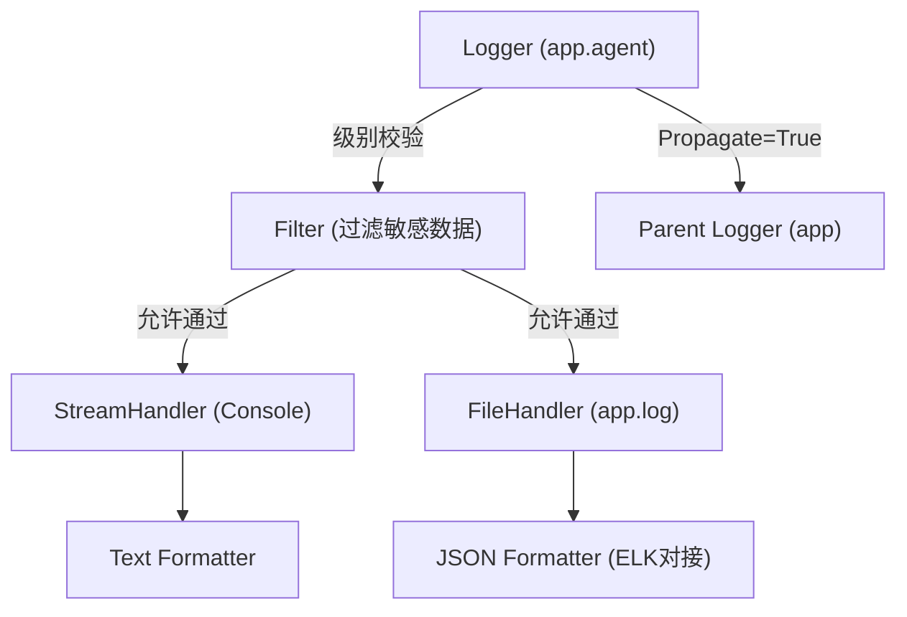
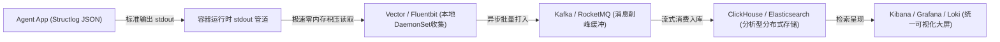
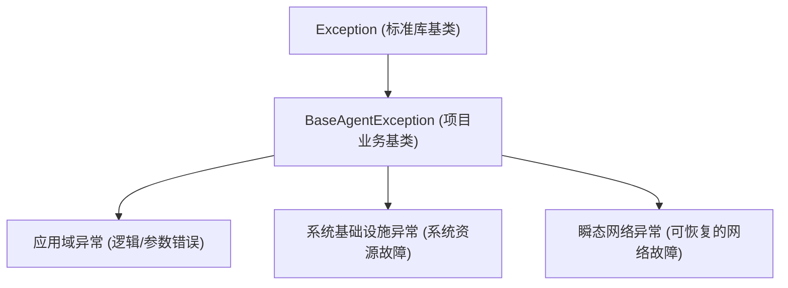
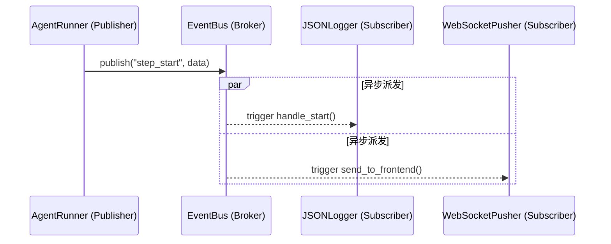

# Day 13：工业级日志与异常工程、低侵入式回调与事件总线

在大型分布式系统或复杂的 Agent 编排系统中，代码的**可观测性（Observability）**与**容错韧性（Resiliency）**决定了系统能否稳定在生产环境运行。本篇讲义将从工业级规范出发，系统性拆解日志治理、异常分级设计，以及低侵入性的事件钩子架构。

---

## 🧭 核心教学六步法

### 第零步：定位并引导痛点场景

#### 【问】如果没有本节课的技术，代码会在哪里卡住？它解决了什么核心痛点？
想象一下，你写了一个 Agent，在后台自动循环调用 LLM 并执行本地 Python 脚本。半夜代码突然崩溃停止运行了，或者结果彻底跑偏。
如果没有规范的异常与回调工程，你会遭遇以下惨象：
1. **黑盒运行，无处排查**：控制台只打印了一个孤零零的 `KeyError: 'content'`，你根本不知道是在哪一步循环、哪一个 Tool 执行、甚至是哪一次 LLM 吐出脏数据时抛出的，必须重新加塞无数的 `print` 重新跑代码。
2. **吞噬异常栈（Silent Failure）**：如果你直接写 `except Exception: pass` 或者在捕获后简单封装并抛出新异常，底层的原始堆栈（比如真正的 Socket 超时或数据库断连堆栈）就会被彻底丢弃，导致后续 Bug 定位极其艰难。
3. **硬编码强耦合**：当你想给 Agent 增加“保存每一步到数据库”或“发送进度通知到微信前端”的功能时，如果你直接把这些通知逻辑写在核心的 Agent 运行循环中，代码会变得极其臃肿、无法维护。
4. **日志同步阻塞**：在高并发或高吞吐场景下，硬编码的 `print` 或同步的 `FileHandler` 会导致磁盘 I/O 阻塞核心事件循环或工作线程，进而造成整个服务假死崩溃。

---

### 第一步：建立直观类比与核心定义

#### 【类比说明】
*   **异常链传递（`raise ... from ...`）**：举例来说，就像顺藤摸瓜。虽然最上面挂着的是“大哈密瓜”（应用级通用异常，如 `AgentTaskFailed`），但是顺着瓜藤，你依然能一路看到“根部”（底层驱动错误，如 `TimeoutError`）。它将两个异常逻辑关联，不丢失历史。
*   **回调函数与事件钩子（Hooks）**：就像你在快递软件上开启了推送通知。你不需要每分钟都去刷新页面看快递到哪了（轮询），而是注册了“到达转运中心”、“派送中”、“已签收”的钩子。快递系统在到达相应状态时，会自动拨打你的电话或发送短信通知你（回调触发）。

#### 【核心定义】
1. **异常链（Exception Chaining）**：在 Python 中使用 `raise NewException(...) from old_exception` 显式将新异常与捕获到的旧异常关联。这会设置新异常的 `__cause__` 属性，使输出的 Traceback 同时展现出两个异常的完整堆栈。
2. **回调协议（Callback Interface）**：定义一组标准的事件处理入口，并在核心组件执行生命周期的关键点（如启动、结束、报错）留出插槽自动触发这些方法，从而解耦核心逻辑与旁路监控逻辑。

---

### 第二步：提供最小但真实的代码示例

下面的代码展示了如何利用自定义异常链和简单的回调追踪器，来记录步骤的成功与异常堆栈。

```python
import traceback
import uuid
import time
from typing import Dict, Any, List

class BaseAgentException(Exception):
    """Agent通用业务基础异常"""
    def __init__(self, message: str, error_code: int = 50000, user_message: str = "系统执行异常"):
        super().__init__(message)
        self.error_code = error_code
        self.user_message = user_message

class ToolExecuteError(BaseAgentException):
    """工具执行阶段异常"""
    def __init__(self, message: str, tool_name: str, execution_time: float):
        super().__init__(f"工具 [{tool_name}] 崩溃: {message}", error_code=50001)
        self.tool_name = tool_name
        self.execution_time = execution_time

class BaseAgentCallback:
    def on_step_start(self, run_id: str, step_name: str, inputs: dict): pass
    def on_step_error(self, run_id: str, step_name: str, error: Exception, duration: float): pass

class LogTracebackCallback(BaseAgentCallback):
    def on_step_start(self, run_id: str, step_name: str, inputs: dict):
        print(f"🌟 [TRACE] [{run_id[:8]}] 步骤 '{step_name}' 开始运行")

    def on_step_error(self, run_id: str, step_name: str, error: Exception, duration: float):
        print(f"❌ [TRACE] [{run_id[:8]}] 步骤 '{step_name}' 失败！耗时: {duration:.4f}s")
        tb_lines = traceback.format_exception(type(error), error, error.__traceback__)
        print("".join(tb_lines).strip())

class SimpleRunner:
    def __init__(self, callbacks: List[BaseAgentCallback]):
        self.callbacks = callbacks

    def run_tool(self, tool_name: str, param: int):
        run_id = str(uuid.uuid4())
        start = time.perf_counter()
        for cb in self.callbacks:
            cb.on_step_start(run_id, tool_name, {"param": param})
        try:
            if param < 0:
                raise ValueError("参数不能为负数")
        except ValueError as original_err:
            duration = time.perf_counter() - start
            wrapped_err = ToolExecuteError(str(original_err), tool_name, duration)
            wrapped_err.__cause__ = original_err
            for cb in self.callbacks:
                cb.on_step_error(run_id, tool_name, wrapped_err, duration)
            raise wrapped_err from original_err
```

---

### 第三步：展示主动破坏与常见报错（防错设计）

#### 1. 吞噬原始异常堆栈的错误范式
*   **破坏手段**：在 `except` 块中，直接 `raise` 一个全新的异常，但不使用 `from` 进行异常链关联。
*   **不良代码**：
    ```python
    try:
        1 / 0
    except ZeroDivisionError:
        raise ToolExecuteError("计算出错", "Calc", 0.0) # 此时 ZeroDivisionError 的堆栈将被截断丢失
    ```
*   **后果**：排查问题时，你只能看到 `ToolExecuteError` 的堆栈，却无法知道底层是由于除零错误（ZeroDivisionError）、类型错误还是空指针引起的。

#### 2. 回调执行发生崩溃导致主业务挂掉
*   **核心引擎在触发回调时，必须使用防御性 try-except 保证旁路逻辑不阻断主流程**。
    ```python
    for cb in self.callbacks:
        try:
            cb.on_step_start(run_id, step_name, inputs)
        except Exception as cb_err:
            logging.error(f"回调执行异常（已忽略以免影响主流程）: {cb_err}")
    ```

---

### 第四步：设计默写与主动召回机制

请尝试在脑海中完成以下填空题（用于自我检测对异常链与回调绑定的掌握）：

```python
import traceback

class AgentTaskError(Exception):
    pass

def execute_step(data: dict):
    try:
        return data["key_not_exists"]
    except KeyError as origin_e:
        # 【填空1：利用异常链关联语法，抛出包装异常，并将 origin_e 作为起因关联】
        raise AgentTaskError("执行步骤时发生关键配置缺失") _________ origin_e

try:
    execute_step({})
except AgentTaskError as e:
    # 【填空2：使用 traceback 模块将异常对象 e 的链式完整堆栈格式化为字符串】
    stack_trace = "".join(traceback._________________(type(e), e, e.__traceback__))
    print(stack_trace)
```

> **【答案公布】**
> * 填空1：`from`
> * 填空2：`format_exception`

---

## 一、 企业级日志框架设计与主流选型

标准的 Python `logging` 模块是一个基于**责任链模式**的树状过滤系统。在生产环境的高并发或高吞吐场景下，硬编码 of `print` 或同步的 `FileHandler` 会导致磁盘 I/O 阻塞核心事件循环或工作线程，进而造成整个服务假死崩溃。

### 1. 日志过滤与流向拓扑（四大核心组件说明）
Python 的日志由四大核心组件构成：
*   **Logger（记录器）**：提供应用程序直接使用的接口。Logger 具有层级结构（例如 `app.agent` 是 `app` 的子 Logger），子 Logger 默认会将事件向上传递（Propagation）给父 Logger。
*   **Filter（过滤器）**：提供比日志级别更细粒度的控制，决定哪些日志记录被丢弃或保留。
*   **Handler（处理器）**：决定日志的去向。例如 `StreamHandler` 输出到控制台，`RotatingFileHandler` 写入本地文件并自动滚动，`QueueHandler` 实现异步非阻塞日志写入。
*   **Formatter（格式化器）**：定义日志的输出文本结构。



---

### 2. 生产环境的三大日志框架选型

| 日志框架 | 生产级定位 | 核心优势 | 缺点与选型痛点 |
| :--- | :--- | :--- | :--- |
| **`structlog`** *(推荐)* | **高并发微服务、大规模 Agent 调度系统首选** | 1. 专为结构化（JSON）日志设计<br>2. 支持 ContextVars 动态上下文绑定<br>3. 天然兼容 OpenTelemetry 等分布式追踪 | 学习曲线陡峭，配置极其繁琐 |
| **`loguru`** | **中小型项目、CLI工具与快速迭代团队** | 1. 极致开箱即用，零配置<br>2. 异步非阻塞落盘（对标 Logback Async）<br>3. 极其强大的错误堆栈本地变量抓取 | 与标准库兼容性差，不易与分布式链路监控（OTEL）集成 |
| **标准库 `logging` + `dictConfig`** | **低依赖要求、云原生底层基础组件** | 无任何第三方依赖，极致的兼容性 | 声明式 XML/YAML 配置极其冗长臃肿，二次封装繁琐 |

---

### 3. 生产级方案 A：Loguru 现代异步非阻塞日志落地
`loguru` 相当于 Python 生态中去除了繁琐 XML 配置的现代版 Logback。以下展示如何在生产环境配置**异步非阻塞写入（类似于 Logback 的 AsyncAppender）**与**日志自动轮转清理**。

```python
import sys
from loguru import logger

def configure_production_logging():
    # 1. 移除默认同步的 stdout 处理器
    logger.remove()

    # 2. 添加生产环境非阻塞 JSON 落地处理器 (对标 Logback AsyncAppender)
    # enqueue=True 启动后台线程池进行异步 I/O 写入，避免磁盘写盘阻塞主业务协程
    logger.add(
        "logs/agent_production.log",
        format="{time:YYYY-MM-DD HH:mm:ss.SSS} | {level: <8} | {name}:{function}:{line} - {message}",
        level="INFO",
        rotation="100 MB",       # 日志文件达到 100M 时自动切分 (对标 SizeAndTimeBasedFNATP)
        retention="10 days",     # 只保留最近 10 天的日志自动清理 (对标 MaxHistory)
        compression="zip",       # 历史日志自动压缩以节省磁盘空间
        enqueue=True,            # 开启异步非阻塞队列
        serialize=True           # serialize=True 会自动将所有输出转化为结构化 JSON 格式
    )
    
    # 3. 添加控制台友好开发处理器
    logger.add(sys.stdout, colorize=True, level="DEBUG", enqueue=True)
```

---

### 4. 生产级方案 B：Structlog + dictConfig 结构化日志流水线
`structlog` 配合标准库 `dictConfig`（类似于 `logback.xml` 的 YAML 声明式配置）是当前大型互联网企业主流的日志流水线搭建方案。它可以轻松在并发协程下，将一个请求的全局 `trace_id` 自动随所有日志进行绑定并统一输出为标准 JSON。

```python
import logging.config
import structlog

def setup_production_structlog():
    # 1. 对标 logback.xml 的 dictConfig 声明式标准库配置
    logging_config = {
        "version": 1,
        "disable_existing_loggers": False,
        "formatters": {
            "json_formatter": {
                "()": "structlog.stdlib.ProcessorFormatter",
                "processor": structlog.processors.JSONRenderer(), # 最终输出为 JSON
            }
        },
        "handlers": {
            "async_console": {
                "class": "logging.StreamHandler",
                "formatter": "json_formatter",
            }
        },
        "loggers": {
            "app.agent": {
                "handlers": ["async_console"],
                "level": "INFO",
                "propagate": False,
            }
        }
    }
    logging.config.dictConfig(logging_config)

    # 2. 配置 structlog 的处理器管道 (Processors Pipeline)
    structlog.configure(
        processors=[
            structlog.stdlib.add_log_level,
            structlog.stdlib.add_logger_name,
            structlog.processors.TimeStamper(fmt="iso"),
            structlog.processors.StackInfoRenderer(),
            # 捕获本地异常堆栈，转换为结构化数据
            structlog.processors.format_exc_info,
            structlog.stdlib.ProcessorFormatter.wrap_for_formatter,
        ],
        logger_factory=structlog.stdlib.LoggerFactory(),
        cache_logger_on_first_use=True,
    )
```

---

### 5. 工业级日志存储与检索架构
在大型分布式云原生架构下，任何写在本地磁盘的文件日志均是“易失的”。生产级日志架构必须采用**收集-传输-存储-可视化**的异步流水线：


*   **Vector / Fluentbit**：轻量级 C 语言日志采集器，相比传统 Java Logstash，其 CPU/内存消耗极低。它直接监听容器 stdout/file 管道，将 JSON 日志以流式非阻塞方式发送。
*   **Kafka**：防突发大流量击穿存储，充当高吞吐削峰缓冲。
*   **ClickHouse / Elasticsearch**：由于 JSON 具有良好的结构，ClickHouse 能够以百亿级每秒的超高性能进行日志的实时 SQL查询。

---

## 二、 工业级异常架构与分级治理

根据故障性质，我们将异常划分为三大类：



*   **应用域异常（Application Domain Exception）**：由于用户输入、Tool 参数校验失败或状态机非法引起的错误。这类异常属于**预期内异常**，系统应直接捕获并反馈给用户，无需报警。
*   **系统基础设施异常（System Infrastructure Exception）**：如磁盘已满、本地数据库损坏。这类异常属于**严重故障**，系统必须立即中断并触发运维报警。
*   **瞬态网络异常（Transient Network Exception）**：如第三方 LLM API 发生 503 报错、连接超时。这类异常通常是**暂时的**，系统防御面应介入**退避重试（Exponential Backoff Retry）**机制。

---

## 三、 低侵入性回调与事件驱动设计（进阶核心）

在核心业务逻辑中直接写 `for cb in self.callbacks: cb.on_step_start(...)` 是一种典型的**硬编码强耦合**，会导致主业务代码支离破碎。我们需要采用低侵入性的优雅设计。

### 1. 方案 A：面向切面编程（AOP）装饰器模式
利用 Python 装饰器（Decorator），我们可以在**不修改任何主业务函数内部代码**的情况下，动态织入（Weave）生命周期拦截和耗时度量逻辑。

```python
# 异步 AOP 切面拦截器示例
def trace_step(step_name: str):
    def decorator(func):
        async def wrapper(*args, **kwargs):
            run_id = str(uuid.uuid4())
            # 1. 触发前置通知（无侵入）
            EventBus.publish("step_start", {"run_id": run_id, "step": step_name, "inputs": kwargs})
            start = time.perf_counter()
            try:
                # 2. 执行核心业务
                res = await func(*args, **kwargs)
                # 3. 触发后置通知（无侵入）
                EventBus.publish("step_end", {
                    "run_id": run_id, 
                    "step": step_name, 
                    "outputs": res, 
                    "duration": time.perf_counter() - start
                })
                return res
            except Exception as e:
                # 4. 触发异常通知（无侵入）
                EventBus.publish("step_error", {
                    "run_id": run_id, 
                    "step": step_name, 
                    "error": e, 
                    "duration": time.perf_counter() - start
                })
                raise
        return wrapper
    return decorator
```

### 2. 方案 B：全局发布-订阅者模式（Event Bus）
引入事件总线，让核心引擎只管“发布事件”，而监控模块、日志模块、消息推送模块充当“订阅者”独立注册。这样，添加新监控功能时，**零修改核心引擎代码**。



---

## 四、 方案 A 与 方案 B 的生产级主流项目落地对比

在工业级生产环境中，方案 A 和方案 B 有着非常清晰的职责定位和选型准则：

### 1. 方案 A (接口回调注入) 的主流生产项目

方案 A 通过**显式接口契约约束**，能提供最高标准的类型安全性，主要在底层 SDK 和计算密集型框架中使用。

*   **LangChain (`CallbackManager` 机制)**：
    *   *具体场景*：LangChain 的核心逻辑（如大模型调用链）在执行前、后和发生异常时，均在主循环中显式通过 `callbacks` 数组逐个遍历并同步触发 `on_llm_start` 等方法。
*   **PyTorch Lightning (`Callback` 训练控制系统)**：
    *   *具体场景*：大模型训练 of Trainer 循环中，会在每个训练 epoch 结束时显式执行注入的回调 `on_epoch_end()` 以同步更新权重状态。

### 2. 方案 B (AOP 与 全局事件总线) 的主流生产项目

方案 B 致力于**零代码侵入和彻底的业务解耦**，是应用级服务和高频业务微服务中旁路治理的绝对核心。

*   **OpenTelemetry Python (工业级分布式链路追踪标准)**：
    *   *具体场景*：使用 AOP 字节码拦截无侵入地劫持 HTTP 请求发送方法，在业务层不知情的情况下，自动生成 Trace ID、度量延时并上报异常。
*   **Celery (Python 工业级异步任务队列)**：
    *   *具体场景*：Celery 的 `signals` 机制基于发布-订阅模式。在任务预运行（`task_prerun`）或任务失败（`task_failure`）时向总线广播，外部组件订阅后即可做微信告警。

### 总结选型标准：

| 评估维度 | 方案 A（接口回调注入） | 方案 B（AOP 装饰器与事件总线） |
| :--- | :--- | :--- |
| **典型代表** | **LangChain**, **PyTorch** | **OpenTelemetry**, **Celery** |
| **耦合属性** | 显式强耦合，存在代码侵入性 | 隐式解耦，零代码侵入 |
| **适用建议** | 基础 SDK 开发、训练主流程监控 | 业务侧 Trace 链路度量、性能监控、安全防爆系统 |

---

## 五、 交付与自底向上重构

请前往练习目录完成以下物理隔离的架构演进对比：
*   **练习模板**：[practice.py](file:///Users/zhouyi/03.AI/03.freshManStart/weekly/w02_pydantic_and_async/day_exercises/day13_callbacks_exceptions/practice.py)
*   **标准答案**：[agent_trace.py](file:///Users/zhouyi/03.AI/03.freshManStart/weekly/w02_pydantic_and_async/day_exercises/day13_callbacks_exceptions/agent_trace.py)
