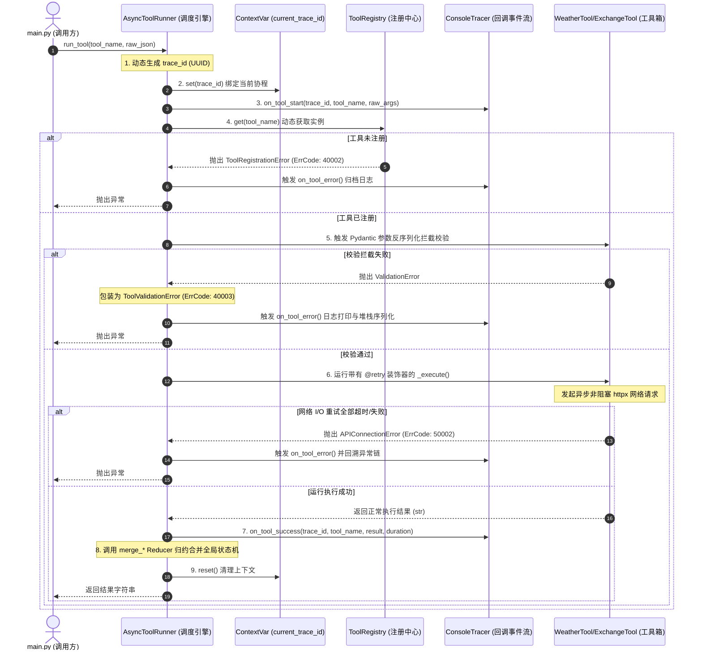

# 🚀 生产级异步多工具调度引擎 (Async Tool Runner)

本项目是 Week 2 的综合实战交付成果，位于 `weekly/w02_pydantic_and_async/project/`，为一个物理隔离、具备生产级架构分层的独立 Python 项目包。

本系统旨在实现一个类似于 LangGraph / LangChain 内部工具调度机制的核心引擎，能够将外部的自然语言动作指令（大模型生成的工具名及 JSON 入参参数）进行安全校验、动态反射加载，并高吞吐、非阻塞地异步并发调度执行，内置完善的可观测追踪（Trace ID）、生命周期事件回调、指数退避重试和降级兜底防护机制。

---

## 🗺️ 系统架构与数据流向

系统的数据流流向、校验拦截关卡与生命周期的触发时序如下所示：



---

## 🧩 模块分层与知识融合映射

项目严格按照生产级工程架构拆分为 7 个子包，融合了 Week 1 和 Week 2 全部 14 天的核心 Python 与 Agent 开发高阶知识点：

| 子模块目录 | 模块职责 | 知识点映射与技术点 |
| :--- | :--- | :--- |
| [**`config/`**](./config/) | 类型安全的配置管理 | **Day 9 & 13**：`python-dotenv` 读取 + Pydantic `BaseModel` 校验，实现环境配置与代码隔离。 |
| [**`exceptions/`**](./exceptions/) | 结构化异常继承体系 | **Day 4 & 13**：5 级业务与系统异常封装，内置 `current_trace_id` 协程安全 `ContextVar` 实现链路追踪。 |
| [**`log/`**](./log/) | 继承链日志工厂 | **Day 5 & 13**：工厂模式创建 Logger，控制台（彩色文本）+ 磁盘文件（JSON 结构化）双 Handler 审计日志。 |
| [**`models/`**](./models/) | 数据校验与状态容器 | **Day 8 & 9 & 10**：`RunnerState` 状态容器；`merge_*` 归约纯函数；`BaseModel` 入参模型、模型联合校验拦截器。 |
| [**`callbacks/`**](./callbacks/) | 可观测性事件钩子 | **Day 5 & 13**：基于 `Protocol` 声明的鸭子类型生命周期回调；`traceback` 故障第一现场深度序列化审计。 |
| [**`tools/`**](./tools/) | 异步工具实现箱 | **Day 1 & 2 & 4 & 12**：`BaseTool` (ABC) 抽象契约；`__call__` / `__repr__` 魔法方法；`httpx.AsyncClient` 异步网络通信；Day 1 嵌套字典安全提取。 |
| [**`core/`**](./core/) | 并发调度核心引擎 | **Day 3 & 5 & 11 & 14**：指数退避重试装饰器（闭包）；`inspect` 反射动态自动发现与注册中心；`asyncio.gather` 非阻塞高并发派发。 |

---

## ⚙️ 环境配置说明

本项目的配置遵循 **12-Factor (配置与代码分离)** 原则。系统默认配置存放在 `AppSettings` 的元数据定义中，可通过当前包目录下的 `.env` 文件进行覆写（加载优先级最高）：

```ini
# 外部 HTTP 强超时阈值限制（秒）
HTTP_TIMEOUT=15.0

# 异步退避重试属性
MAX_RETRIES=3
RETRY_BASE_DELAY=0.5

# 外部真实 API 基地址配置
WEATHER_API_BASE=https://wttr.in
EXCHANGE_API_BASE=https://api.frankfurter.dev/v2

# 日志输出配置
LOG_LEVEL=DEBUG
LOG_TO_FILE=true
LOG_FILE_PATH=tool_runner.log
```

---

## ⚡ 高并发流控与并发异常隔离

在大规模工具并发调度时，系统在 `AsyncToolRunner.run_batch` 中内置了两层防护机制：

1. **异步信号量流量控制 (asyncio.Semaphore)**：
   - **痛点**：如果不加控制地直接通过 `asyncio.gather` 派发大量工具任务，会导致瞬间发起海量网络 TCP 连接，造成系统文件描述符（FD）耗尽崩溃（`Too many open files`），并极易触发目标 API 的防刷拦截（`HTTP 429` 报错）。
   - **方案**：利用信号量 `asyncio.Semaphore(max_concurrent_tools)` 限制同一时刻处理的任务总数。当并发数达上限时，新协程会自动非阻塞挂起进入队列等待，实现平滑的削峰限流。

2. **并发异常物理隔离 (Error Isolation)**：
   - **痛点**：在默认的并发控制中，某一个子任务发生网络超时或除零异常时，如果任其向上抛出，会导致整个批量运行链条被强制腰斩，导致其他正常运行的任务一同失败。
   - **方案**：在局部协程闭包内进行 `try...except` 拦截，将抛出的异常实例作为正常对象返回（`return e`）。这保证了批量并发运行期间子任务互不连累，调度引擎能安全地搜集到全部执行状态并移交给状态归约器。

---

## 🚀 运行与验证指南

### 1. 运行自动化测试套件 (Pytest)
在项目根目录下，使用您的虚拟环境运行完整的测试套件（覆盖参数拦截、反射、并发和网络）：
```bash
.venv/bin/pytest weekly/w02_pydantic_and_async/project/tests/ -v
```

### 2. 执行主演示程序 (main)
以模块化方式拉起演示程序，查看 8 阶段的生命周期链路展示：
```bash
.venv/bin/python -m weekly.w02_pydantic_and_async.project.main
```

演示程序主要包含以下 8 阶段的完整串联演示：
* **Phase 1**：解析本地 `.env` 获得配置元数据并映射为 `AppSettings` 对象。
* **Phase 2**：装配具有 `tool_runner.*` 名字空间的 logger。
* **Phase 3**：利用 `inspect` 动态扫描并反射注册 `tools` 模块内所有合法的 `BaseTool` 子类。
* **Phase 4**：导出 OpenAI 兼容格式的 Function Calling 参数 Schema 声明。
* **Phase 5**：通过调度器调用本地 CPU 计算（如 `100.5 * 2.0`）及公网网络 API（查询北京 3 天天气和 USD 兑 CNY 汇率），并在控制台打印 Trace ID 和运行信息。
* **Phase 6**：利用 `asyncio.gather` 并发请求上海/广州/深圳等多个网络任务，展示异步高吞吐量。
* **Phase 7**：制造脏输入校验失败、除以零崩溃、相同货币兑换等场景，验证系统防崩溃拦截及包装异常链（`raise ... from ...`）。
* **Phase 8**：通过 Reducer 归约，最终打印出一份包含总步数、成功数、失败数、审计日志和历史工具结果集在内的 `RunnerState` 终态审计报告。
