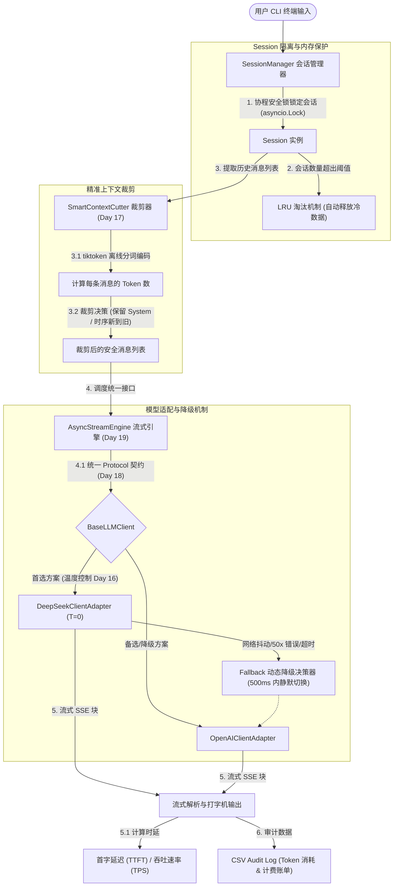

# 📅 Week 3: LLM 原理与 API 交互 —— 宏观总览与框架拆解

> **第三周核心目标**：从零构建一个**“具有动态 Fallback 与 Token 审计的异步流式 CLI 聊天终端”**。掌握大模型自回归生成机制，控制 API 的采样概率参数，实现支持离线 Token 裁剪、多会话 LRU 淘汰、多模型自动降级以及非阻塞流式输出的工业级 Agent 底座。

---

## 1. 业务流程与架构拓扑图

---

## 2. 知识链路图（Daily Knowledge Link）

本周每日的知识点不是孤立的，而是**环环相扣，最终在 Day 21 收敛为工业级终端项目**：

*   **Day 15（自回归与 KV Cache 原理）**
    *   *作用*：理解 Prefill 和 Decode 阶段的时延特征，奠定对 **TTFT** 和 **TPOT** 性能度量的理论根基。
*   **Day 16（采样参数与确定性路由）**
    *   *作用*：控制温度参数（Temperature）与核采样（Top-P），实现 Agent 业务路由时的确定性（`T = 0`）与反思纠错时的创造性。
*   **Day 17（BPE 分词与上下文裁剪）**
    *   *作用*：引入 `tiktoken` 精准计算并过滤历史消息，实现 [SmartContextCutter](file:///Users/zhouyi/03.AI/03.freshManStart/docs/week_3_llm_and_api.md#L36)，构筑上下文溢出防护墙。
*   **Day 18（统一 API 适配器 Protocol）**
    *   *作用*：解耦大模型厂商依赖，设计 [BaseLLMClient](file:///Users/zhouyi/03.AI/03.freshManStart/docs/week_3_llm_and_api.md#L51) 契约，支持不同大模型的无缝热切换（为 Fallback 提供设计支持）。
*   **Day 19（异步流式解析引擎）**
    *   *作用*：实现高并发非阻塞的流式输入处理，提供流畅的“打字机”体验并实时观测首字时延。
*   **Day 20（并发安全会话管理器）**
    *   *作用*：多用户并发请求下的协程安全数据隔离与冷会话 LRU 自动清理，保护系统内存免于泄露。
*   **Day 21（终期综合实战大融合）**
    *   *作用*：集成前述模块，追加双模型 500ms 动态 Fallback 逻辑，输出 CSV Token 审计账单，完成闭环交付。

---

## 3. 核心组成模块与痛点问题解析

| 模块名称 | 它具体做了什么？ | 解决了什么痛点问题？ |
| :--- | :--- | :--- |
| **统一 API 适配器** `BaseLLMClient` | 通过 Python 强类型契约 `Protocol` 统一包装不同大模型（如 OpenAI、DeepSeek）的 API 初始化、参数传递和输出解析。 | **API 强耦合痛点**：避免因某一家大模型服务挂掉或计费调整，需要大规模修改上层业务代码的灾难。 |
| **消息裁剪器** `SmartContextCutter` | 在发送 API 请求前，利用 `tiktoken` 离线分词进行精确 Token 计算，按照“保留 System -> 时序从新到旧 -> 消息物理不打碎”的策略裁剪。 | **Context Limit 崩溃痛点**：杜绝因 Agent 决策循环产生的大量工具观测和历史信息撑爆上下文窗口而抛出 API 400 错误。 |
| **异步流式引擎** `AsyncStreamEngine` | 使用 `httpx.AsyncClient` 进行非阻塞的异步调用，逐块（Chunk）解析并渲染大模型的流式输出，统计 TTFT 响应指标。 | **同步排队与首字长延迟痛点**：杜绝同步调用引起的并发请求相互阻塞，消除长文本输出时用户的干等焦虑。 |
| **并发安全会话管理器** `SessionManager` | 通过 `asyncio.Lock` 保证并发会话读写的原子性，结合 `OrderedDict` 实现最大容量下的 LRU 会话自动淘汰。 | **会话串线与内存泄露痛点**：解决多协程并发写入同一会话时导致的用户上下文错乱问题，以及长时间挂置冷会话导致内存占满的问题。 |
| **容错降级控制器** `FallbackController` | 协调主辅适配器。若首选大模型（如 DeepSeek）因服务不稳定或网络异常报错，在 500ms 内静默重试并切换至备用模型（如 OpenAI）。 | **云服务不可靠痛点**：消除由于云端大模型偶发性故障、限流（Rate Limit）或服务中断带来的应用不可用，提高 Agent 的可用度。 |
