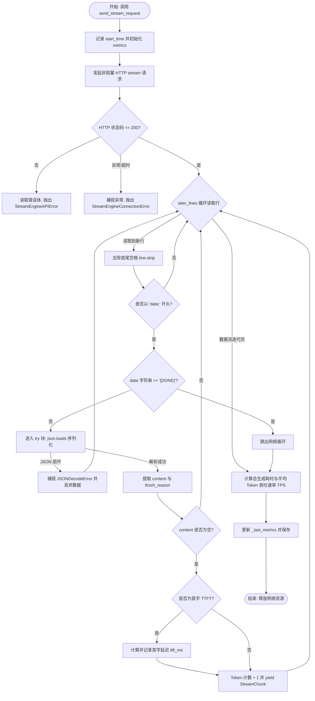

# Day 19：异步非阻塞 API 并发调用与流式分块解析引擎

在大模型应用（Agent）中，大模型生成的耗时是非常高昂的（生成几千 Token 通常需要数秒甚至数十秒）。如果采用传统的“等待大模型全部生成完再统一返回”的同步阻塞式交互方案，会给上层应用和最终用户带来极长的前端卡顿。

本篇文档将结合 **“多 Agent 并发代码审查系统”** 这一具体场景，重点分析如何利用 Python 协程非阻塞并发调用大模型 API，并通过逻辑流程图与核心伪代码剖析 HTTP 流式响应（Server-Sent Events, SSE）的解析过程。

---

## 1. 业务场景：多 Agent 并发代码审查系统 (Multi-Agent Code Reviewer)

### 1.1 业务背景
当开发者向系统提交一段 Python 代码时，主审查 Agent（Master Agent）需要并发调度三个专属的子 Agent 执行深度扫描：
1.  **LinterAgent**：扫描代码中的静态风格、PEP8 规范与命名缺陷。
2.  **SecurityAgent**：分析代码中是否存在 SQL 注入风险、敏感凭据泄露或安全漏洞。
3.  **PerformanceAgent**：评估算法的时间与空间复杂度，检测潜在的内存泄漏或多重循环优化点。

每个子 Agent 都需要调用大模型，并返回一段几百 Token 的详细 Markdown 报告。

### 1.2 异步非阻塞并发与流式响应的性能跃升
1.  **异步并发调用**：Master Agent 使用 `asyncio.gather` 同时向大模型 API 发起 3 个子 Agent 的审查请求。由于网络 I/O 非阻塞，3 个网络请求的等待耗时完全重叠，系统总耗时从 $5 + 8 + 6 = 19$ 秒缩减到 $\max(5, 8, 6) = 8$ 秒。
2.  **流式分块解析**：当耗时最短的 `LinterAgent` 在第 200 毫秒生成第一个字符时，终端就能立刻通过 SSE（Server-Sent Events）通道实时以“打字机”模式渲染出 Linter 报告，首字延迟（TTFT）从 19 秒降至 200 毫秒。

---

## 2. 核心原理：异步非阻塞与 SSE 协议

*   **异步非阻塞 (Asynchronous Non-blocking)**：基于操作系统底层的 **I/O 多路复用** 机制。在发起网络请求后，当前协程将 CPU 控制权交还给 `asyncio` 事件循环（Event Loop）。在等待网络数据报文返回期间，单线程可以继续调度和执行其他就绪的协程。
*   **服务器发送事件 (Server-Sent Events, SSE)**：这是一种轻量级的 HTTP 长连接流式传输协议。服务器将 HTTP `Content-Type` 响应头设置为 `text/event-stream`，并在保持连接不断开的情况下，以 `data: {...}\n\n` 这种标准的纯文本分块格式将模型生成的 Token 逐个推送给客户端。

---

## 3. 异步流式解析引擎控制流图

### 3.1 异步 SSE 解析数据流向流程图
下面展示了 `AsyncStreamEngine` 在处理非阻塞网络长连接与解析 SSE 每一帧时的决策流向：



---

## 4. 异步流式分块解析核心逻辑伪代码

下面展示 `AsyncStreamEngine` 最核心的非阻塞流式请求与 SSE 解析伪代码：

```python
# 异步非阻塞 SSE 流式解析核心伪代码
async def send_stream_request(messages):
    start_time = now()
    ttft_time = None
    
    # 1. 建立异步 HTTP 长连接流式通道
    async with httpx.AsyncClient() as client:
        async with client.stream("POST", url, json=payload) as response:
            
            # 2. 异步迭代读取网络文本行（非阻塞 I/O）
            async for line in response.aiter_lines():
                if line.startswith("data:"):
                    data_str = strip_prefix(line)
                    
                    if data_str == "[DONE]":
                        break
                        
                    data_json = parse_json(data_str)
                    content = extract_content(data_json)
                    
                    if content:
                        if ttft_time is None:
                            # 精确度量首字延迟
                            ttft_time = now() - start_time
                        
                        yield StreamChunk(content)
                        
    # 3. 统计吞吐效率指标
    self._last_metrics = compute_metrics(start_time, ttft_time)
```

---

## 5. 生产级异常处理与防御设计

在大模型流式解析的网络数据交互中，必须在架构设计层面防范以下坏路径：

*   **数据截断导致不完整 JSON**：
    由于网络抖动，`aiter_lines()` 读入的可能是不完整的 JSON 数据块。直接使用 `json.loads` 会抛出 `json.JSONDecodeError` 导致程序崩溃。必须在解析段使用 `try...except json.JSONDecodeError` 进行保护，记录日志并忽略损坏的分块。
*   **流式链接挂死超时**：
    流式传输是长连接，若大模型服务端发生卡顿，连接不会立即断开但也不会发送任何数据。必须在 `httpx.AsyncClient` 初始化时配置显式的 `httpx.Timeout` 对象（例如：`httpx.Timeout(timeout=30.0, read=10.0, connect=5.0)`），以捕获 `httpx.ReadTimeout` 异常。

---

## 6. 优秀开源项目的工程实践模式

在 **LangChain** 或大模型网关等主流开源架构的底层：
1. **Trace 信息同步推送**：
   流式传输不仅回传模型 Token，还采用自定义 SSE 事件（如 `event: tool_start`, `event: agent_thought`）来在前端展现 Agent 的思考心路历程，极大降低了用户等待焦虑。
2. **连接恢复与心跳设计**：
   开源框架中常引入“断线重连”与心跳包检测机制。如果在传输过程中网络突发断开，客户端会利用上一次 SSE 的 `Last-Event-ID` 重新请求接口，大模型网关层则可以从缓存中恢复该会话流。
