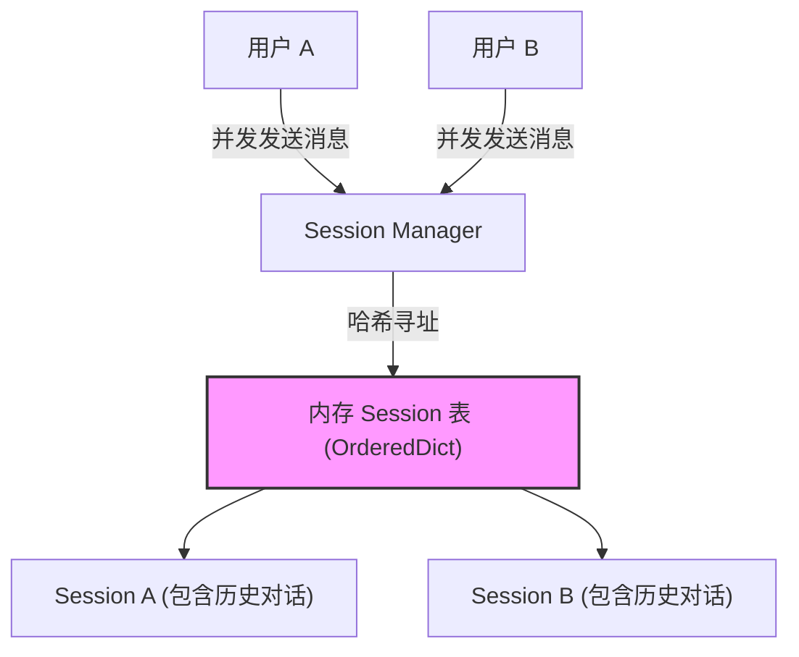
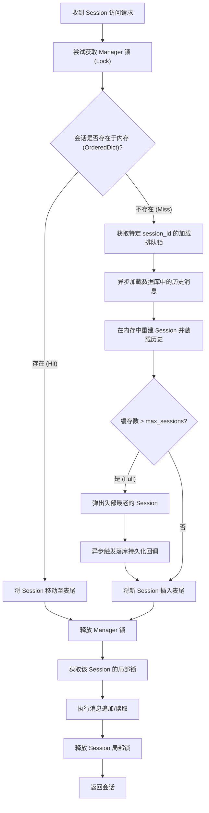

# 并发安全的 Session 会话管理器与 LRU 淘汰机制

在构建工业级多用户 Agent 系统（例如智能客服系统、并发多租户助理）时，如何高效、安全地管理用户的会话状态（Session）是系统稳定性的基石。本篇笔记将剖析高并发场景下的会话状态隔离、协程并发安全保护、二级缓存热装载设计以及缓存击穿防范。

---

## 1. 业务场景与内存溢出隐患

在智能客服系统中，数以万计的用户可能同时在线与 Agent 交互。每个用户拥有独立的 `Session`，用以存储其专属的消息历史（Message History）、系统提示词（System Prompt）以及临时决策元数据。



### 痛点指标量化对比

| 指标 | 未采用 LRU 与并发锁的系统 (原生 Dict) | 采用并发安全 LRU 与二级缓存热装载的系统 |
| :--- | :--- | :--- |
| **内存增长趋势** | 持续暴涨，随用户总量呈线性 $O(N)$ 增长，最终导致 **OOM (内存溢出)** | 内存大小恒定，通过 `max_sessions` 限制物理内存占用上限 |
| **高并发数据一致性**| 发生**竞态条件 (Race Condition)**，多协程并发写入时可能导致消息覆盖或上下文丢失 | 使用 `asyncio.Lock` 序列化读写，保障协程强一致性 |
| **持久化与回装机制** | 无淘汰落地，完全依赖手动或全局周期清理，实时性差且易丢历史 | 淘汰时触发回调**落库 (Evict)**；未命中时触发**热装载 (Lazy Load)** 恢复历史 |
| **并发高吞吐防击穿** | 并发读取不存在的会话时，可能会触发多次数据库查询或重复创建会话 | 引入**双重检查锁 (Double-Checked Locking)** 机制，防止缓存击穿 |

---

## 2. 协程并发安全下的会话隔离机制

在 Python 的 `asyncio` 异步编程中，虽为单线程，但在执行异步 I/O 操作（如等待大模型响应 `await client.chat(...)`）时，协程会主动交出 CPU 控制权。
若在等待期间，同一个用户发起了另一次并发请求（例如快速连击发送），它们操作同一个 Session 字典时，没有锁保护就会发生多协程对单个 Session 历史列表的交叉读写。

### 核心锁机制设计
1. **Manager 级锁**：保护整个会话缓存表的增删、LRU 优先级调整等 OrderedDict 操作的原子性。
2. **Session 级锁**：保护单个会话内消息列表追加（`append`）和状态更新的原子性，确保消息先后顺序不乱。

---

## 3. LRU 缓存设计与二级缓存（回装/落库）机制

**LRU（Least Recently Used, 最近最少使用）** 算法的核心思想是：如果数据最近被访问过，那么将来被访问的几率也更高。当缓存空间满时，优先淘汰最久未被访问的数据。

在工业级设计中，淘汰不仅仅是“丢弃”，而是将冷数据**持久化（Evict/落库）**；当该用户再次请求时，从数据库中**热装载（Lazy Load/回装）**其历史数据至内存，重新调整 LRU 优先级。



---

## 4. 防御性并发安全与缓存击穿防护（Double-Checked Locking）

在高并发多用户同时访问同一个不存在的或已被淘汰的 Session 时，如果没有防护，会导致并发协程都判定缓存未命中，从而同时发起数据库查询并重复执行加载。

我们在内存不命中时，对当前 `session_id` 引入细粒度加载锁，并在获取锁后再次进行内存检索（双重检查），确保只有一个协程去加载数据或创建会话，其余协程排队等待并直接复用。

### 极简核心逻辑伪代码（包含防击穿与二级缓存）

```python
async def get_session(self, session_id: str) -> Session:
    # 1. 快速检索内存
    async with self.lock:
        if session_id in self.sessions:
            self.sessions.move_to_end(session_id)
            return self.sessions[session_id]

    # 2. 内存未命中，排队加载锁（防止并发击穿）
    sid_lock = self.get_or_create_session_lock(session_id)
    async with sid_lock:
        # 双重检查，防止其他协程已完成加载
        async with self.lock:
            if session_id in self.sessions:
                return self.sessions[session_id]
        
        # 3. 从数据库热装载
        history = await self.db_load(session_id)
        session = Session(session_id, history)
        
        # 4. 插入内存，若超出容量，则淘汰并执行异步落库
        evicted = None
        async with self.lock:
            self.sessions[session_id] = session
            if len(self.sessions) > self.max_sessions:
                _, evicted = self.sessions.popitem(last=False)
        
        if evicted:
            await self.db_save(evicted)
            
        return session
```
