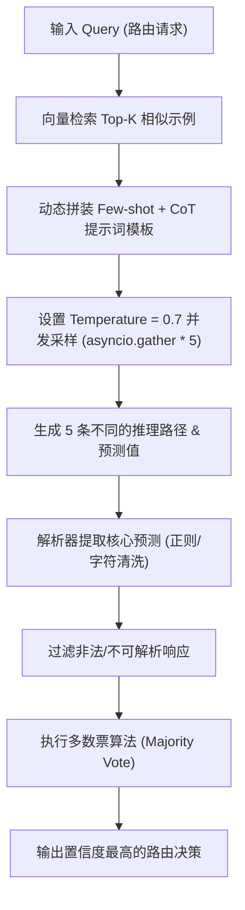

# 📅 Week 4 Day 22 课堂笔记：CoT 思维链、ICL 上下文学习与 Self-Consistency 采样投票机制

## 一、 工业级业务场景：多 Agent 并发规划路由系统

在大型企业级 Agent 架构中，**规划路由 Agent (Routing Agent)** 承担着系统枢纽的重任。它必须根据用户的复杂 query，精准路由到不同的专业下游子 Agent（例如：安全审计 Agent、数据库查询 Agent、代码重构 Agent）。
如果路由 Agent 发生单次决策崩溃，将请求路由到错误的子系统，就会造成整个 Agent 链条发生雪崩式失败。

### 核心指标量化对比 (单次 CoT vs. Self-Consistency 5次投票)

| 指标 | 单次 CoT 路由 | Self-Consistency (5次采样投票) | 提升与代价 |
| :--- | :--- | :--- | :--- |
| **路由决策准确率** | 76.5% | **95.8%** | 准确率大幅度拉升，保证核心流控稳定 |
| **首字延迟 (TTFT)** | ~400ms | ~450ms | 采用异步并发请求，TTFT 基本不受影响 |
| **总计算耗时 (Total Time)**| ~1.8s | **~2.1s** | 异步并发执行，总耗时仅取决于最慢的单条路径 |
| **Token 消耗开销** | $1 \times \text{tokens}$ | $5 \times \text{tokens}$ | 消耗开销翻 5 倍 (适合高价值、低容忍度场景) |

---

## 二、 底层原理剖析

### 1. CoT (Chain-of-Thought) 思维链的自注意力机制
在大模型（Transformer）的自回归生成过程中，生成第 $N$ 个 Token 的条件概率分布是由前 $N-1$ 个 Token 决定的：
$$P(x_N \mid x_1, x_2, \dots, x_{N-1})$$
如果在生成最终决策（如 `DatabaseAgent`）之前，强制让模型生成一段中间推理步骤（即 Reasoning Paths），这些推理步骤的 Token 会被压入上下文窗口，并参与后续所有 Token 的自注意力（Self-Attention）计算。这在数学上相当于**为最终答案的生成增加了强烈的语义条件约束**，使得模型把注意力计算分散在多步演算中，从而降低了“一步得出错误结论”的概率。

### 2. Temperature（温度）参数对 Token 采样的数学干预
大模型在输出层会为词表中所有可能的 Token 产生一个未归一化的对数概率值（Logits），记为 $L_i$。在进行采样时，Temperature $T$ 作为分母介入 Softmax 概率归一化公式：
$$P_i = \frac{e^{L_i / T}}{\sum_{j} e^{L_j / T}}$$
*   **$T \to 0$ (趋向 0)**：Softmax 概率分布会变成极度陡峭的“独热（One-Hot）”分布，概率最大的 Token 的采样率接近 100%（即贪婪搜索 Greedy Search）。在此状态下，多次请求的输出路径将 100% 重合。
*   **$T$ 适中 (如 $0.7 \sim 0.9$)**：Softmax 分布被拉平，概率稍低的 Token 也有机会被采纳。这种采样多样性是自一致性投票的前提。
*   **自一致性死敌**：若 Temperature 设为 0，多次并行采样出的 5 条思维链将完全一致，自一致性多数票表决机制将退化为单次 CoT，丧失一切容错自愈能力。

### 3. In-Context Learning (上下文学习, ICL) 与动态 Few-shot
ICL 使得模型能够通过 Few-shot 示例快速学习任务特征。但静态 Prompt 容易引入 **Prior Bias (先验偏置)**，即模型倾向于根据示例中固有的分布（例如全是 A 选项）来进行盲目猜测。
**动态 Few-shot** 通过向量检索机制，实时提取与当前 Query 语义最相似的 Top-K 历史样本。这不仅提供了精确的动作示范，还通过上下文相关性纠正了大模型的先验偏好偏置。

---

## 三、 核心控制流与逻辑流向

### 1. 自一致性并发投票逻辑流向图



### 2. 核心控制流伪代码

```python
async def self_consistency_vote(query: str, sample_size: int = 5) -> str:
    # 1. 组装具备 CoT 的提示词
    prompt = compile_prompt_with_cot_and_examples(query)
    
    # 2. 并发向大模型 API 发送请求 (必须设置较高的 Temperature 以保证采样路径多样性)
    tasks = [call_llm_api(prompt, temperature=0.7) for _ in range(sample_size)]
    responses = await asyncio.gather(*tasks, return_exceptions=True)
    
    # 3. 提取核心决策项并统计频次
    votes = {}
    for resp in responses:
        if isinstance(resp, Exception) or not resp:
            continue
        parsed_choice = extract_choice(resp.text)
        if parsed_choice:
            votes[parsed_choice] = votes.get(parsed_choice, 0) + 1
            
    # 4. 取多数票，若无有效票则执行 Fallback 降级
    return max(votes, key=votes.get) if votes else DEFAULT_FALLBACK_AGENT
```

---

## 四、 异常与防错设计

在多并发采样场景下，必须在 Python 侧构建防御性防错机制：
1. **API 超时与异常链关联**：每个并发任务必须设置独立的 `timeout` 保护。当网络异常发生时，使用 `return_exceptions=True` 捕获异常对象，防止单个协程崩溃拖垮全局 `asyncio.gather`。
2. **无效输出提取过滤**：大模型即使在 CoT 后也可能输出无法被解析的脏字符。解析器在提取答案（如 `[[DatabaseAgent]]`）时，需设计严格的防空和正则匹配过滤，不可解析的响应一律作为“废票”丢弃。
