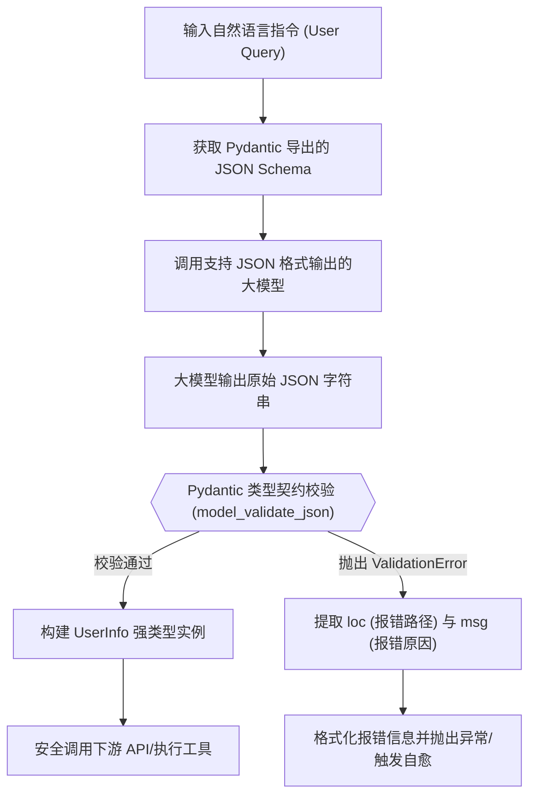

# 📅 Week 4 Day 23 课堂笔记：大模型原生结构化输出与 Pydantic 边界类型契约

## 一、 工业级业务场景：大模型工具调用与参数拦截网关

在构建复杂的 Agent 系统时，大模型经常需要将自然语言转化为特定的结构化指令或参数，并将其传递给外部系统 API（例如：向 CRM 系统插入用户信息、调用云函数创建资源、触发数据库更新操作）。
在没有严格约束的情况下，大模型输出的 JSON 容易出现以下异常：
1. **字段缺失或溢出**：漏掉必填字段或产生冗余字段；
2. **类型不匹配**：将需要整型（`int`）的字段输出为字符串（`str`），或者把邮箱、URL 等格式写错；
3. **结构嵌套破损**：在多层嵌套的字典/列表中出现括号不匹配，直接导致 JSON 无法解析。

这些异常直接传递到下游强类型系统时，会导致服务器抛出 500 崩溃，严重威胁 Agent 系统的整体稳定性。

### 核心技术方案量化对比 (非严格 JSON 提示词 vs. Pydantic 类型契约校验)

| 衡量指标 | 纯提示词约定 JSON | Pydantic 类型校验网关 | Structured Outputs (大模型严格模式) |
| :--- | :--- | :--- | :--- |
| **JSON 解析失败率** | 12.5% ~ 25.0% | **0% (未校验通过的将被拦截)** | **0% (模型在 Token 层面被物理限制)** |
| **异常感知深度** | 语法层（JsonDecodeError） | **语义边界层（ValidationError）** | **语法与边界层** |
| **系统鲁棒性** | 弱，下游服务直接报错 | **强，在 Python 边界拦截并报错** | **极强，由大模型端侧保证 100% 正确率** |
| **性能损耗** | 无额外开销 | 毫秒级 Pydantic 内存校验开销 | 大模型端首次请求解析 Schema 略有 TTFT 延迟 |

---

## 二、 底层原理剖析

### 1. JSON Mode 与 Structured Outputs (严格模式) 的本质区别
*   **JSON Mode (提示词约束)**：
    大模型提供商（如 OpenAI/MiniMax）仅仅是通过在系统 Prompt 后面隐式追加引导语（如 "Please output in JSON format"），并使用通用的 JSON 自回归头。模型在解码（Decoding）过程中仍然是在全量词表（Vocabulary）上进行多项式采样。如果中间发生自注意力偏移，极易输出非合法的 JSON。
*   **Structured Outputs (严格模式)**：
    在该模式下，开发者在请求 API 时必须同时提交一个标准的 JSON Schema。大模型网关的解码器利用该 Schema 构建一个**确定性有限自动机 (DFA, Deterministic Finite Automaton)**。在生成每一个 Token 的过程中，解码器会预测当前状态下合法的 Token 集合，并在 Softmax 采样前对不符合状态机跳转规则的词表 Logits 进行**掩码干预 (Logits Masking)**，强制将其概率设为 $-\infty$。这在数学上保证了生成的 Token 序列在语法上 100% 符合 JSON Schema 的约束。

### 2. Pydantic 运行时类型契约校验机制
Pydantic 是 Python 的数据验证和设置管理库。它不是简单的类型声明，而是一种**运行时类型契约**。
当我们将数据输入给 Pydantic 的 `BaseModel` 时，它会执行以下步骤：
1. **类型强转 (Coercion)**：如果可能，它会自动将兼容的类型进行安全转换（例如将字符串 `"123"` 转为整数 `123`）。
2. **嵌套校验 (Nested Validation)**：递归校验嵌套的模型，如果发现深层错误，能够精确定位到具体的字段路径（如 `skills -> python -> level`）。
3. **自定义拦截器 (Field Validators)**：通过 `@field_validator` 允许开发者在字段制造前注入自定义的业务逻辑校验（例如对邮箱格式进行正则表达式强校验，或者检验数值区间）。

---

## 三、 架构设计与数据流向

### 1. 结构化参数校验拦截与自愈回路流向图



### 2. 核心控制流伪代码

```python
from pydantic import BaseModel, Field, ValidationError

# 1. 定义强类型契约
class ToolArgs(BaseModel):
    name: str
    port: int = Field(..., ge=1, le=65535)

# 2. 校验拦截逻辑
def parse_and_validate_args(raw_json: str) -> ToolArgs | None:
    try:
        # 执行运行时校验，并进行类型强转
        args = ToolArgs.model_validate_json(raw_json)
        return args
    except ValidationError as e:
        # 捕获异常，分析出错的具体字段与原因
        for error in e.errors():
            field_path = " -> ".join(map(str, error["loc"]))
            error_reason = error["msg"]
            print(f"安全拦截: 字段 [{field_path}] 校验失败，原因: {error_reason}")
        raise e
```

---

## 四、 异常与防错设计

在捕获 `pydantic.ValidationError` 时，其内部包含非常丰富的结构化错误元数据，决不能仅通过简单的 `print(e)` 打印。
每个错误详情主要由以下字典字段构成：
*   **`loc`**：一个元组（Tuple），记录从根到叶子的错误路径，例如 `('skills', 'python', 'level')`。对于精确定位多层嵌套数据中的脏数据极其关键。
*   **`msg`**：友好的报错说明，如果是自定义验证器，会包含 `ValueError` 中抛出的自定义文案。
*   **`type`**：异常类型代码（如 `less_than_equal`、`value_error`）。
*   **`input`** : 导致这次校验失败的原始输入值。

在编写生产级 Agent 时，必须对 `ValidationError` 进行优雅的格式化解析，并在控制台或日志系统中清晰展示其越界细节，以便于系统做出重试决策或为前端返回精确的输入表单提示。
