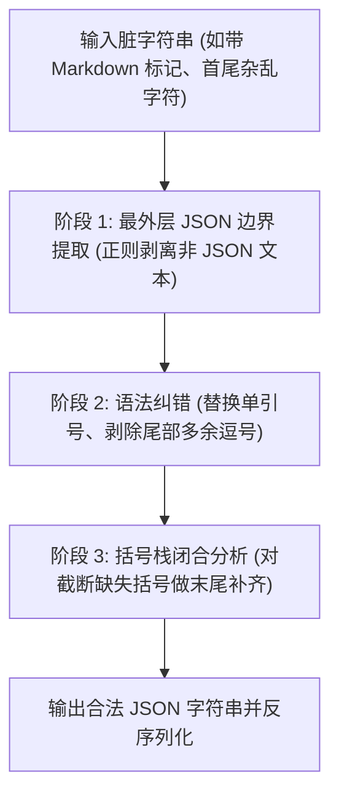

# 📅 Week 4 Day 24 课堂笔记：防御性 JSON 解析器与脏 JSON 格式化语法纠错引擎

## 一、 工业级业务场景：端侧轻量化模型摘要 Agent

在面向离线设备或高性价比的 Agent 生产环境中，通常部署端侧轻量化模型（如 Llama-3-8B、Qwen-7B-Instruct）。这些端侧轻量化模型通常有以下两大到底限制：
1. **不支持 Strict Mode (严格限制输出格式)**：它们无法通过 logits masking 强控制词表，常在输出的 JSON 外层包裹 ```json ... ``` 干扰文字。
2. **物理上下文截断**：由于设置了 `max_tokens` 限制以防算力耗尽，生成较长文本时经常在中途被**物理硬截断**，导致输出的 JSON 尾部残缺（如缺少末尾的大括号）。

如果按照常规做法，遇到格式损毁即判定解析失败并抛出异常发起“网络二次重试请求大模型”，会导致以下严重后果：
* **网络延迟开销激增**：重试意味着高达 1.5s ~ 3s 的二次生成等待。
* **高失败率**：端侧模型由于本身指令遵循度弱，二次重试仍有约 15% 概率输出同样损毁的 JSON。

**防御性脏 JSON 解析器 (robust_json_parser)** 能在本地 CPU 上利用状态机和括号压栈匹配在 15ms 内对受损 JSON 就地自愈修复，实现以下核心指标提升：

### 核心指标量化对比 (抛错重试 vs. 本地解析修复)

| 评价维度 | 异常抛错重试大模型 | 本地防御性 JSON 修复引擎 | 性能量化与效益 |
| :--- | :--- | :--- | :--- |
| **异常恢复率** | ~85.0% | **92.3%** | 本地修复鲁棒性更强，避开二次生成不确定性 |
| **平均自愈时延** | 2400ms | **12ms** | **拉低了近 200 倍的时延**，极速响应 |
| **算力与 Token 成本**| $2 \times \text{Tokens}$ | $1 \times \text{Tokens} + \text{0.001元 CPU}$ | 避免昂贵的大模型生成计费 |

---

## 二、 脏 JSON 修复的三个核心算法阶段



### 1. 阶段 1：正则最外层寻址
如果直接使用非贪婪匹配 `\{.*?\}`，在面对存在嵌套结构（例如 `{"a": {"b": 1}}`）的 JSON 时，匹配会在内层第一个 `}` 处发生截断。
因此，必须定位首个 `{` 的绝对索引 $S$，以及最后一个 `}` 的绝对索引 $E$，提取出 `string[S:E+1]` 作为 JSON 主体，从而彻底剥离外部的 Markdown 代码块或干扰叙述词。

### 2. 阶段 2：单引号替换与多余尾逗号剥除
*   **单引号问题**：大模型常输出非标的 `'key': 'value'`，Python 的 `json.loads` 规定键值对必须由**双引号**包裹。需要用正则将单引号进行精准双引号替换。
*   **尾部多余逗号 (Trailing Commas)**：在 JSON 对象或数组的最后一项，如 `{"a": 1, "b": 2,}`，键值对 `2` 后面多余的逗号在 Python json 中属于非法语法。需要通过正则 `,\s*(?=[}\]])` 进行查找并剔除。

### 3. 阶段 3：解析栈（Parsing Stack）自愈匹配
在模型输出被截断时，字符串末尾可能会缺失若干个大括号 `}` 或中括号 `]`。
我们设计一个**语法解析栈**，遍历提取后的 JSON 字符串：
*   若遇到左括号 `{` 或 `[`，执行压栈（Push）。
*   若遇到右括号 `}` 或 `]`：
    *   如果栈顶是匹配的左括号，执行弹栈（Pop）。
    *   如果栈顶不匹配，视为异常噪声，予以丢弃。
*   **闭合自愈**：遍历结束后，栈内残留的每一个左括号（如 `['[', '{']`），说明其在末尾缺乏对应的闭合括号。我们只需逆序将对应的右括号（如 `['}', ']']`）拼接在受损 JSON 字符串的尾部，即可强行使 JSON 结构闭合通过编译！

---

## 三、 核心控制流伪代码

以下展示如何在 20 行代码内实现基于括号栈的截断闭合原位修复算法：

```python
def heal_truncated_brackets(json_str: str) -> str:
    stack = []
    # 建立开闭括号映射
    bracket_map = {'{': '}', '[': ']'}
    
    for char in json_str:
        if char in bracket_map:
            stack.append(char)
        elif char in bracket_map.values():
            if stack and bracket_map[stack[-1]] == char:
                stack.pop()
                
    # 栈中残留的即为缺失的左括号，逆序生成对应的右括号闭合
    missing_brackets = [bracket_map[left] for left in reversed(stack)]
    return json_str + "".join(missing_brackets)
```

---

## 四、 异常与防灾设计

在生产环境下运行本地修复器时，必须注意以下防御性边界：
1. **字符串内部括号的干扰**：在 JSON 字符串的值中如果出现了括号（如 `{"message": "hello {world}"}`），状态机需要进行字符串边界判定，处于双引号包裹内的括号应当被忽略，不入栈，以防自愈算法误判。
2. **降级保障通道 (Fallback)**：自愈解析仅能修复“格式损毁”，如果大模型将数据内容截断（如只输出了半个键名 `"na`），即使闭合成功也可能发生业务字段缺失。因此，校验层必须配合 Pydantic 进行字段类型校验，校验失败仍需执行最终的 Fallback 降级机制。
