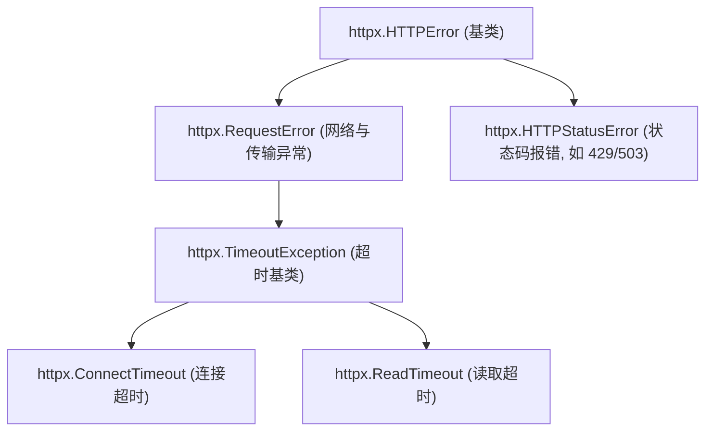
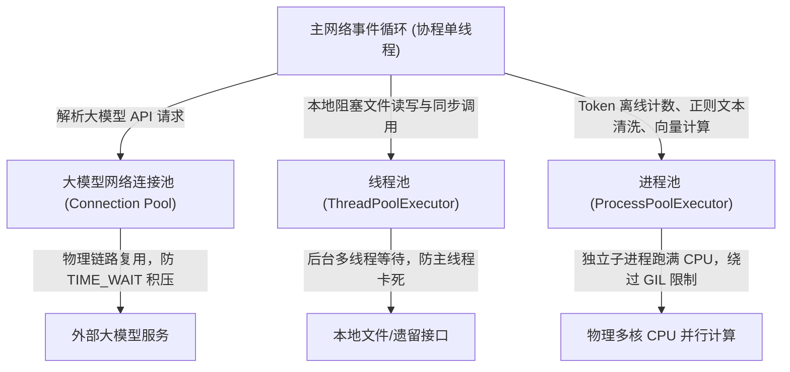

# 📅 Week 4 Day 26 课堂笔记：HTTPX 连接池优化与 HTTP 异常工程

## 一、 工业级业务场景：高并发多 Agent 系统中的网络端口枯竭灾难

在高并发 Agent 运行环境（如：多 Agent 并行代码审查、舆情高频监控诊断）下，系统需要在短时间内向大模型 API 发起数百次异步请求。
*   **不复用连接的灾难**：如果每次网络调用都通过 `async with httpx.AsyncClient() as client:` 临时实例化一个客户端，会迫使系统在每次请求时重新发起 TCP 三次握手与 TLS 安全协商。请求结束后，套接字关闭，导致大量的 TCP 连接在 OS 内核中处于 `TIME_WAIT` 状态（默认持续 60s ~ 240s）。在高并发下，会迅速耗尽服务器的临时端口资源，抛出 `OSError: [Errno 99] Cannot assign requested address` 导致整个 Agent 服务崩溃挂起。

**复用 HTTPX 异步连接池 (Pooled Async Connection)** 能实现 TCP 链路保活（Keep-Alive），对 Agent 吞吐进行极致性能优化：

### 核心指标量化对比 (单次实例化 vs. 异步连接池复用)

| 评价维度 | 单次实例化新建连接 (`httpx.Client`) | 异步连接池复用 (`httpx.Limits` 调优) | 性能量化与效益 |
| :--- | :--- | :--- | :--- |
| **高并发崩溃率** | 极高 (并发 > 200 即端口耗尽) | **0.0%** | TCP 复用，系统套接字数量保持稳定常数 |
| **TLS 握手延迟** | 每次请求约增加 150ms ~ 300ms | **仅首次请求发生** | 消除重复握手，**平均时延拉低近一倍** |
| **首字延迟 (TTFT)** | ~450ms | **~180ms** | 显著提升流式响应首字吐出速度 |

---

## 二、 httpx.AsyncClient() 异步机制详解

在 Python 开发中，传统的 `requests` 库是**同步阻塞型（Sync Blocking）**的。当调用 `requests.post()` 时，Python 解释器当前线程会被强制挂起，直到大模型网络响应返回。在多 Agent 并发场景中，这会导致其他并发协程被全部卡死，系统退化为单线程串行。

`httpx.AsyncClient()` 原生支持 `async/await` 异步非阻塞规范，是构建高性能 Agent 系统的网络基石。

### 1. 底层事件循环驱动原理
*   **非阻塞 Socket**：`AsyncClient` 在底层通过非阻塞套接字（Non-blocking Sockets）发起网络连接。
*   **I/O 多路复用 (I/O Multiplexing)**：当 Agent 发送大模型请求后，协程通过 `await` 关键字将控制权交还给 Python 事件循环（Event Loop）。此时 CPU 处于空闲状态，可以立即去调度运行其他的 Agent 逻辑或发送其他的并发网络请求。
*   **事件唤醒**：当大模型服务器的数据包（Token 块）通过网卡抵达操作系统网络协议栈时，内核唤醒事件循环，原协程在原断点处恢复执行，读取数据。

### 2. 上下文生命周期控制陷阱
在编写 HTTPX 代码时，很多新手会陷入以下反模式（Anti-pattern）：

```python
# 🚨 反模式：在并发函数内部频繁使用上下文管理器
async def call_llm(payload):
    async with httpx.AsyncClient() as client:  # 每次调用都开闭连接
        return await client.post("...", json=payload)
```
*   **为什么这是错的**：`async with` 上下文管理器在退出代码块时，会隐式调用 `await client.aclose()` 强行关闭底层的 TCP 套接字并清空池。这导致每次高并发请求依然在频繁经历 TCP 三次握手和 TLS 握手重建，**连接池彻底失效**。
*   **正确的工程设计**：必须将 `AsyncClient` 实例作为**长生命周期单例（Long-lived Singleton）**挂载在客户端类的属性或全局变量中，直到整个 Agent 系统服务下线时，才统一调用一次 `aclose()` 关闭连接池。

---

## 三、 HTTPX 连接池与超时四维矩阵

### 1. 异步连接池复用原理
HTTP 协议的 `Keep-Alive` 允许在同一个 TCP 连接上发送多个 HTTP 请求。
HTTPX 通过 `httpx.Limits` 在内存中维持一个保活连接队列，当一个大模型请求结束后，该连接不关闭，而是放回池中，供下一个 Agent 请求复用。

```
[Agent 协程并发] ➔ [向 Pool 申请 Idle 连接] ➔ [TCP 链路复用 (无需重新握手)] ➔ [归还连接至 Pool]
```

### 2. 精细化调优配置参数
*   **`max_connections` (最大连接数限制)**：连接池允许同时打开的最大 TCP 连接总数。高并发下应上调该值（如 100），防止协程在池外排队发生池超时。
*   **`max_keepalive_connections` (最大保活连接数)**：当请求空闲时，池中允许保留的最大 Keep-Alive 连接数。如果设得太低（如默认的 20），空闲时多余连接会被销毁，从而在下一次高并发波峰来临时重新握手。

### 3. 超时四维矩阵 (Four-Dimensional Timeout)
HTTPX 弃用了简单的单一超时，引入了精细的四维超时控制以防止 Agent 被死锁：
*   **`connect` (连接超时)**：建立 TCP 连接的最长等待时间。大模型服务若节点挂起，此配置可快速熔断（推荐 5.0s）。
*   **`read` (读取超时)**：等待大模型输出下一个 Token 块的最大时间。大模型推理长文本耗时较长，此值必须放宽（推荐 60.0s），防止被提前误杀。
*   **`write` (写入超时)**：向网络缓冲区发送请求数据的最大时间（推荐 5.0s）。
*   **`pool` (池等待超时)**：当连接数达到 `max_connections` 且无空闲连接时，协程在池外等待可用连接的最长时间（推荐 10.0s），超时抛出 `PoolTimeout`。

---

## 三、 HTTP 异常工程继承树与退避重试流



### 指数退避与随机抖动重试机制 (Exponential Backoff with Jitter)
当遇到网络抖动（Timeout）或服务限流（HTTP 429 Too Many Requests）时，不能立即重试，否则会形成“惊群效应（Thundering Herd）”，使大模型服务器负载更加雪上加霜。
*   **指数退避**：重试间隔随次数指数级增长（$Delay = \text{base\_delay} \times 2^{\text{attempt}}$）。
*   **随机抖动 (Jitter)**：在计算出的延迟上加入随机数（如 $\pm 20\%$ 随机波动），错开高并发 Agent 并行重试的冲突时间点。

---

## 四、 核心控制流伪代码

以下展示如何在 20 行内构建带指数退避和四维超时的连接池请求客户端：

```python
import httpx
import asyncio
import random

async def request_with_retry(client: httpx.AsyncClient, url: str, payload: dict) -> dict:
    retries = 3
    base_delay = 1.0
    for attempt in range(retries):
        try:
            # 使用池中的连接发送请求，并配置精细超时
            response = await client.post(url, json=payload)
            response.raise_for_status()
            return response.json()
        except (httpx.TimeoutException, httpx.HTTPStatusError) as e:
            if attempt == retries - 1:
                raise e
            # 计算指数退避并注入 Jitter 抖动
            delay = (base_delay * (2 ** attempt)) + random.uniform(0, 0.2)
            await asyncio.sleep(delay)
```

---

## 五、 生产级高并发铁三角：协程、线程池与进程池容量调优

在企业级大模型 Agent 开发中，单靠协程无法包揽一切任务。为了充分压榨硬件性能并确保主事件循环不卡死，生产级系统通常会根据任务物理属性，混合使用**协程**、**线程池**和**进程池**。

### 1. 并发模型核心特征对比

| 并发维度 | 管理调度实体 | 核心应用场景 | 物理计算限制与瓶颈 | 生产容量调优经验值 |
| :--- | :--- | :--- | :--- | :--- |
| **协程 (Coroutine)** | 用户态事件循环 (Event Loop) | 海量异步网络 I/O (大模型请求、Redis) | 物理 I/O 连接池大小、OS 文件描述符 (ulimit) | 大模型网络池连接数建议配置为 `max_connections = 30 ~ 100` |
| **线程池 (ThreadPool)**| 操作系统内核级线程 | 同步阻塞 I/O (本地文件读写、老旧单线程 SDK) | 内核上下文切换开销较重，受 Python GIL 锁限制 | 经验公式：$N_{\text{threads}} = \text{CPU核心数} \times 5$，或固定 `64 ~ 128` |
| **进程池 (ProcessPool)**| 操作系统独立物理进程 | 重度 CPU 计算 (分词 Token 计数、向量计算、PDF清洗)| 启动开销极重，抢占物理 CPU。不受 GIL 锁影响 | 经验公式：$N_{\text{processes}} = \text{CPU物理核心数} - 1$ (保留一核) |

### 2. 生产级 Agent 高并发混合协作拓扑

在生产级 Agent 运行环境中，三者的协作分工流向如下：



### 3. 容量调优核心法则
1.  **协程并发受阻于网络 Limits**：千万不要以为协程开得越多越好。如果底层 `httpx.Limits` 只配了 50，那么 1000 个并发协程中的 950 个依然会在池外排队等待。
2.  **线程池切忌超配**：同步 I/O 线程数不能配成几千个，上下文切换（Context Switch）的系统开销会拖垮主线程事件循环。
3.  **进程池配置必须留出一核**：进程池配置为 `CPU 核心数 - 1`，留出一个空闲核心专门服务于事件循环与操作系统日常调度。如果强行配满，一旦后台跑重度 CPU 计算，主线程协程将因为抢不到 CPU 时间片而发生严重假死。

