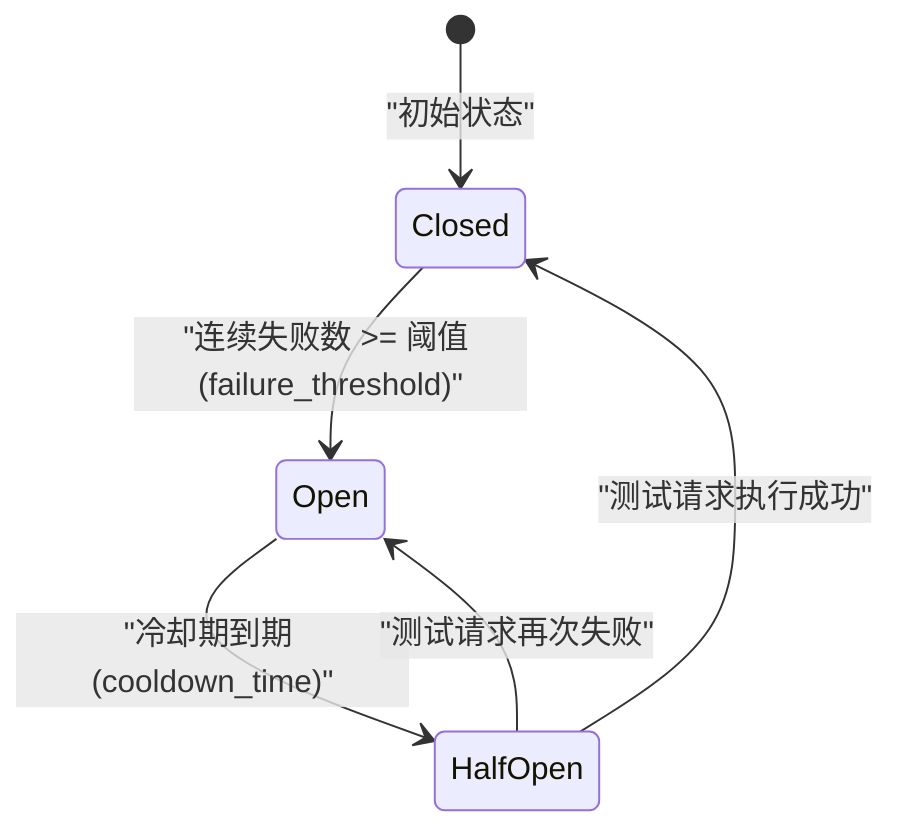
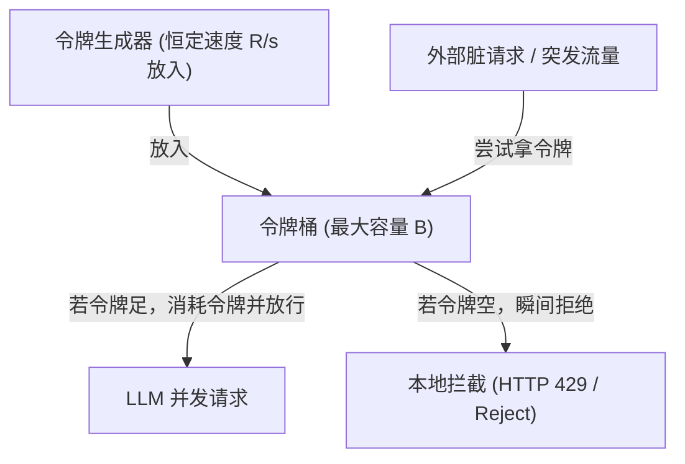

# 📅 Week 4 Day 27 课堂笔记：工具安全护栏与熔断状态机引擎

## 一、 工业级业务场景：大模型服务雪崩下的级联死锁

在高频自动化工单分配或多 Agent 并行分析场景中，系统如果遭遇云端大模型接口过载（HTTP 503 / 429）或网络骨干网抖动，如果系统不具备**熔断保护**，就会引发以下灾难性链式反应：
1.  **无效重试拖死客户端**：数百个协程仍在根据退避策略拼命向受损服务器发送无效的 HTTP 请求。
2.  **池排队死锁**：所有连接卡在连接池外等待连接释放，耗尽 `pool_timeout`。
3.  **惊群效应压垮服务端**：客户端不受控的重试洪峰会使已经过载的服务端彻底瘫痪，无法自愈。

**工具熔断保护器 (Circuit Breaker)** 能够在本地快速拦截垃圾流量，实施**快速失败 (Fail-Fast)**，保护系统高可用：

### 核心指标量化对比 (无熔断防护 vs. 熔断状态机保护)

| 维度 | 无熔断防护系统 | 熔断状态机安全护栏系统 | 系统防雪崩效益 |
| :--- | :--- | :--- | :--- |
| **突发故障下客户端表现** | 级联死锁，抛出大量池超时崩溃 | **本地 1ms 内快速失败 (Fail-Fast)** | 本地快速返回降级文本，保障核心服务不挂 |
| **对服务端的请求冲撞** | 持续高频重试，恶化服务端负载 | **切断 100% 的垃圾重试流量** | 留给服务端宝贵的冷却和重启自愈时间 |
| **故障后自动恢复** | 需人工干预重启或等待全局重置 | **冷却期过后自动半开探路自愈** | 全自适应状态转换，无缝恢复正常业务 |

---

## 二、 熔断器状态机 (Closed-Open-HalfOpen) 工作原理



### 1. 三大状态流转规则
*   **Closed (闭合/正常运转)**：大模型请求正常向下转发。系统统计连续失败次数，一旦**连续失败数 $\ge$ 阈值**（如 5 次），状态机断开，切为 **Open** 状态。
*   **Open (断开/快速熔断)**：本地直接拦截所有请求，不再向大模型 API 发起物理网络请求。直接抛出 `CircuitBreakerOpenException` 实施快速失败，直到**冷却期 (Cooldown Time)** 到期，状态机切为 **Half-Open**。
*   **Half-Open (半开/尝试自愈)**：状态机放行**极少个（如 1 个）**测试请求去呼叫大模型服务：
    *   如果测试请求**成功**，说明服务已恢复正常，重置状态回 **Closed**，清空失败计数器。
    *   如果测试请求**失败**，说明服务仍在过载，重新切回 **Open**，并重置冷却计时器。

---

## 三、 速率限制器 (Rate Limiter) 算法机制与并发安全防御

高并发下，Agent 系统不仅需要熔断保护，还需要依靠**限流器 (Rate Limiter)** 在客户端进行流量整形，防范大模型服务端发生过载，并抵御恶意攻击。

### 1. 物理概念辨析：并发限制 vs. 速率限制
*   **并发限制 (Concurrency Limiting)**：限制的是“同一瞬间处于进行中的网络连接数（最大飞行请求数）”。例如使用 `asyncio.Semaphore(5)`，即使有 100 个请求排队，也强控制同一毫秒内最多只能有 5 个 TCP 链路在传输。
*   **速率限制 (Rate Limiting)**：限制的是“特定时间窗口内的总请求次数”（如 1 分钟限制 60 次，即 60 RPM）。即使并发度再低，只要在窗口期内总次数超标，即执行拦截。

### 2. 经典限流算法拆解与对比

#### ① 令牌桶算法 (Token Bucket) — 允许突发流量的最佳方案
*   **算法机制**：系统以恒定速率（如每秒 $R$ 个）向容量为 $B$ 的“令牌桶”中填入令牌。每次请求来临时，必须先尝试扣减并获取一个令牌，获取成功则放行；如果桶空了，则请求被丢弃（429 报错）或排队挂起。
*   **核心优势**：**原生支持突发流量 (Burst)**。如果桶内已经积满 $B$ 个令牌，当突发流量涌入时，系统可以在瞬间放行高达 $B$ 的并发请求，随后的请求才退化为按 $R$ 的速率匀速放行。这在 LLM API 调用场景（偶尔连续发出 5 个 Reasoning 请求，随后长等待）中极佳。



#### ② 漏桶算法 (Leaky Bucket) — 极致的流量平滑消峰
*   **算法机制**：请求像水流一样以任意速率灌入“漏桶”，而漏桶底部的洞则以**绝对恒定的速度**（如滴水速度）匀速放行请求。如果流入的水超过了桶的容量上限，则溢出丢弃。
*   **核心优势**：**强制平滑**。绝不允许任何突发（Burst）流量穿透到服务端，起到极致的削峰填谷保护效果。

#### ③ 滑动窗口算法 (Sliding Window Log) — 精确防边界双倍流量穿透
*   **算法机制**：将时间划分为细粒度网格。每次请求到达时，系统会回溯当前时刻前推一个窗口（如 60s）的总请求计数，若计数未满则通过，满则拒绝。
*   **核心优势**：彻底解决了**固定窗口算法 (Fixed Window)** 在临界点时间（如 11:59:59 和 12:00:01 两个周期临界点）由于双倍请求瞬间倾泻导致的服务端击穿问题。

### 3. 服务端过载与恶意攻击防护场景

#### ① 客户端防过载防御 (Backpressure)
当大模型服务端因拥堵响应变慢时（TTFT 由 0.5s 拖长到 5.s），如果客户端不实施防过载保护，排队的请求会迅速塞满内存队列。
*   **背压机制**：当大模型响应延迟陡增时，限流器会自动调低令牌生成速率（或降低信号量并发度），在消费端自动“踩刹车”，将过载压力拦截在客户端，给云端服务留出喘息机会。

#### ② 恶意暴力攻击阻断 (Rate-Limit Shield)
在多用户共享 API Key 的 Agent Web 平台中，恶意用户常通过暴力脚本并发刷单，耗尽共享 Key 的 RPM 限额，造成其他用户的服务被“拒绝服务（DoS）”。
*   **攻击阻断**：在 Agent 入口处对 IP 或 User Token 挂载限流盾（利用令牌桶或滑动窗口）。一旦捕获单个 IP 产生脉冲攻击（如 1 秒内发起 100 次调用），限流器会在本地 1ms 内瞬间熔断抛出异常并拉黑，防止脏流量打到云端大模型导致高昂扣费与并发阻塞。

### 4. 令牌桶限流器极简 Python 伪代码

以下展示如何使用不到 20 行的协程锁，手写实现支持时间戳动态回算补齐的令牌桶限流算法：

```python
import time
import asyncio

class TokenBucketLimiter:
    def __init__(self, rate: float, capacity: float):
        self.rate = rate          # 令牌填充速率 (个/秒)
        self.capacity = capacity  # 桶容量上限
        self.tokens = capacity    # 当前令牌数
        self.last_update = time.time()
        self.lock = asyncio.Lock()

    async def acquire(self) -> bool:
        async with self.lock:
            now = time.time()
            # 根据时间差，动态回算补齐累加生成的令牌数，防止背景定时器空耗 CPU
            generated = (now - self.last_update) * self.rate
            self.tokens = min(self.capacity, self.tokens + generated)
            self.last_update = now
            
            if self.tokens >= 1.0:
                self.tokens -= 1.0
                return True  # 成功获取令牌，放行
            return False  # 令牌不足，拦截拒绝
```

---

## 四、 核心状态机控制伪代码

以下展示如何使用不到 20 行的核心代码实现带有冷却检测的熔断器状态转换逻辑：

```python
import time

class CircuitBreaker:
    def __init__(self, failure_threshold=3, cooldown=5.0):
        self.state = "CLOSED"
        self.failures = 0
        self.cooldown = cooldown
        self.last_state_change = time.time()

    def before_call(self):
        # 处于 Open 状态且超过冷却时间，切为半开
        if self.state == "OPEN" and (time.time() - self.last_state_change > self.cooldown):
            self.state = "HALF-OPEN"
            self.last_state_change = time.time()
            
        if self.state == "OPEN":
            raise Exception("熔断器处于开启状态，请求被拦截！")

    def after_success(self):
        self.state = "CLOSED"
        self.failures = 0

    def after_failure(self):
        self.failures += 1
        if self.failures >= 3:
            self.state = "OPEN"
            self.last_state_change = time.time()
```

---

## 五、 异常与降级设计

1.  **退避降级 (Fallback Graceful Degradation)**：当拦截到 `CircuitBreakerOpenException` 时，Agent 不能直接向终端用户抛错。应当配置安全降级通道（如：当大模型连接熔断时，自动转为本地规则匹配返回兜底文本，或将请求转给低配置的备用离线模型）。
2.  **网络异常分类统计**：并非所有网络异常都算作熔断器的失败计数。由于用户入参错误导致的 HTTP 400 不应计入失败计数，只有系统级的 HTTP 500/503 或物理超时 Timeout 才属于状态机判定的失败指标。
