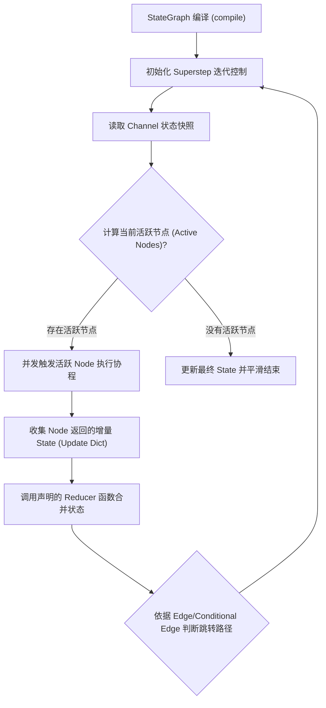
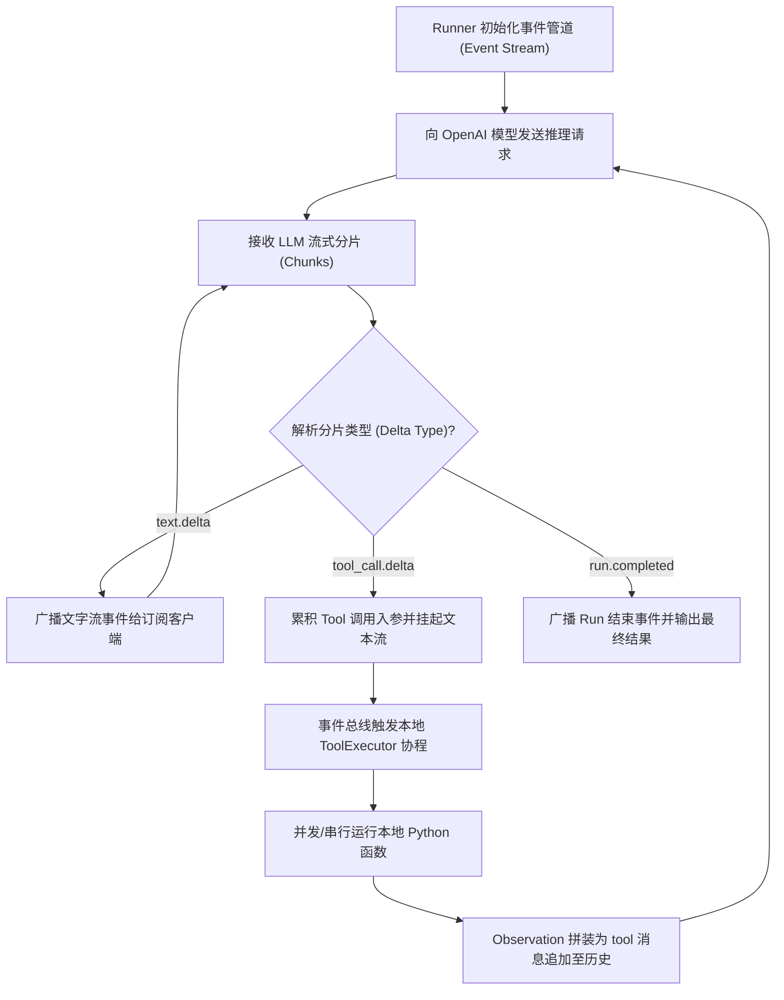
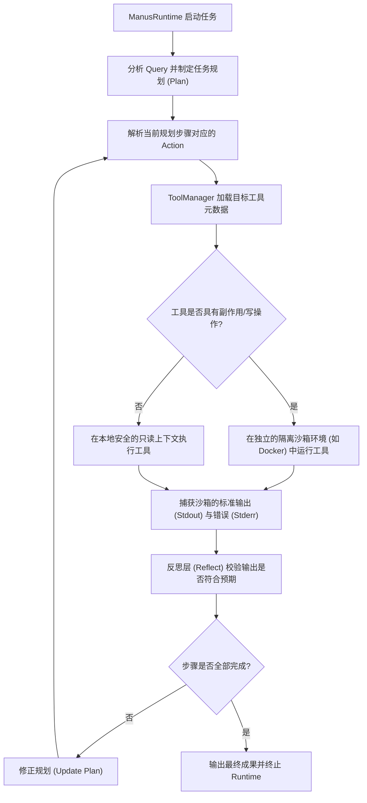
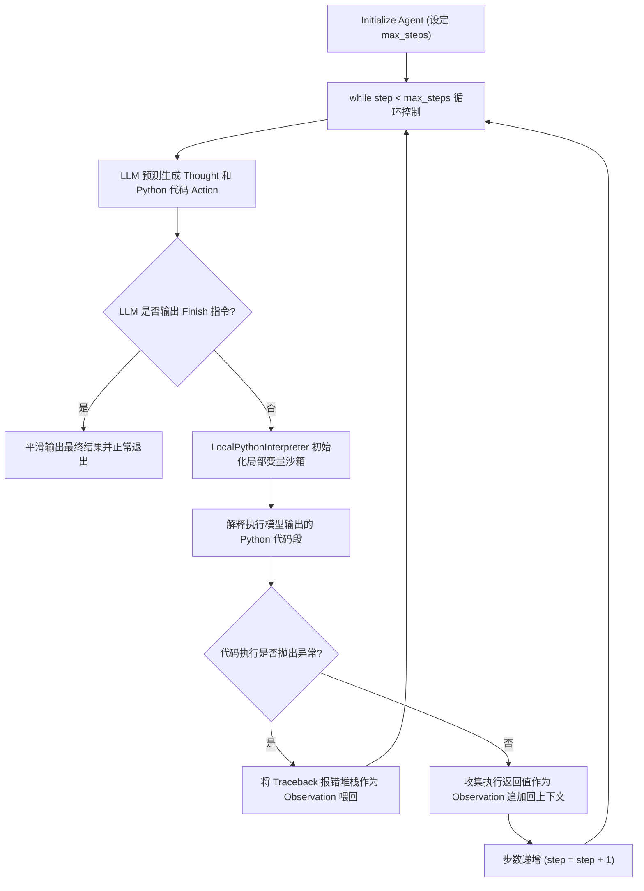

# 深度剖析：主流开源 Agent 框架的核心控制环与工具调度设计对比

在完成 Day 29 的 ReAct 主循环与死循环检测器（`StuckDetector`）的核心实战后，我们需要将目光投向工业级 Agent 框架。工业级系统在面对复杂的业务流控制、大范围并行工具调度以及安全沙箱边界时，给出了不同的系统设计范式。

本篇文档将重点对比并详细分析 **LangGraph**、**OpenAI Agents SDK**、**OpenManus** 和 **smolagents** 四个代表性开源框架的核心设计理念、数据流迁移控制和工具调度机制。

---

## 1. 核心架构特征横向对比矩阵

| 特征维度 | LangGraph | OpenAI Agents SDK | OpenManus | smolagents |
| :--- | :--- | :--- | :--- | :--- |
| **设计哲学** | 将决策链路抽象为拓扑图（带环有向图），重度控制状态流转。 | 事件驱动流式架构，面向异步高频可观测性客户端解耦。 | 模块化 Runtime 调度，重记忆、重规划与物理执行沙箱。 | 极简主义，主张“代码即行动”（Code-as-Action）及轻量沙箱。 |
| **控制流迁移机制** | 基于 **Pregel 算法** 的超级步拓扑节点跳转，不支持简单 while 循环。 | 隐藏 while 循环，基于**事件总线 (Event Loop)** 发送流式 Delta 事件驱动状态前进。 | 显式 Runtime 闭环，按“Plan -> Execute -> Reflect”迭代控制。 | 内置于单方法的极简 `while step < max_steps` 循环体。 |
| **状态容器设计** | 全局集中式 State，通过声明的 **Reducer** 函数增量更新与原子级合并。 | 上下文线程安全的 Message 历史队列，依赖 OpenAI 服务端 Session。 | 独立管理的短期记忆栈（Memory）与多维历史上下文队列。 | 单一 Agent 实例上下文，状态直接挂载在 Python 内存变量中。 |
| **工具调度方式** | 图中的 Node 映射或反射，支持同步/异步工具反射运行。 | 遇到 `tool_call` 事件挂起文本流，利用 `ToolExecutor` 调度并回填。 | `ToolManager` 插件式动态加载，在物理隔离环境内安全解析。 | 内置的受限 Python 解释器在局部作用域中动态执行 Python 代码。 |
| **安全沙箱边界** | 默认在宿主机环境运行（需开发者自行在 Node 内封装安全边界）。 | 由本地 SDK 执行（完全暴露本地执行权限，需自行隔离）。 | 具有物理隔离安全边界（强制将副作用工具放至 Docker 隔离环境）。 | 逻辑作用域级沙箱，控制内置解释器对高危库和内置函数的访问。 |
| **核心适用场景** | 状态迁移拓扑极其复杂、涉及多人协同或循环带环的工业级 Workflows。 | 需要向前端提供打字机流式输出、低时延响应的智能客服与交互助手。 | 自动编码 Agent、需要高安全保障的底层系统维护与运维 Agent。 | 轻量级工具库调度、需要低往返延迟实现多工具复杂嵌套的数据分析系统。 |

---

## 2. 各框架底层设计理念与运行流程剖析

### 2.1 LangGraph: 基于 Pregel 算法的有向图拓扑调度与状态合并 (Reducer)

#### 2.1.1 设计理念
LangGraph 突破了普通 ReAct 线性 while 循环的瓶颈。它认为 Agent 本质上是一个有限状态机（FSM），可以用图（Graph）来定义每一个步骤。节点（Nodes）只负责纯粹的数据计算与状态映射，而状态的迁移则由边（Edges）和基于大模型决策输出的条件边（Conditional Edges）来管控，实现了路由逻辑与逻辑处理的彻底解耦。

#### 2.1.2 状态合并（Reducer）机制
LangGraph 引入了 Reducer 概念。多个并行执行的 Node 返回的增量更新，必须通过在 State 声明时指定的 Reducer（如 `operator.add` 或者是合并/覆盖函数）来进行线程安全的更新合并，这极大地防范了多 Agent 并发读写冲突。

#### 2.1.3 核心控制流状态迁移图

---

### 2.2 OpenAI Agents SDK: 事件驱动流式循环 (Event-Driven Stream Loop)

#### 2.2.1 设计理念
OpenAI Agents SDK 旨在通过解耦的事件模型提供可交互性极强的流式响应。它隐藏了传统的 ReAct `while` 控制链，转而暴露一个高度可订阅的流式事件接口。状态的推进完全依赖模型输出所触发的一连串 Delta 切片事件（如 `text.delta`、`tool_call.delta`）。

#### 2.2.2 工具调度与流式挂起
事件循环在运行中如果解析到 `tool_call`，会触发**状态挂起机制**。文本生成管道被暂停，本地 `ToolExecutor` 触发对应工具协程的执行，并在 Observation 产生后组合为特殊的 `tool` 类型的消息再次送入模型上下文，进而拉起新一轮的 LLM 推理以解挂。

#### 2.2.3 核心控制流状态迁移图

---

### 2.3 OpenManus: 模块化 Runtime 调度与安全工具沙箱

#### 2.3.1 设计理念
OpenManus 是专门为执行高复杂度的操作系统交互、软件开发等任务设计的。在设计理念上，它坚决推行**规划层与执行层的物理隔离**。主 Runtime 引擎（`ManusRuntime`）负责抽象的规划决策、记忆更新与反思，而真正的具体执行动作（尤其是写操作或有副作用的 Bash/Python 工具）则通过 `ToolManager` 路由到独立的物理沙箱内。

#### 2.3.2 物理沙箱安全边界
所有具有破坏性倾向的工具（如在宿主机上运行 rm、修改关键文件或调用任意网络）都会在宿主机外的 Docker 容器或受限的虚拟化环境中运行，有效解决了 Agent 在大并发及逻辑发散下恶意破坏系统的安全问题。

#### 2.3.3 核心控制流状态迁移图

---

### 2.4 smolagents: 极简控制环与 Code-as-Action 执行器 (Lightweight Interpreter Engine)

#### 2.4.1 设计理念
由 Hugging Face 研发的 `smolagents` 主张“极简”与“代码表达力”。它反对使用复杂的 JSON Schema 去限制模型的输出格式，而是推崇 **Code-as-Action** 范式。即大模型不再输出 `{"action": "calculator", "args": {...}}`，而是直接生成一段原生的 Python 代码段。

#### 2.4.2 受限的 Python 解释器
为了安全地运行大模型输出的任意 Python 代码，smolagents 引入了一个非 `eval` 的受限 Python 解释器（`LocalPythonInterpreter`）。该解释器在内存中维护了一套受控的变量上下文作用域，并且限制了高危内置库与操作的访问权限。这种做法使得 Agent 仅在一轮网络往返中即可利用 Python 的循环、条件跳转嵌套调用多个本地工具，大幅度消除了传统的 ReAct 循环往返多次的性能开销。

#### 2.4.3 核心控制流状态迁移图

---

## 3. 工业级场景架构选型指南

在实际业务开发中，我们应该遵循何种技术决策路径？

*   **场景 1：构建企业级多 Agent 代码仓库重构工具**
    *   👉 **建议选型：OpenManus / LangGraph**。代码重构存在巨大的系统副作用风险，必须使用 OpenManus 式的物理 Docker 隔离沙箱。如果是多人并发、多节点依赖的重构流程，利用 LangGraph 的 FSM 状态更新能保障状态不冲突。
*   **场景 2：流式电商客服与业务办理助手**
    *   👉 **建议选型：OpenAI Agents SDK**。此类业务高度依赖极短的 TTFT 与打字机流式交互，且不需要本地系统执行权限。SDK 的流式挂起及事件通道设计是最佳解。
*   **场景 3：本地复杂数据清洗与可视化生成工具**
    *   👉 **建议选型：smolagents**。对于需要多步提取、循环计算并绘制图表的操作，大模型直接输出一段 Python 代码并由 `LocalPythonInterpreter` 并发运行，速度极快（省去了多轮 Tool Call 的往返等待），开发体验极佳。
