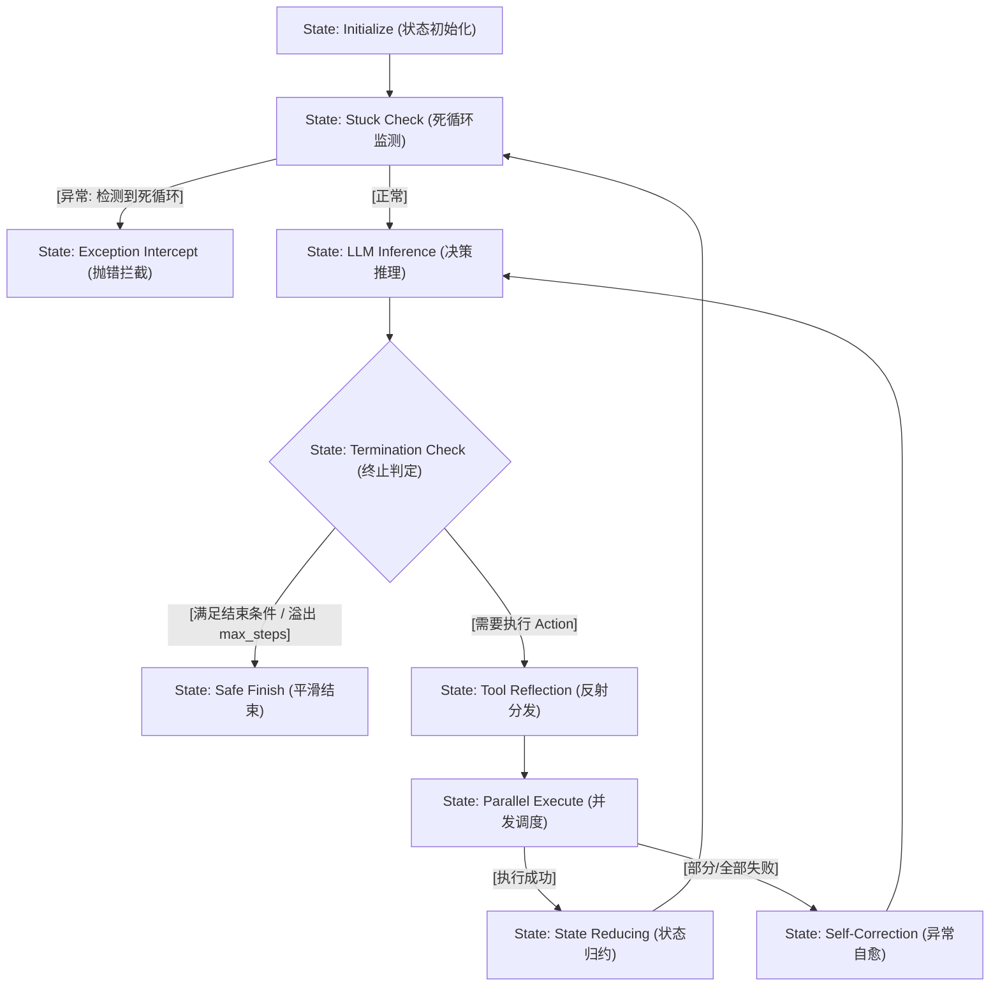

# 课堂笔记：ReAct 决策流有限状态机映射与死循环监测机制

## 1. 业务背景：多 Agent 并发代码审查系统中的死循环隐患

在高度并发的自动化工程链路（例如：多 Agent 并发代码审查系统）中，Agent 需要频繁调用外部静态分析工具（如 `run_linter`、`fetch_git_diff`）来执行自动化审查。若大模型提示词设计不够鲁棒，或工具返回的 Observation 含有意料之外的报错，Agent 极易陷入逻辑打转的病态运行：

*   **逻辑死锁**：模型在 `Thought` 阶段无法正确解析 linter 的报错，生成了与上一轮完全一致的 `Action` 和 `Parameter`（例如重复修复同一行代码而无效）。
*   **财务灾难**：在 `while` 控制环中，如果没有底层的死循环强拦截机制，并发 100 个审查任务时，若有 10% 陷入死循环，将在数分钟内产生数万次无效的 LLM API 调用，带来极高 TTFT 延迟与数千美元的 Token 账单。

---

## 2. ReAct 协议原理与有限状态机 (FSM) 映射

ReAct 范式通过将推理（Reasoning）与行动（Acting）物理结合，驱动一个经典的闭环控制环：
$$\text{Thought} \to \text{Action} \to \text{Observation} \to \text{Thought}$$

为实现工程级生命周期管控，可将 ReAct 控制环映射为**有限状态机 (FSM)**：



---

## 3. Stuck Loop 核心指标量化与滑动哈希窗口检测算法

### 3.1 核心算法设计
死循环检测的核心在于**滑动窗口哈希对比**：
1.  **滑动窗口机制**：维护一个固定大小为 $N$ (通常 $N=3$) 的双端队列（`deque(maxlen=3)`）。
2.  **动作唯一性哈希**：将单次决策的 `Action` 字符串与其参数字典 `Parameter` 序列化为标准化字符串，计算其 MD5 哈希。
3.  **判定条件**：当且仅当滑动队列填满，且队列内所有哈希值完全一致（即集合唯一数量为 1），触发强行拦截。

### 3.2 极简核心逻辑伪代码
```python
class StuckDetector:
    def __init__(self, window_size: int = 3):
        self.window = []
        self.window_size = window_size
        
    def check_and_push(self, action: str, params: dict) -> None:
        # 1. 递归排序字典防止因乱序导致哈希失效
        normalized_params = json.dumps(params, sort_keys=True)
        action_hash = hashlib.md5(f"{action}:{normalized_params}".encode()).hexdigest()
        
        # 2. 维护滑动窗口
        self.window.append(action_hash)
        if len(self.window) > self.window_size:
            self.window.pop(0)
            
        # 3. 判定死循环
        if len(self.window) == self.window_size and len(set(self.window)) == 1:
            raise AgentStuckError("检测到 Agent 陷入死循环拦截。")
```

---

## 4. 异常防错设计：参数规范化与抗扰动防御

大模型生成的 JSON 参数可能带有微小的扰动（例如 key 的声明顺序不同、额外的空格），这会导致直接序列化出来的哈希值不一致，从而发生**死循环漏检**。

### 4.1 字典深度递归排序规范化
在计算哈希前，必须通过递归算法对参数字典的所有 key 进行字母表排序（`sort_keys=True`），并去除所有空白符（`separators=(',', ':')`）。
*   **输入 A**：`{"file": "main.py", "details": {"line": 10, "column": 5}}`
*   **输入 B**：`{"details": {"column": 5, "line": 10}, "file": "main.py"}`
*   **规范化输出**：`{"details":{"column":5,"line":10},"file":"main.py"}` (二者哈希完全相同，防御乱序扰动)
