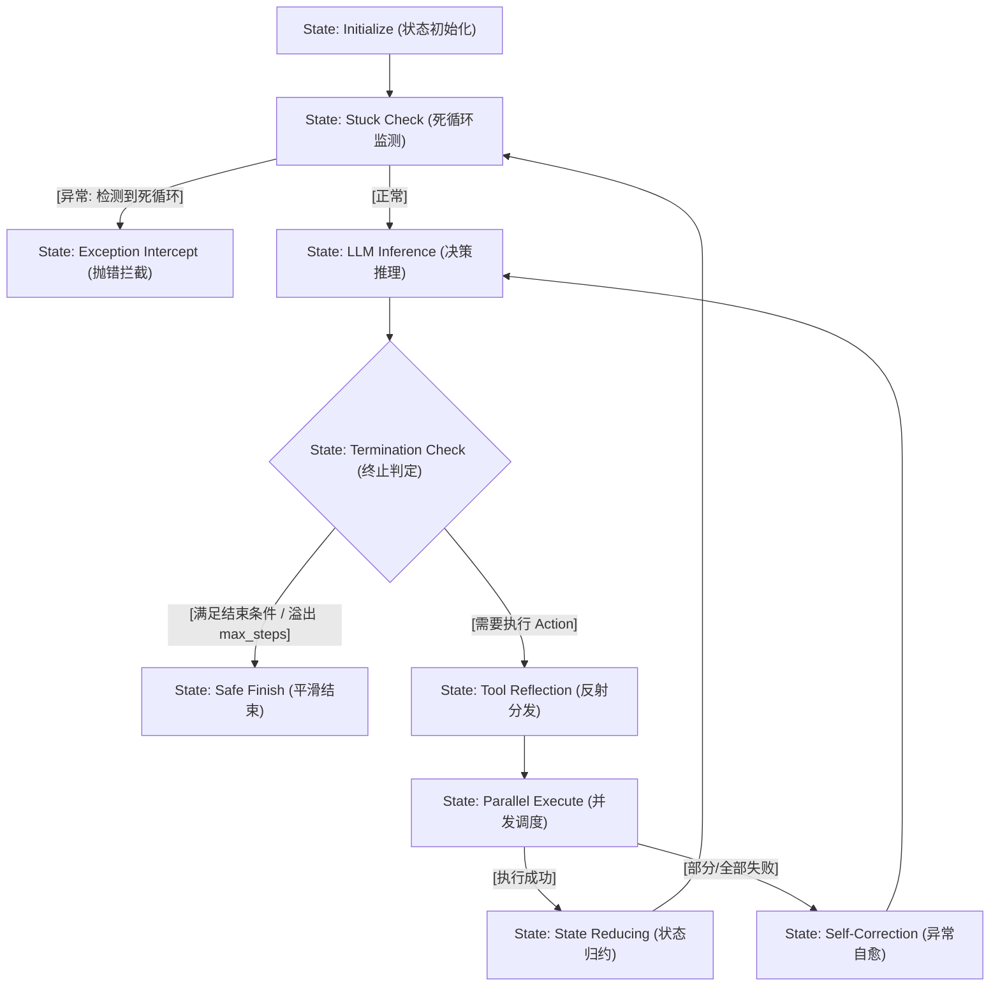

# 课堂笔记：ReAct 决策流有限状态机映射与死循环监测机制

## 1. 业务背景：多 Agent 并发代码审查系统中的死循环隐患

在高度并发的自动化工程链路（例如：多 Agent 并发代码审查系统）中，Agent 需要频繁调用外部静态分析工具（如 `run_linter`、`fetch_git_diff`）来执行自动化审查。若大模型提示词设计不够鲁棒，或工具返回的 Observation 含有意料之外的报错，Agent 极易陷入逻辑打转的病态运行：

*   **逻辑死锁**：模型在 `Thought` 阶段无法正确解析 linter 的报错，生成了与上一轮完全一致的 `Action` 和 `Parameter`（例如重复修复同一行代码而无效）。
*   **财务灾难**：在 `while` 控制环中，如果没有底层的死循环强拦截机制，并发 100 个审查任务时，若有 10% 陷入死循环，将在数分钟内产生数万次无效的 LLM API 调用，带来极高 TTFT 延迟与数千美元的 Token 账单。

---

## 2. ReAct 协议原理与有限状态机 (FSM) 映射

ReAct 范式通过将推理（Reasoning）与行动（Acting）物理结合，驱动一个经典的闭环控制环：
$$\text{Thought} \to \text{Action} \to \text{Observation} \to \text{Thought}$$

为实现工程级生命周期管控，可将 ReAct 控制环映射为**有限状态机 (FSM)**：



---

## 3. Stuck Loop 核心指标量化与滑动哈希窗口检测算法

### 3.1 核心算法设计
死循环检测的核心在于**滑动窗口哈希对比**：
1.  **滑动窗口机制**：维护一个固定大小为 $N$ (通常 $N=3$) 的双端队列（`deque(maxlen=3)`）。
2.  **动作唯一性哈希**：将单次决策的 `Action` 字符串与其参数字典 `Parameter` 序列化为标准化字符串，计算其 MD5 哈希。
3.  **判定条件**：当且仅当滑动队列填满，且队列内所有哈希值完全一致（即集合唯一数量为 1），触发强行拦截。

### 3.2 极简核心逻辑伪代码
```python
class StuckDetector:
    def __init__(self, window_size: int = 3):
        self.window = []
        self.window_size = window_size
        
    def check_and_push(self, action: str, params: dict) -> None:
        # 1. 递归排序字典防止因乱序导致哈希失效
        normalized_params = json.dumps(params, sort_keys=True)
        action_hash = hashlib.md5(f"{action}:{normalized_params}".encode()).hexdigest()
        
        # 2. 维护滑动窗口
        self.window.append(action_hash)
        if len(self.window) > self.window_size:
            self.window.pop(0)
            
        # 3. 判定死循环
        if len(self.window) == self.window_size and len(set(self.window)) == 1:
            raise AgentStuckError("检测到 Agent 陷入死循环拦截。")
```

---

## 4. 异常防错设计：参数规范化与抗扰动防御

大模型生成的 JSON 参数可能带有微小的扰动（例如 key 的声明顺序不同、额外的空格），这会导致直接序列化出来的哈希值不一致，从而发生**死循环漏检**。

### 4.1 字典深度递归排序规范化
在计算哈希前，必须通过递归算法对参数字典的所有 key 进行字母表排序（`sort_keys=True`），并去除所有空白符（`separators=(',', ':')`）。
*   **输入 A**：`{"file": "main.py", "details": {"line": 10, "column": 5}}`
*   **输入 B**：`{"details": {"column": 5, "line": 10}, "file": "main.py"}`
*   **规范化输出**：`{"details":{"column":5,"line":10},"file":"main.py"}` (二者哈希完全相同，防御乱序扰动)

---

## 5. 主流开源 Agent 框架的核心控制环与状态管理设计对比

为更好地理解工业级 Agent 系统的架构模式，本节对比分析了四个具有代表性的开源 Agent 框架在核心控制环、状态迁移和工具调度层面的设计方案。

### 5.1 LangGraph: 基于 Pregel 算法的有向图拓扑调度与状态合并 (Reducer)
*   **状态容器 (State)**：通过定义 Pydantic 模型或 TypedDict 结构声明全局 State。节点执行后不直接修改 State，而是返回增量 update 字典，利用声明的 Reducer 函数（如 `operator.add`）进行状态合并与原子写入。
*   **状态迁移与拓扑**：不支持简单的 while 循环，而是将控制流抽象为有向图。利用 `StateGraph` 构建节点（Nodes）与边（Edges）。通过条件边（Conditional Edges）计算跳转逻辑。
*   **执行器 (Executor)**：基于分布式计算中的 Pregel 算法。在每一个“超级步 (Superstep)”中，并发激活图中的活跃节点，节点间通过 Channels（信道）传递状态变化，在步末执行状态归约。非常适合拓扑结构复杂、带回环多分支的复杂 Agent 工作流调度。

### 5.2 OpenAI Agents SDK: 事件驱动流式循环 (Event-Driven Stream Loop)
*   **Agent 抽象与 Runner**：将 Agent 抽象为具备 Instructions、Tools 与 Model 属性的高内聚实体。由 `Runner` 托管推理生命周期，并不直接暴露底层的 `while`，而是封装在事件循环内。
*   **事件驱动设计**：`Runner` 的控制流采用流式事件总线设计，运行时会向下游派发一系列状态事件（如 `text.delta`、`tool_call.delta`、`run.step.completed` 等）。
*   **Tool 调度机制**：一旦在事件流中识别到 `tool_call` 信号，立即挂起文本生成通道，调用内置的工具执行器并发或串行运行本地函数，并将 Observation 作为 `tool` 类型的消息载荷追加回上下文，驱动下一轮迭代。这种异步事件循环对于需要高频向前端输出打字机流式渲染的系统极其契合。

### 5.3 OpenManus: 模块化 Runtime 调度与安全工具沙箱 (Agent Runtime & Tool Manager)
*   **Runtime 调度**：将复杂的“Plan -> Execute -> Reflect”决策链路封装在统一的 `ManusRuntime` 执行器中。Runtime 负责维持 Agent 的短期记忆栈与消息总线，使算法策略层与网络 IO 驱动层物理分离。
*   **工具管理与安全隔离**：核心提供 `ToolManager` 负责工具的插件化动态加载与元数据 schema 映射。针对带有高副作用的工具（如执行 Bash 脚本、运行 Python 解释器），OpenManus 主张在独立的隔离环境（沙箱）中运行工具，有效隔离了本地系统被异常代码损毁的安全隐患。

### 5.4 smolagents: 极简控制环与 Code-as-Action 执行器 (Lightweight Interpreter Engine)
*   **核心控制流设计**：`smolagents`（Hugging Face 开发）贯彻了极简主义设计哲学，其核心的 ReAct 循环收拢在单个 `run()` 方法中。没有任何多余的状态机框架包装，仅利用基本的 `while` 控制结构、`max_steps` 阈值以及标准的 Try-Except 异常捕获机制，可读性极高。
*   **Code-as-Action 范式**：区别于其他框架通过 JSON 表达 Tool Calls 的方式，其特色在于让模型直接输出 Python 代码片段 (Code Action)。框架内置了一个沙箱 Python 解释器 (`LocalPythonInterpreter`)，在受限的变量作用域内动态解析并 await 运行大模型输出的代码，这能以极低的网络往返次数完成多步骤的工具嵌套组合。

