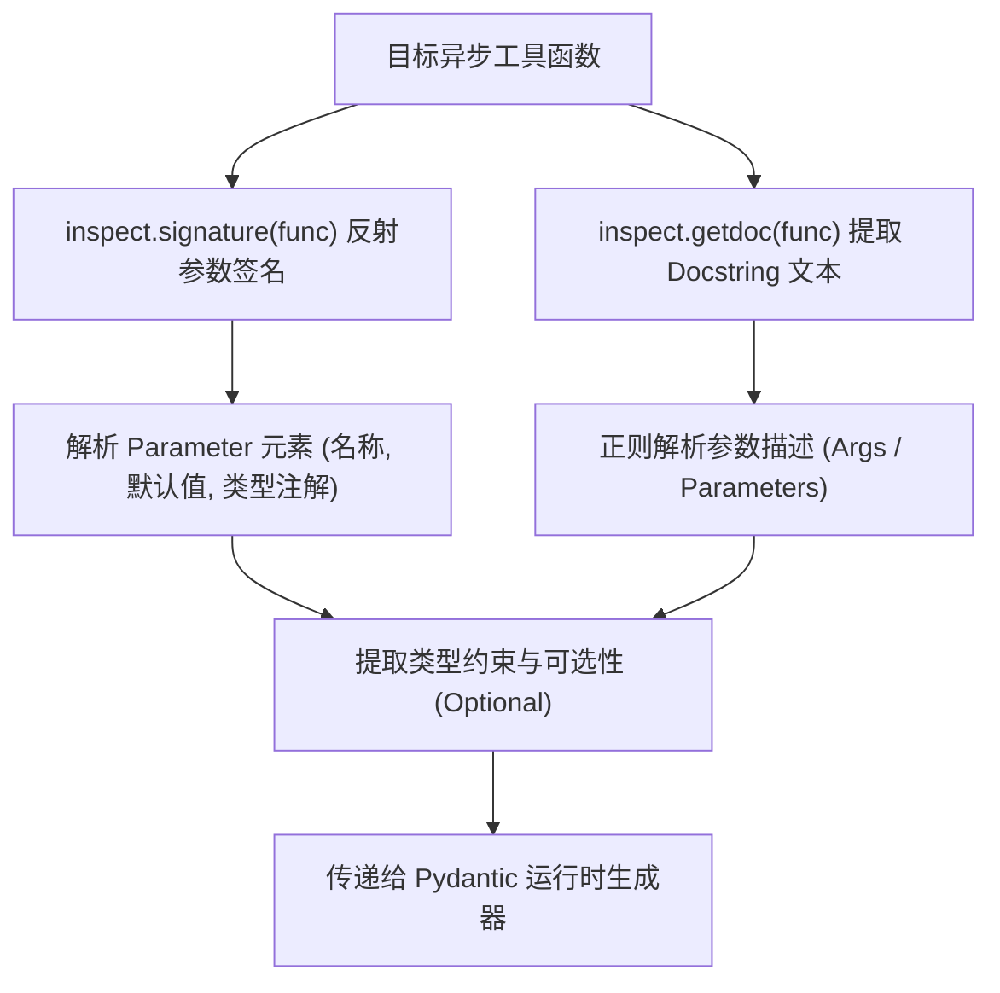

# 课堂笔记：动态反射注册中心与 Pydantic 动态参数建模

## 1. 业务背景：硬编码 Schema 的维护崩溃痛点

在生产级 Agent 系统的工具库扩展中，大模型进行 Function Calling 前必须获知工具的 JSON Schema 定义。如果我们采用传统硬编码手写 JSON Schema 字典的方式：

*   **配置冗余与同步失控**：每次修改工具函数（例如增加一个可选参数，或者调整参数说明），开发者必须在 Python 代码和对应的 JSON Schema 字典中同步更新。极易因遗漏导致模型传入不合规的参数组合，从而产生运行时异常。
*   **运行时类型校验缺失**：大模型生成的 Tool Call JSON 载荷是未经校验的原始字符串。如果系统缺乏统一的运行时拦截机制，非法类型的入参（如将要求为整型的端口号传成字符串 `"8080"`）将直接穿透到工具执行层，导致物理执行崩溃。

---

## 2. 反射原理：利用 inspect 与函数类型契约提取特征

Python 的 `inspect` 模块提供强大的运行时反射（Reflection）能力，可提取函数的元数据与类型契约：



### 2.1 递归提取签名特征
*   **参数名称**：`param.name`。
*   **默认值判定**：若 `param.default == inspect.Parameter.empty`，说明该参数无默认值，在类型契约中属于**必须项（Required）**。
*   **类型注解校验**：通过 `param.annotation` 获取。如果参数未标明类型注解，系统在反射期应拒绝注册，确保工具层面的强类型安全。

---

## 3. 动态建模：基于 `pydantic.create_model` 的运行时类型校验器组装

### 3.1 运行时动态拼装
通过 `pydantic.create_model`，我们可以在内存中实时生成一个继承自 `BaseModel` 的校验类，而无需编写静态的 class 代码。

```python
# 动态拼装伪代码 (<= 20行)
def create_dynamic_model(name: str, fields_spec: dict):
    # fields_spec 格式: {field_name: (field_type, field_default_or_Field)}
    return create_model(name, **fields_spec)
```

对于无默认值的必填字段，使用 `...` 作为默认值占位：
```python
fields_spec["city"] = (str, Field(description="城市名称"))
```
对于有默认值的可选字段，直接赋予默认值：
```python
fields_spec["days"] = (int, Field(default=1, description="天气预测天数"))
```

---

## 4. Schema 规整：OpenAI Function Calling 标准协议转换

当动态生成 Pydantic 模型后，利用内置的 `model.model_json_schema()` 导出符合标准 JSON Schema 规范的字典。
为了对齐 OpenAI 协议，我们将结构重组为标准的 Function 定义字典：

```json
{
  "type": "function",
  "function": {
    "name": "工具函数名",
    "description": "函数 docstring 的简要描述",
    "parameters": {
      "type": "object",
      "properties": { ... },
      "required": [ ... ]
    }
  }
}
```

> [!TIP]
> 导出的 JSON Schema 中，Pydantic 默认会添加字段的 `title` 属性。在组装 Function Calling 声明时，应递归清洗或移除多余的 `title` 键，防止干扰大模型的参数预测。
