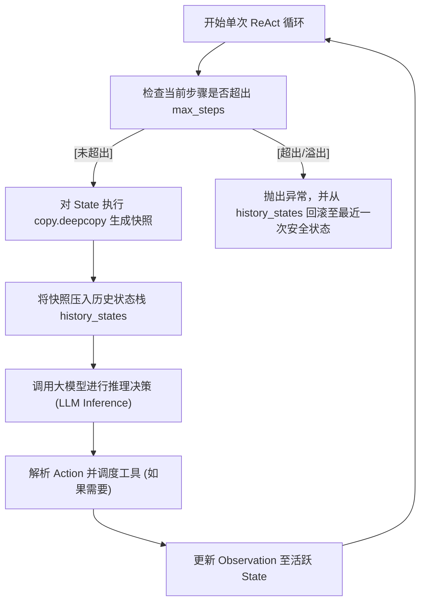

# 课堂笔记：主决策 while 循环与状态深拷贝回滚机制

## 1. 业务背景：高并发场景下的上下文状态污染与崩溃隐患

在工业级 Agent 系统的长时间运行或多轮对话交互中，主控制环（ReAct Loop）维护着全局的 Agent 状态（包括历史消息队列、当前步骤计数器、并发工具执行 Observation 等）。如果状态管理设计不当，会引入以下严重隐患：

*   **状态污染与副作用级联**：大模型生成了无效的工具入参，导致系统在运行时发生局部崩溃。如果不具备快照机制，脏数据（例如损坏的上下文消息）会被直接写死在历史记录中，污染后续所有轮次的模型预测，导致系统死锁。
*   **步数溢出与账单失控**：如果模型由于幻觉未吐出终止标识，`while` 控制环会在没有硬边界保护的情况下无限消耗 Token。因此，必须在底层实现强有力的 `max_steps` 强拦截，并在拦截时平滑回滚到最后一次已知的健康状态快照。
*   **人在回路（HITL）与分支回溯（Time Travel）的底层障碍**：生产环境常需要人工对 Agent 步入的决策进行微调，或者回溯至特定历史节点重新分发。若无深拷贝物理备份，各节点将共享同一内存对象，修改其中一个将破坏整个历史链路。

---

## 2. 状态备份：基于 deepcopy 的状态快照与回滚机制

为防范脏状态污染，在每一轮控制循环开始前，必须对当前的 State 进行**深拷贝物理备份（Deep Copy Snapshot）**。

### 2.1 为什么必须用 `copy.deepcopy` 而非 `copy.copy`？
*   `copy.copy`（浅拷贝）仅复制最外层容器对象的引用。由于消息历史 `messages` 是一个由嵌套字典 `{"role": "user", "content": "..."}` 组成的列表，浅拷贝会导致新老状态对象仍指向同一个字典内存地址，修改新状态的 content 依然会污染备份快照。
*   `copy.deepcopy` 会递归复制所有子对象，从而在物理内存上实现 100% 的状态隔离。

---

## 3. 截断控制：控制环边界（max_steps）安全保护设计

在 `while` 循环体外侧，必须维护一个步数计数器 `steps`。
*   在调用大模型前执行检查：`if self.current_state.steps >= self.max_steps`。
*   若触发截断，停止 LLM 发射，抛出自定义的异常（如 `AgentStepOverflowError`），并将 `self.current_state` 回滚到最近一次合法快照，以确保返回给上层调用者的状态数据完全干净、合规。

---

## 4. 终止协议：Finish 条件捕获与平滑安全退出

在 ReAct 控制环中，大模型生成的输出有三种走向：
1.  **Call Tool**：模型返回 tool_calls 载荷，控制环进入工具分发阶段。
2.  **Finish**：模型预测任务已完成，返回最终答复。我们需要拦截并识别模型输出中的结束标识（如特定的 `finish_reason == "stop"` 或提取自定义的 Action 为 `Finish`），并立即平滑跳出 `while` 循环。
3.  **异常**：触发死循环或步数溢出，由系统强行中断。
