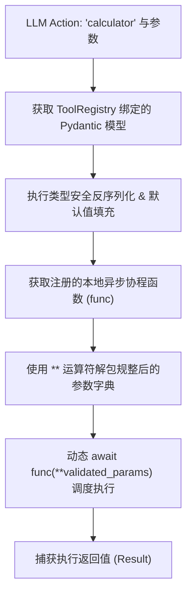

# 课堂笔记：动态反射分发、参数解包与 Observation 状态归约

## 1. 业务背景：LLM 决策符号与本地执行实体映射断裂痛点

大模型（LLM）在 ReAct 控制环中，仅扮演“决策大脑”的角色，输出调用工具的决策符号（例如生成 `Action: get_weather`，以及相应的 JSON 参数）。大模型本身既没有网络访问权限，也无法直接驱动本地的硬件资源或执行系统指令。

在没有 Agent 分发层的情况下：
*   **符号与实体断裂**：系统无法自动将大模型生成的 `Action: "get_weather"` 文本符号，映射并动态执行本地真正的 `async def get_weather(...)` 函数。
*   **不确定性注入**：大模型预测输出的 JSON 参数是不受控的，可能包含冗余字段或类型不符的值。若不做运行时参数规整，直接解包（`**params`）传给本地函数，极易产生 `TypeError` 导致整个控制环发生硬崩溃。

---

## 2. 反序列化：利用 Pydantic 运行时模型的安全反序列化过滤

工具分发网关的第一道防线是**安全校验拦截**：
1.  **解析原始参数**：从 LLM 输出的 Tool Call 中提取 JSON 参数，若为字符串则通过 `json.loads` 反序列化为字典。
2.  **契约校验拦截**：从 `ToolRegistry` 获取该工具对应的 Pydantic 动态校验模型。调用 `model(**params)` 执行运行时类型校验。
3.  **参数规整过滤**：通过 `model.model_dump()` 导出经过类型校正（例如字符串 `"123"` 自动转换为整型 `123`）、去除多余未声明参数、且应用了默认值补全的干净参数字典。

---

## 3. 反射分发：基于协程调度的 Reflective Dispatching 机制

在通过 Pydantic 校验后，引擎利用反射分发器动态映射并调用本地异步函数：



由于工业级工具多涉及 IO 密集型操作（如网络请求、数据库读写），工具函数必须声明为 `async def`。分发器通过 `await` 关键字实现非阻塞的并发反射调度。

---

## 4. 状态归约：Observation 的合并（Reducing）与上下文归集

当工具协程执行完毕并返回结果后，必须将结果转化为**工具响应消息（Observation）**，并合并回全局 `AgentState` 中。

### 4.1 状态归约（State Reducing）协议
工具的 Observation 不能随意拼装，必须遵循特定的消息契约追加到历史消息队列尾部，确保下一轮 LLM 决策能够正确消费：
```python
observation_message = {
    "role": "tool",
    "name": action_name,
    "content": str(tool_result)
}
self.current_state.messages.append(observation_message)
```
通过向 `messages` 列表原子追加此格式化字典，大模型的上下文链（Context Chain）得以闭环。下一轮大模型的 Thought 推理即可读取此 Observation 并进行针对性的新一轮规划。
