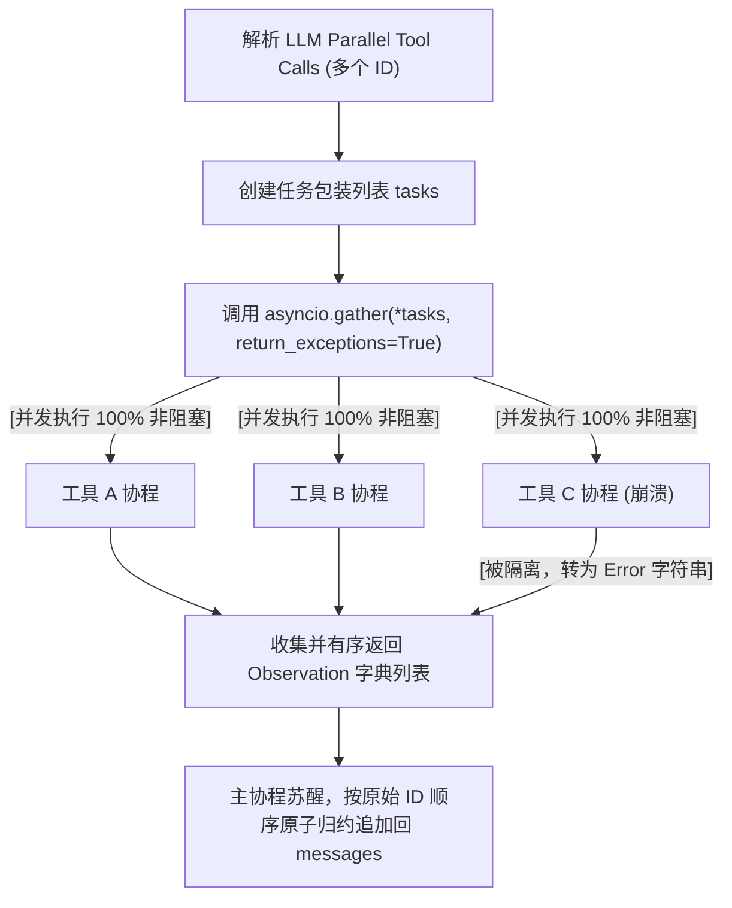

# 课堂笔记：Parallel Tool Calls 的并发非阻塞调度与异常隔离机制

## 1. 业务背景：高并发场景下的工具串行开销与容灾痛点

在复杂的 Agent 应用（如多 Agent 代码审查、量化投资交易分析）中，大模型经常会在单轮决策中做出并发调用多个独立工具的决定（例如同时调用 3 次 search 查询不同公司的财报）。

如果采用传统的串行 ReAct 调度：
*   **TTFT 延迟暴增与响应阻滞**：如果每个网页搜索需要耗时 2 秒，串行调用 3 个工具意味着整轮决策循环仅工具等待就需耗时 6 秒。这导致客户端首字延迟（TTFT）呈线性累加，系统体验极差。
*   **局部故障导致级联崩溃**：如果 3 个并发工具中，有一个工具发生网络超时或格式抛错，在串行/缺乏异常隔离的控制流中，该单点故障会直接穿透并拉垮整个批次任务链，导致大模型无法接收另外 2 个健康工具的 Observation，任务直接夭折。

---

## 2. 并发调度：基于 asyncio.gather 的非阻塞并发驱动

Python 内置的 `asyncio.gather` 是实现非阻塞并发调度的核心。它能够将多个协程任务同时分发给事件循环（Event Loop）并行推进：



*   **执行效率对比**：假设 $N$ 个工具中最大耗时为 $T_{\max}$，采用非阻塞并发后，整轮调度的耗时由 $\sum T$ 锐减为 $\approx T_{\max}$。

---

## 3. 容灾保障：局部故障隔离与异常 Observation 转化

为了实现**部分失败隔离（Exception Isolation）**，必须确保单个协程的抛错绝不传染给其他并行的健康协程：

### 3.1 异常防御性包装模式
不要让裸协程直接被 `gather` 执行。应为每个 `tool_call` 创建一个包装函数（如 `_execute_single_tool`），在内部使用 `try-except` 捕获所有运行时异常：
```python
async def _execute_single_tool(self, call_id: str, action: str, params: dict):
    try:
        observation = await self.dispatch_tool(action, params)
        return {"role": "tool", "tool_call_id": call_id, "name": action, "content": observation}
    except Exception as e:
        # 异常就地转化为格式化 Observation 文本喂回，隔离单点崩溃
        return {"role": "tool", "tool_call_id": call_id, "name": action, "content": f"Error: {str(e)}"}
```

同时在 `asyncio.gather` 中指定 `return_exceptions=True`。这能够确保即使某个包装函数发生致命错误，也不会阻断其他正常任务的运行，整个 gather 会将异常转化为结果列表的一部分返回给主协程。

---

## 4. 协议对齐：并发 Observation 的 ID 配对与顺序归约

大模型（如 OpenAI API）在多工具并发执行时有极强的协议契约要求：
*   每一个返回的 `role: "tool"` 消息必须包含唯一的 `tool_call_id`。
*   返回消息的顺序必须与上一次 `assistant` 消息中 `tool_calls` 的 ID 序列保持一致。

通过由主协程统一等待 `gather` 返回，再按原始列表顺序依次 `append` 到全局消息历史中，我们既防范了无序并发导致的乱序，又彻底闭环了 Function Calling 并行调用协议。
