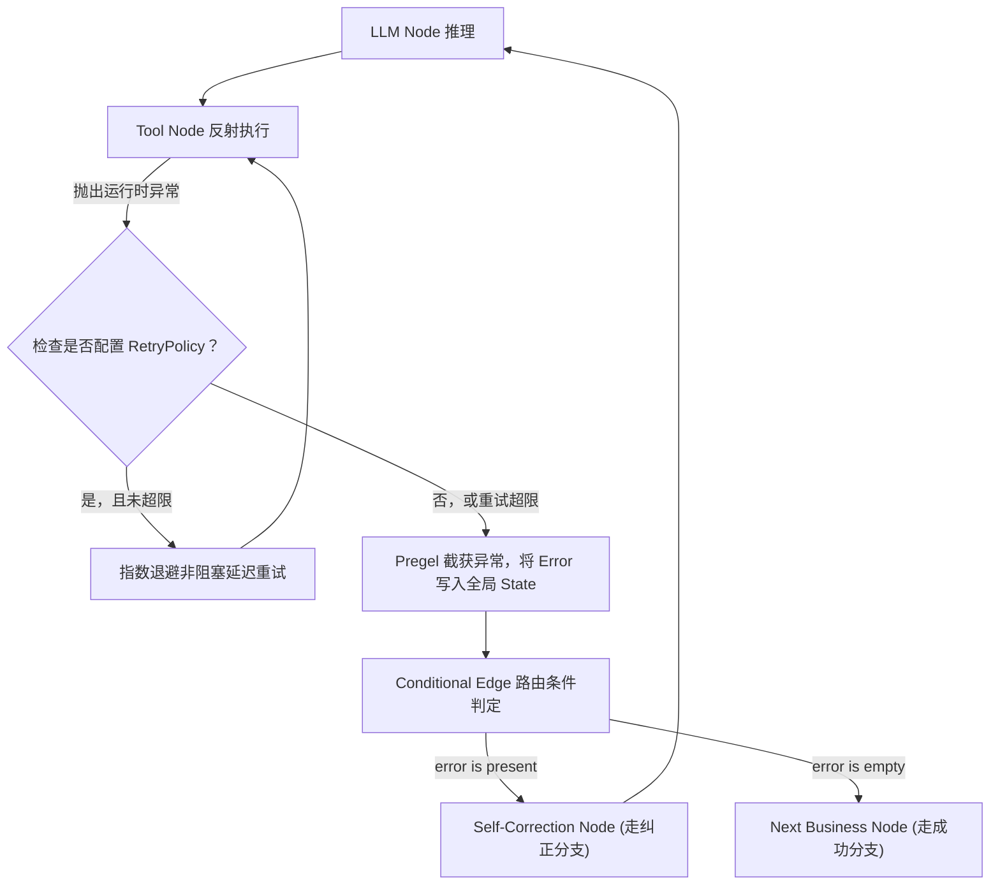
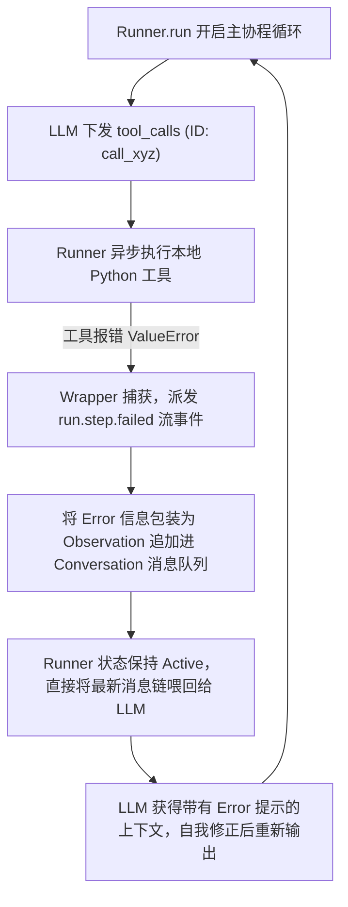

# 开源框架异常处理与调度容灾机制深度剖析

在设计工业级 Agent 系统的工具控制流与主控制环时，如何应对本地运行时异常、超时、网络丢包或模型参数格式错误，是衡量一个框架是否具备生产级可用性的分水岭。

本文将深度对比剖析两大主流 Agent 开源框架——**LangGraph** 与 **OpenAI Agents SDK** 在异常处理、重试策略、图路由跳转与事件流恢复层面的底层架构与源码机理。

---

## 1. 异常与故障恢复特征横向对比矩阵

| 维度 | LangGraph | OpenAI Agents SDK |
| :--- | :--- | :--- |
| **核心设计哲学** | 基于 **Pregel 状态图拓扑** 的超步（Superstep）循环控制流 | 基于 **事件驱动（Event-Driven）** 的流式状态挂起与恢复 |
| **状态容器设计** | 强一致性的全局 State，每次状态转移伴随 Checkpoint 存档 | 扁平的会话消息历史（Conversation Message Thread） |
| **重试控制机制** | 节点级细粒度的 `RetryPolicy`，内置指数退避与随机抖动 | 主控制环内部的网络防抖重试与局部异常再请求机制 |
| **故障路由机制** | **条件边（Conditional Edge）**：根据 State 中的报错状态在图上跳转 | **事件回调恢复（Runner Recovery）**：将异常事件化后喂给 LLM 纠错 |
| **安全沙箱边界** | 支持外部图执行中断，由用户提供人工介入（Human-in-the-loop） | 主线程事件循环异常挂起，依靠 LLM 运行时重新决策进行自愈 |
| **核心适用场景** | 复杂的多 Agent 并行协作、有向无环图状态机、人工审计工作流 | 单 Agent 动态交互、Function Calling 原生协议流式对齐 |

---

## 2. LangGraph 异常控制源码机制剖析

LangGraph 采用了基于有向图（StateGraph）的 Pregel 计算模型。在 LangGraph 中，一切逻辑节点（Nodes）在物理上都是状态转换器，它们消费当前 State 并产出 State 更新，而边（Edges）则负责指示状态转移方向。

### 2.1 Retry Policy（重试策略）
LangGraph 允许在编译节点时，为特定的 Node 绑定一个 `RetryPolicy`。
其底层机制是：当节点在执行期间抛出异常，Pregel 调度器会截获该异常：
*   **退避与防抖算法**：根据配置的参数进行退避延迟计算：
    $$\text{Delay} = \text{initial\_delay} \times (\text{backoff\_factor})^{\text{attempt}} \pm \text{jitter}$$
*   **非阻塞挂起**：事件循环在等待重试时，通过异步休眠（`await asyncio.sleep(delay)`）让出 CPU 资源。若重试次数超出 `max_attempts`，则将异常向上传递并打上崩溃标记。

### 2.2 Error Edge 与 Conditional Edge
在 LangGraph 中，当重试耗尽或未配置重试导致 Node 运行彻底失败时，异常不会直接使系统死机，而是通过**图的跳转**自然流向纠错逻辑：

1.  **异常记录入全局状态**：被捕获的 Exception 或失败信息，会作为状态字典（State）的字段（例如 `state["error"]`）进行合并更新。
2.  **条件边（Conditional Edge）的动态计算**：
    在编译图拓扑时，我们定义了条件边路由函数：
    ```python
    def route_after_tool(state: AgentState):
        if state.get("error"):
            # 检测到上一步发生错误，引导状态流向“纠错/反思”节点
            return "self_correct_node"
        # 无错，正常流向 LLM 推理节点
        return "llm_node"
    
    # 编译图绑定条件边路由
    workflow.add_conditional_edges("tool_node", route_after_tool)
    ```
    这种设计让“失败后走另一条边”完全不需要写在大段的业务 `try-except` 中，而是将异常转化成了**状态数据**，图引擎根据最新的状态自动匹配拓扑路径，实现了极高的声明式系统架构美感。

### 2.3 LangGraph 异常路由状态图


---

## 3. OpenAI Agents SDK 异常与恢复机制剖析

OpenAI Agents SDK 采用了一种更加扁平的、面向网络流（Stream-based）的事件驱动模型。它不对控制流强加有向无环图（DAG）约束，而是完全依赖 `Runner` 驱动的对话事件流。

### 3.1 Tool Error Handling 与 Exception Conversion（异常事件化转换）
在 OpenAI Agents SDK 执行过程中，LLM 下发了 `tool_calls`。
当 `Runner` 调用本地绑定的异步 Python 工具函数时：
1.  **异常就地转换为 Observation（Observation Wrapper）**：
    SDK 内部拥有一个顶层的工具运行期保护罩（Wrapper）。当工具抛出 `ValueError`、`TypeError` 或网络请求超时等运行时异常时，该 Wrapper 会将异常堆栈进行提取并转化为一个**错误说明文本**。
2.  **流式异常事件化派发**：
    与传统的同步抛错阻断程序运行不同，SDK 会将这个错误包装成一个流式包，向外部注册的 Event Listener 广播 `run.step.failed` 事件，或是下发 `error.delta` 信号。
    这保证了前端或日志监控系统能实时且非阻塞地捕获“工具刚才坏了”这一事实，但底层协程队列依然是可控的。

### 3.2 Runner Recovery（事件循环恢复）
在异常被转化为事件后，系统是如何恢复生命周期，而不是直接挂掉的？
1.  **协议合规回填**：
    为了对齐 OpenAI Assistants 原生 Function Calling 协议，`Runner` 会自动向 Conversation 历史消息队列中追加一条特殊的 Tool 消息：
    ```json
    {
      "role": "tool",
      "tool_call_id": "call_98x1",
      "content": "Error: ValueError('date pattern unmatch')"
    }
    ```
    这条消息充当了该 ID 的 Observation，成功回应了模型的 Tool 调用请求。
2.  **不中断的主循环自愈拉起**：
    `Runner` 在捕获此 ToolError 后，会将更新后的会话历史（包含这条失败的 Observation）立即作为下一次请求的入参，重新发起大模型的 Completion 请求。
    因为流式状态始终是 Active（激活的），`Runner` 并没有中断，只是在协程队列中压入了一个新的 Completion 任务。大模型读取到该 Error 后，在接下来的输出中自动执行反思并纠偏，`Runner` 从而在不重启动引擎的情况下恢复了正常运行。

### 3.3 OpenAI Agents SDK 事件流恢复图


---

## 4. 工业级异常架构设计与决策指南

在具体选型和开发你自己的 Agent 系统时，应遵循以下决策边界：

1.  **选择 LangGraph 的场景**：
    *   业务逻辑中包含极其清晰且复杂的降级逻辑（如：如果“查询数据库”抛出权限错误，走“申请审批节点”；如果抛出超时错，走“缓存查询节点”；如果抛出格式错，走“大模型纠错节点”）。
    *   对于多步骤、分支跳转关系极其苛刻、需要产生持久化 Checkpoint 存档以便随时“回退上一步”的工程系统。
2.  **选择类似 OpenAI Agents SDK/ReAct 自愈环的场景**：
    *   任务逻辑扁平，主要围绕 Function Calling 进行（Thought -> Action -> Observation 的线性循环）。
    *   对系统的执行开销（Token 消耗量、网络调用层数）非常敏感，希望能以极低的性能和内存损耗，让大模型在单轮中自我纠错，不希望引入过重的图拓扑引擎。
