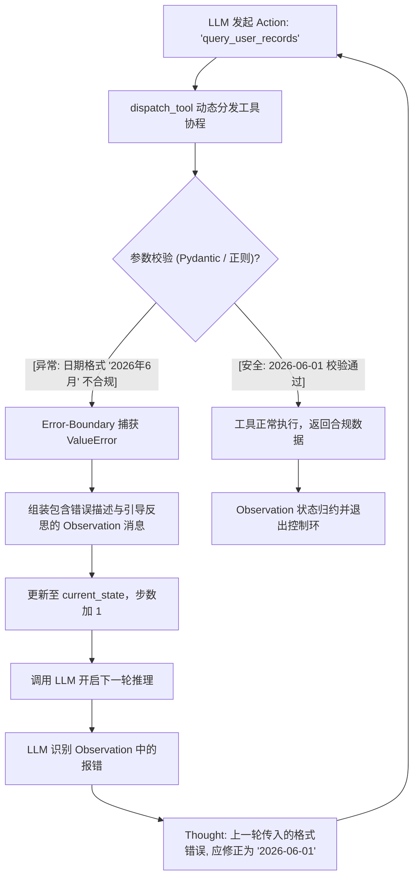

# 课堂笔记：工具层异常自愈与 Self-Correction 反思环

## 1. 业务背景：异常传递断链与脆弱的控制环系统

在生产环境的 Agent 运行期，外部工具与执行环境（如数据库、第三方网络 API）千变万化，难免会因为网络波动、参数校验、数据缺失等引发运行时异常。

在缺乏自愈机制的传统 ReAct 系统中：
*   **异常穿透硬崩溃**：一旦工具内部抛出 `ValueError` 或网络超时，主控制环捕获到异常后只能选择中断退出。这在工业级高可用要求下是不可接受的。
*   **大模型盲盒盲区**：如果不将工具执行的底层堆栈与格式化报错反馈给大模型，模型在下一轮决策中将无法感知“工具为什么失败”，进而导致其持续生成错误的参数，或者直接陷入逻辑死转。

---

## 2. 错误边界机制：Error-Boundary Prompting 的错误堆栈重构

为了提升系统的弹性，必须建立**错误边界提示词（Error-Boundary Prompting）**机制：
1.  **异常捕获与翻译**：在 `dispatch_tool` 抛出参数契约校验失败（`ValueError`）或执行失败时，引擎不能任由其导致进程挂掉，而应将其转化为特定的 Observation 文本载荷。
2.  **纠错前缀注入**：在 Observation 中，注入具有引导语气的错误反思前缀。
    *   *示例*：`"工具 'query_user_records' 调用失败 (ValueError): 日期参数必须是符合 YYYY-MM-DD 格式的字符串。请在 Thought 中反思并纠正你传入的参数，然后再重新发起工具调用。"`

---

## 3. 自愈控制流：Self-Correction 纠错反思环的时序路由

通过将报错 Observation 喂回给大模型，控制环从普通的线性跳转演变为**自愈纠错双环结构**：



在第二轮迭代中，大模型读取了上下文里的“错误 Observation”，并在 `Thought` 阶段自动执行反思动作，从而自主生成修正后的入参，实现**在运行期动态进行参数纠偏的超弹性（Resilience）**。

---

## 4. 真实演练设计：面向非结构化输入的数据校验自愈

本节我们将利用真实的 API 请求，对接包含严格正则校验的本地数据库查询工具：
*   **工具契约**：日期参数 `date` 必须严配 `^\d{4}-\d{2}-\d{2}$`（如 `2026-06-01`）。
*   **大模型真实引导**：用户输入“帮我查一下小明 2026年6月 的记录”。大模型首次提取时，由于非结构化自然语言的影响，大概率会预测出不合规的参数。通过拦截该错误，观察大模型如何在真实网络交互中根据堆栈信息实现自我矫正（Self-Correction）并最终通关。

---

## 5. 工程思考：超大规模工具池下的注意力稀释与缓存瓶颈

在实际工业级 Agent 开发中，当系统注册的工具规模不断增大（例如达到数十甚至上百个）时，如果硬编码将所有工具的 JSON Schema 拼接入 System Prompt，会引发以下工程瓶颈：
*   **上下文膨胀与成本激增**：每个工具的 Schema 都会吃掉上百个 Token，数百个工具会导致单次推理费用暴涨。
*   **注意力稀释（Attention Dilution / Lost in the Middle）**：模型极易混淆相似的工具或遗忘长上下文中间处的工具定义，产生严重的幻觉或误选。
*   **首字延迟（TTFT）恶化**：处理长 Prompt 需要更长的 Pre-fill（首算）时间。

### 5.1 提示词缓存（Prompt Caching）能否解决注意力稀释？
*   **结论**：**不能。**
*   **物理本质**：提示词缓存（如大模型的 KV Caching）是一种 **“计算重用”** 技术。当输入开头与历史 100% 重合时，大模型避免了重复计算这些 Token 的 Self-Attention，能降低计费并减少 TTFT，但这些文本在计算时**依然完整地驻留在 Attention 窗口中**，注意力分配概率依然会被稀释。
*   **注意力稀释本质**：是一种 **“认知过载”** 机制，大模型在面对 100 个选项时，依然会因为 Softmax 概率摊薄而选错工具。

### 5.2 工业级黄金搭档解决方案
为了同时解决这两大痛点，工业级 Agent 通常采用以下双层联合架构：

```mermaid
graph TD
    A["用户输入 Query"] --> B["向量相似度检索 (Tool RAG)"]
    B -->|'"Top-K 召回 3~5 个工具"'| C["过滤掉 95% 以上的无关工具"]
    C --> D["将召回的工具组装进 system_prompt (根治注意力稀释)"]
    D --> E["真实 LLM 交互 + 原生 API Tool Caching (降低费用与 TTFT)"]
```
通过前置 RAG 检索在物理上裁剪掉大部分噪音工具（根治注意力稀释），再利用 Prompt Caching 重用当前轮次中剩余工具的 KV Cache 状态（优化成本与时延），实现极致的准确度与运行效率。
