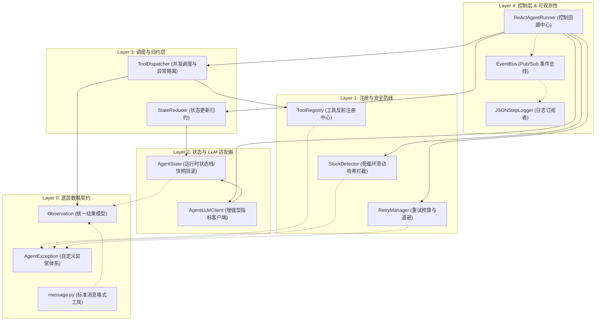
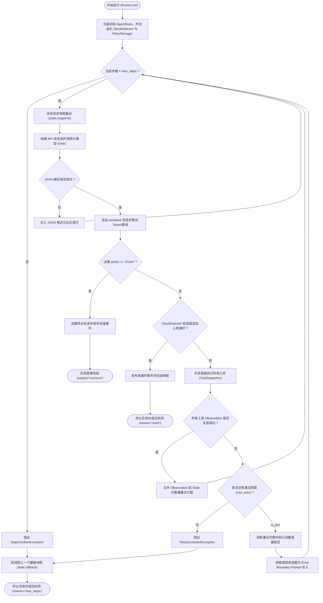

# MiniAgent Framework v1.0 — 工业级 ReAct Agent 运行引擎

本项目为 Week 5 大项目实战：**纯 Python 手写实现一个解耦、鲁棒且符合工业级架构设计的 ReAct Agent Runtime**（不依赖 LangChain、LangGraph、OpenAI Agents SDK 等第三方 Agent 框架）。

---

## 🛠️ 项目目录结构

```text
day35/
├── mini_agent/
│   ├── schema/           # Layer 0: 数据契约层
│   │   ├── exception.py  # 统一异常层级树
│   │   ├── observation.py# 结构化工具结果数据模型 (Observation)
│   │   └── message.py    # 消息构建与 API 格式化标准纯函数
│   ├── agent/            # Layer 1~3: 核心决策与调度层
│   │   ├── registry.py   # @tool 装饰器与动态 Pydantic 反射注册中心
│   │   ├── dispatcher.py # 工具分发调度器（支持 asyncio.gather 并发与局部异常隔离）
│   │   ├── reducer.py    # 状态归约器（纯静态状态修改器）
│   │   ├── stuck.py      # MD5 滑动窗口死循环拦截检测器
│   │   ├── retry.py      # 重试预算管理器与指数退避延迟器
│   │   ├── state.py      # AgentState 运行时状态容器（含快照与回滚）
│   │   ├── event_bus.py  # [⭐ BONUS] Pub/Sub 同步事件总线
│   │   └── runner.py     # ReActAgentRunner 控制流主循环拼装墙
│   ├── llm/              # Layer 2: LLM 适配器
│   │   └── openai_client.py # AgentLLMClient 封装增强（含耗时/费用/Token 采集）
│   ├── logger/           # Layer 4: 可观测性表现层
│   │   └── json_logger.py# 基于 EventBus 监听的结构化 JSON 步骤日志打印器
│   └── tools/            # 内置测试工具集（天气、计算器、并发搜索）
├── tests/                # 单元测试集（5大功能点，共40个 pytest 用例）
├── demo.py               # 演示场景入口（单调用、并行调用、自愈、超时降级）
├── practice.py           # 学员练习骨架模版（带 friendly TODO 拦截提示）
└── notes.md              # 框架设计原理笔记与决策对比看板
```

---

## 📐 架构设计与核心运行流程

### 1. 框架层级拓扑图
MiniAgent Framework v1.0 遵循“自底向上”的严格层级调用链（Layer 4 到 Layer 0），控制与表现完全分离，层级关系分明：



### 2. Core ReAct 控制流图
以下是 Runner 驱动的控制回路，展示了死循环阻断、并行异常隔离、快照回滚与自愈反思环的决策分支路径：



---

## 🚀 快速开始

### 1. 运行测试套件（验证核心组件）
在主工作区根目录下运行：
```bash
python -m pytest weekly/w05_react_and_tools/day35/tests/ -v
```
预期输出：**40 passed in < 1.0s**，说明工具反射、参数强校验、死循环拦截、自愈退避、并行隔离等全部功能点均运行正常。

### 2. 运行演示场景
确保根目录下存在包含 `MINIMAX_API_KEY` 的 `.env` 环境变量配置文件，然后运行：
```bash
python -m weekly.w05_react_and_tools.day35.demo
```
该 Demo 会运行四个经典场景：
1. **单工具调用**：查天气。
2. **并行工具调用**：同时查询 3 个城市天气（验证并发调度）。
3. **自愈反思环**：故意让模型传入不合法日期格式，大模型通过 **Error-Boundary** 自行修正参数重试成功。
4. **超时安全降级**：调用有 2s 延时的搜索工具但限制 0.2s 超时，框架拦截超时并触发降级，而**不引起进程崩溃**。

---

## 🎯 核心架构亮点与 EventBus 的深度解耦价值

### 1. 异常层级体系（自愈 vs 致命）
我们设计了完整的自定义异常树（均继承自 `AgentException`）：
* **可自愈异常**（`ToolException`、`ValidationException`、`TimeoutException`）：工具内部报错、参数不符或执行超时。此时 LLM “大脑”仍然完好，Runner 不应崩溃，而是向消息历史中注入 **Error-Boundary Prompt** 反馈，触发 **Self-Correction (自愈机制)**。
* **不可恢复致命异常**（`FatalException`）：例如 LLM 接口连接失败或请求超时。此时 Agent 失去推理能力，异常将**立刻向上传播中断进程**，保护系统不陷入无脑死循环。

### 2. EventBus 事件总线机制（解耦与未来扩展）
在框架中，核心主循环 `ReActAgentRunner` 和工具执行器 `ToolDispatcher` **内部不包含任何一行 `print` 打印或日志记录逻辑**。它们在关键运行节点只会向 `EventBus` 发布事件（Publish）：
* `on_step_start` / `on_step_end`（步骤开始/结束）
* `on_llm_start` / `on_llm_end`（大模型调用前/后，含 Token 消费、延迟和费用数据）
* `on_tool_start` / `on_tool_end`（工具开始执行/执行完成）
* `on_retry` / `on_stuck` / `on_error`（自愈、死循环、错误捕获）

当前我们只接入了一个订阅者 **`JSONStepLogger`**，专门监听事件并把日志格式化为 JSON 行输出到控制台。但这种 **Publish/Subscribe 架构**为未来的生产级功能提供了极强的**插拔式扩展能力**：

#### 🌟 5 大生产级扩展场景（无需修改核心引擎代码）

1. **实时 Web 控制台渲染 (SSE/WebSocket 流式更新)**：
   注册一个 `WebStreamer` 订阅者，监听到 `on_llm_start` 或 `on_tool_start` 时，将状态通过 WebSocket 推送给前端浏览器，在聊天界面上动态展示“Agent 正在思考”或“正在调用工具 X”的加载条和进度树。
2. **APM 性能监控与度量 (Prometheus / Grafana)**：
   注册一个 `MetricsCollector` 订阅者，在 `on_llm_end` 和 `on_tool_end` 时，累加 Token 消耗、大模型调用延迟、工具成功率。这些指标通过 Prometheus Exporter 暴露，即可在 Grafana 看板上实时看到线上 Agent 的成本和健康度。
3. **大模型调用链路追踪 (LangSmith / OpenTelemetry)**：
   注册一个 `TraceExporter` 订阅者，把 `on_tool_start` 到 `on_tool_end` 的整个过程转换成标准 Trace 链，上报至 Jaeger 或 Phoenix，生成可视化树状图，轻松找出哪一个工具是整条推理链路的性能瓶颈。
4. **长任务持久化检查点 (DbCheckpointer / SQLite)**：
   对于运行时间较长的复杂任务，注册一个 `Checkpointer` 订阅者监听 `on_step_end`。每走完一步，就将 `AgentState` 快照存入 Redis 或 SQLite。如果后台进程意外重启，可以从最近的检查点直接拉起，无需重新消耗大模型 Token。
5. **人工介入审批 (Human-in-the-Loop)**：
   对于敏感工具（如 `execute_sql` 或 `send_email`），注册一个 `ApprovalGuard` 订阅者监听 `on_tool_start`，检测到敏感动作时拦截并挂起 Runner，通过 Slack / 钉钉向管理员推送审批卡片，管理员确认后再恢复执行。
