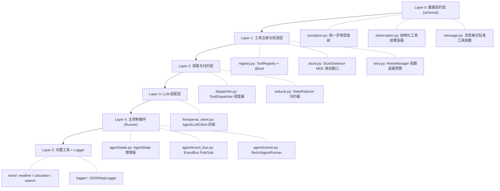

# Day 35 — MiniAgent Framework v1.0 设计笔记

> **里程碑一：从零实现工业级 ReAct Agent Runtime**

---

## 一、业务背景与工程痛点

Day31-34 已经实现了一个能运行的 ReAct Agent，但它存在典型的"单文件工程陷阱"：

| 痛点 | 具体问题 | 引发的工程后果 |
|---|---|---|
| **职责混合** | `run()` 方法同时做 LLM 调用、工具分发、状态归约、日志打印 | 修改日志格式 → 改 Runner → 引入回归风险 |
| **无 Observation 契约** | 工具结果以裸字符串传递 | Logger 需要 hack 字段名才能记录延迟 |
| **无异常层级** | 所有异常用 `except Exception` 捕获 | 无法区分"可自愈"和"致命"异常 |
| **无重试预算** | 靠 max_steps 限制失败次数 | 无法精确控制"连续失败允许几次" |
| **日志耦合 Runner** | `print()` 直接在 Runner 内部 | 无法替换为结构化 JSON / 接入监控系统 |

**Day35 的工程目标**：用 Framework 思维把这些痛点逐一消灭。

---

## 二、整体架构（自底向上依赖链）



---

## 三、各模块职责边界（积木拼装思想）

### 3.1 Runner — 只做流程编排

Runner 的 `run()` 方法做且只做：

```
while step < max_steps:
    state.snapshot()
    llm_response = _call_llm(state)
    解析 JSON → thought / action / params
    StuckDetector.check_and_push()    # 死循环检测
    Dispatcher.execute_parallel()     # 并发调度
    对每个 Observation:
        if success → Reducer.append_observation()
        if error   → RetryManager → Reducer.append_error_boundary()
    EventBus.publish(on_step_end)
```

**不做**：消息格式构建、Observation 转 dict、Error-Boundary 文本生成。

### 3.2 ToolDispatcher — 只做调度执行

```
dispatch(tool_name, raw_params, call_id):
    1. Registry 查工具
    2. Pydantic 校验参数
    3. asyncio.wait_for(func(**args), timeout)
    4. 返回 Observation 对象

execute_parallel(tool_calls):
    tasks = [_execute_single(c) for c in tool_calls]
    results = await asyncio.gather(*tasks, return_exceptions=True)
    return results  # 有序 Observation 列表
```

**不做**：死循环检测（StuckDetector）、重试预算管理（RetryManager）。

### 3.3 StateReducer — 只做状态更新

全部静态方法，无状态，纯函数风格：

```python
StateReducer.append_observation(state, obs)     # 归约工具结果
StateReducer.append_error_boundary(state, ...)  # 注入自愈提示
StateReducer.merge_parallel_observations(...)   # 批量归约
StateReducer.update_usage(state, ...)           # 累计 Token/cost
StateReducer.set_finish(state, reason)          # 设置终止原因
```

**未来扩展**：Context Window 裁剪、Memory 压缩摘要 → 全部加在这里，Runner 无感知。

---

## 四、Observation 统一数据模型

Day33 的问题：工具结果以 `{"role": "tool", "content": str}` 字典传递，Logger 无法访问 `latency_ms`。

Day35 的解决：统一 `Observation` Pydantic 模型：

```python
class Observation(BaseModel):
    tool_call_id: str          # 关联 LLM tool_calls 的 ID
    tool_name: str             # 工具函数名
    status: ObservationStatus  # "success" | "error"
    content: str               # 结果文本
    latency_ms: float          # 执行耗时（毫秒）
    error_type: str | None     # 异常类型名
    metadata: dict             # 扩展元数据
```

工厂方法快速构建：
- `Observation.from_success(...)` — 成功路径
- `Observation.from_error(...)` — 失败路径（_execute_single 异常隔离时使用）

---

## 五、异常层级体系

```text
AgentException（基类）
├── ToolException          → 可自愈（Self-Correction）
├── ValidationException    → 可自愈（Error-Boundary）
├── TimeoutException       → 可自愈（降级处理）
├── RetryExceededException → 安全终止（finish_reason="retry_exceeded"）
├── StuckException         → 强制终止（finish_reason="stuck"）
├── StepOverflowException  → 正常超出（finish_reason="max_steps"）
└── FatalException         → 向上传播（不在 Runner 内吞掉）
```

Runner 的异常路由：

```python
except StepOverflowException → 回滚 + 终止（非错误）
except RetryExceededException → 回滚 + 终止
except FatalException → raise（不捕获，传给调用方）
```

---

## 六、EventBus 事件总线（Bonus）

```
Runner 发布 (publish)            Logger 订阅 (subscribe)
─────────────────────────────── ──────────────────────────
on_step_start  → {step}
on_llm_start   → {step, msg_count}
on_llm_end     → {step, thought, tokens, cost, latency}  ← JSONStepLogger.log
on_tool_start  → {step, tool_name, params}               ← JSONStepLogger.log
on_tool_end    → {step, observation}                     ← JSONStepLogger.log（完整聚合）
on_retry       → {step, error, retry_count}              ← JSONStepLogger.log
on_stuck       → {step, action, hash}
on_finish      → {finish_reason, summary}
```

关键设计决策：
- **同步执行**：Handler 在 `publish()` 中同步触发，无需 `await`
- **静默隔离**：Handler 异常被捕获，不影响 Runner 主流程
- **多订阅支持**：同一事件可挂多个 Handler（Logger + Monitor + UI）

---

## 七、五个核心测试要点

| 测试 | 验证重点 | 关键断言 |
|---|---|---|
| **test_registry** | @tool 自动注册 + OpenAI Schema 格式 | `name in registry` / `schema["type"] == "function"` |
| **test_dispatcher** | Pydantic 校验 + 反射调度 + 异常分类 | `obs.status == SUCCESS` / 抛出正确异常子类 |
| **test_parallel** | 并发效率 + 一个失败不影响其他 | `elapsed < 串行时间` / 其他 obs 为 SUCCESS |
| **test_retry** | 预算消耗 + reset + 指数退避 | `can_retry()` 状态变化 / `backoff_delay` 值 |
| **test_stuck** | Key 乱序不变性 + 窗口滑动 + reset | 第 3 次触发 `StuckException` / 乱序参数等价 |

---

## 八、与工业框架的对应关系

| 本项目模块 | LangGraph 对应 | OpenAI Agents SDK 对应 |
|---|---|---|
| Runner | `CompiledGraph.invoke()` | `Runner.run()` |
| ToolRegistry | `ToolNode` | `FunctionTool` 注册表 |
| Dispatcher | `ToolNode._execute()` | `tool_runner` |
| StateReducer | 边函数（Edge Function） | `RunContextWrapper` |
| EventBus | `StreamingCallback` | `on_tool_start/end` 钩子 |
| StuckDetector | 无（需自定义 Guard Node） | 无 |
| RetryManager | `RetryPolicy`（需配置） | `max_turns` 部分覆盖 |
