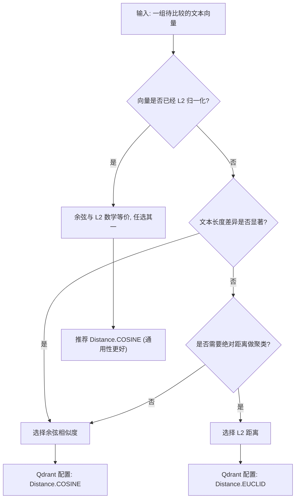
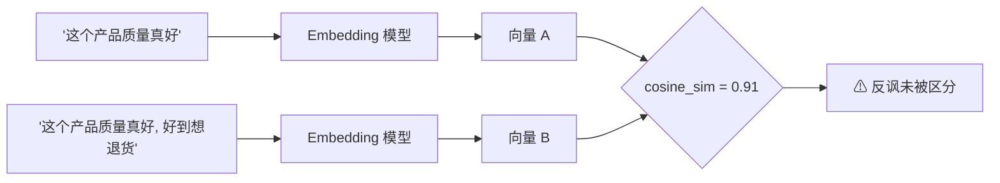

# Day 36 — 文本向量化（Embedding）数学直觉与表征限制

> **本日在 "AI 研究助手" 项目中的定位**：向量化距离计算是整个知识检索引擎的数学基石。Day 37-42 的索引构建、相似度检索、批量导入模块，全部依赖本日建立的距离度量选型能力与表征退化边界认知。

---

## 一、业务场景：Agent 知识检索中的距离度量选型困境

### 1.1 系统痛点量化

**场景**：多 Agent 并发知识检索系统——用户输入自然语言问题，系统从 10 万+ 文档块中检索 Top-5 相关结果返回给 LLM 做上下文增强（RAG）。

| 度量选择 | 文本对 | 期望 | 实测 | 后果 |
|---|---|---|---|---|
| 余弦相似度 | "机器学习" vs 机器学习长段落定义 | 高相似 | 0.9559 ✅ | 正确召回 |
| 余弦相似度 | "苹果公司发布手机" vs "超市买苹果" | 低相似 | 0.3686 ✅ | 多义词正确区分 |
| 余弦相似度 | "质量真好" vs "质量真好，好到用三天就坏了" | 低相似 | 0.8710 ❌ | 反讽语义被稀释 → 误召回 |
| 余弦相似度 | "天气好，阳光明媚" vs "天气好，但心情糟透了" | 低相似 | 0.9111 ❌ | 转折语义被稀释 → 误召回 |

> **重要发现**：MiniMax embo-01 返回的向量已经过 L2 归一化（所有向量模长 = 1.0），因此余弦与 L2 在该模型下**数学等价**（L2² = 2(1-cosine)）。但其他模型（如 BGE、text-embedding-ada-002）不一定做归一化，选型时必须确认。

**核心矛盾**：盲目选择距离函数 + 不理解表征退化边界 → Agent 检索结果偏离用户语义真实意图。

### 1.2 本日必须回答的两个工程问题

1. **选型问题**：余弦相似度与 L2 的适用场景边界在哪？什么条件下两者数学等价？
2. **退化问题**：反讽/转折文本的余弦相似度偏差有多大？需要什么工程防御策略？

---

## 二、余弦相似度（Cosine Similarity）

### 2.1 数学定义

$$\text{cosine\_sim}(\vec{a}, \vec{b}) = \frac{\vec{a} \cdot \vec{b}}{||\vec{a}|| \times ||\vec{b}||} = \frac{\sum_{i=1}^{d} a_i \cdot b_i}{\sqrt{\sum_{i=1}^{d} a_i^2} \times \sqrt{\sum_{i=1}^{d} b_i^2}}$$

### 2.2 核心性质

- **值域**：\[-1, 1\]（Embedding 空间中通常 \[0, 1\]）
- **几何含义**：两个向量在高维空间中的**方向偏差角度的余弦值**
- **关键性质**：对向量模长（magnitude）**完全不敏感**——只衡量方向是否一致，不关注长度

### 2.3 适用判定

- ✅ 文本长度差异大的检索场景（短 query vs 长文档）
- ✅ 归一化后的向量比较
- ❌ 需要区分绝对距离的聚类任务

---

## 三、欧氏距离（L2 Distance）

### 3.1 数学定义

$$L2(\vec{a}, \vec{b}) = \sqrt{\sum_{i=1}^{d} (a_i - b_i)^2}$$

### 3.2 核心性质

- **值域**：\[0, +∞)
- **几何含义**：高维空间中两个点之间的**直线位移距离**
- **关键性质**：对向量模长**高度敏感**——长文本产生的长模长向量会系统性地增大 L2 距离

### 3.3 适用判定

- ✅ 向量已 L2 归一化（此时 L2² = 2(1 - cosine\_sim)，**两者数学等价**）
- ✅ K-Means 聚类等需要精确绝对距离的算法
- ❌ 未归一化的长短文本混合检索

---

## 四、选型决策流程

---

## 五、维度裁剪（Matryoshka Representation Learning）

### 5.1 原理

Matryoshka 训练策略在模型训练阶段对**多个维度前缀**同时计算损失函数，强制模型将最关键的语义信息编码在向量的**前几个维度**中。信息密度从前到后**渐进递减**。

裁剪操作在工程上极其简单：`truncated_vector = full_vector[:target_dim]`

### 5.2 工程收益量化

以 100 万文档的知识库为基准，float32 精度：

| 原始维度 | 裁剪维度 | 内存占用 | 节省比例 | 余弦保留率（估算） |
|---|---|---|---|---|
| 1536 | 1536 | 5.73 GB | 基准 | 100% |
| 1536 | 768 | 2.87 GB | 50% | ~98% |
| 1536 | 256 | 0.95 GB | 83% | ~95% |
| 1536 | 64 | 0.24 GB | 96% | ~87% |

> 在实际演示中，我们会用真实 API 返回的向量做裁剪对比，验证保留率。

---

## 六、表征退化：单向量表征的固有限制

### 6.1 反讽的特征稀释机制

反讽文本中，绝大多数 token 与肯定含义完全相同，否定语义仅由末尾少量修饰词携带。在 Embedding 的加权池化（Weighted Pooling）过程中，少量否定维度被大量肯定维度的数值**稀释**，导致最终向量方向偏移极小。

### 6.2 工程防御策略

| 策略 | 实现方式 | 适用场景 |
|---|---|---|
| 双阶段检索 | 先向量召回 Top-50 → LLM Reranker 精排 | 通用（推荐） |
| 情感预分类 | 在检索前用分类器标注 query 情感极性 | 评论/客服场景 |
| 相似度阈值卡控 | cosine < 0.75 直接丢弃 | 降低误召回率 |
| 扩充 query | 用 LLM 改写 query 消除歧义 | 高精度场景 |

---

## 七、速查表

| 维度 | 余弦相似度 | 欧氏距离（L2） |
|---|---|---|
| 几何含义 | 方向偏差（角度余弦） | 空间位移（直线距离） |
| 值域 | \[-1, 1\] | \[0, +∞) |
| 模长敏感 | 不敏感 | 高度敏感 |
| 长短文本混合 | ✅ 推荐 | ❌ 长文本系统性偏大 |
| 归一化后 | 与 L2 等价 | 与余弦等价 |
| Qdrant 配置 | `Distance.COSINE` | `Distance.EUCLID` |
| 主流 RAG 选择 | ✅ 绝大多数场景首选 | 聚类/特殊场景 |
