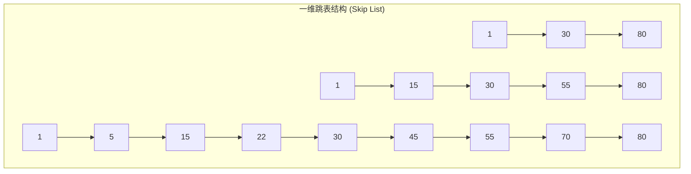
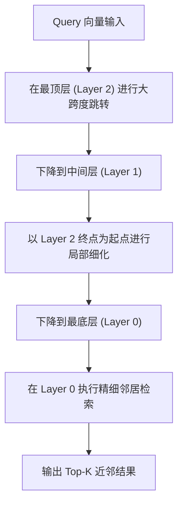
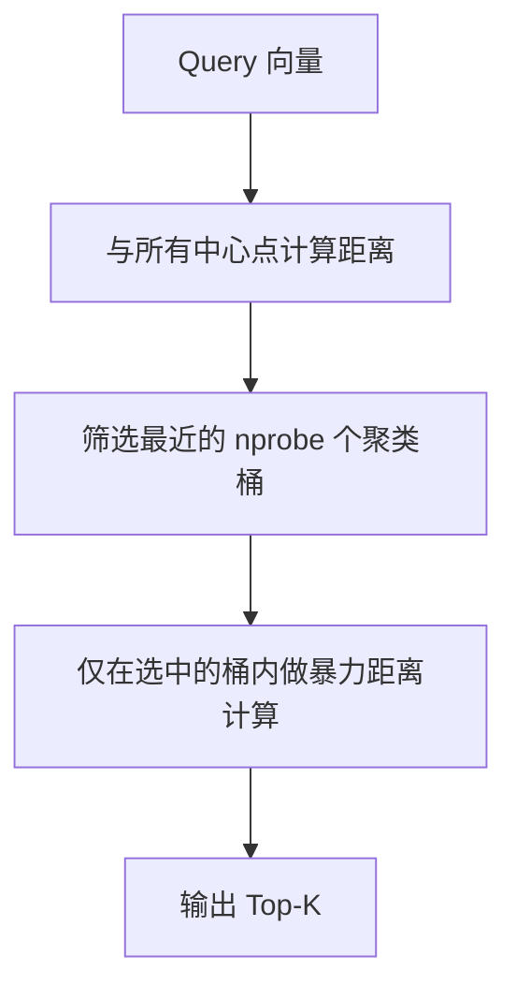

# Day 37 — Chroma / Qdrant 向量数据库原理与本地 HNSW 索引部署

> **本日在 "AI 研究助手" 项目中的定位**：当知识库的文档分块（Chunks）规模达到万级甚至百万级时，暴力计算会导致 Agent 决策时延从毫秒级暴涨至秒级。本日学习的 HNSW 索引部署与参数调优，是确保 Agent 检索时延在 15ms 内的绝对核心技术。

---

## 一、业务场景：多 Agent 并发知识检索的暴力计算瓶颈

### 1.1 性能退化与痛点量化
在多 Agent 并发知识检索系统（RAG）中，如果知识库文档量达到 10 万+。当用户输入问题时，若采用**暴力检索（Flat / Brute-force）**，即对所有向量进行一一比对：

| 知识库规模 (1536 维) | 检索算法 | 单次检索时延 | 50 并发 QPS | 系统 CPU 负载 | 核心痛点 |
|---|---|---|---|---|---|
| 1,000 Chunks | Flat 暴力 | ~1.2 ms | ~800 | 15% | 无明显感知 |
| 10,000 Chunks | Flat 暴力 | ~12.5 ms | ~80 | 65% | 出现轻微排队 |
| 100,000 Chunks | Flat 暴力 | ~128.0 ms | ~7 | **100% 挂起** | 延迟剧增，内存排队导致 OOM |
| 1,000,000 Chunks | Flat 暴力 | ~1320.0 ms | < 1 | **系统崩溃** | 无法支持生产环境 |

### 1.2 近似最近邻检索（ANN）的引入
为了将检索时间复杂度从 $O(N)$ 降到 $O(\log N)$，必须采用**近似最近邻检索（Approximate Nearest Neighbor Search, ANN）**。它通过损失极其微小的召回精度（例如 1% 的偏差），换取成百上千倍的检索吞吐量。

---

## 二、HNSW (分层导航小世界) 算法原理

### 2.1 从一维跳表（Skip List）到高维图
HNSW 借鉴了**跳表**的经典思想。在一维链表中，查找一个元素需要 $O(N)$。如果在链表之上构建多层稀疏索引（跳表），就能实现类似于二分查找的 $O(\log N)$ 检索。



在多维空间中，HNSW 将这个机制扩展为**多层有向图**：
1. **第 0 层（Layer 0）**：包含数据集中所有的向量节点，且节点之间的连接关系最稠密。
2. **上层（Layer 1, Layer 2 ...）**：节点以指数级递减的概率被“选拔”到上层。越往上层，图的结构越稀疏，连接线的几何跨度越大。

### 2.2 检索流程：从粗筛到精筛
1. 检索从最高层的**入口点（Entry Point）**开始。
2. 在当前层，利用贪心算法沿着连接边快速跳转，找到距离查询向量（Query）最近的节点。
3. 将该最近节点作为下一层的入口点，下降到下一层继续进行局部查找。
4. 重复此过程，直到第 0 层，最终返回 Top-K 结果。



### 2.3 核心参数调优
在 Qdrant 中构建 HNSW 索引时，有三个关键参数需要我们进行权衡折损：

1. **`m` (Max Edge Connections)**：
   - **定义**：每个节点在构建图时最大连接的邻居数量。
   - **影响**：`m` 越大，高维图的连通性越好，召回率越高，但会显著增加索引文件的**内存占用**和构建耗时。
   - **推荐**：小维度/简单数据设为 16，大维度（如 1536 维）或复杂语义场景设为 16 ~ 32。

2. **`ef_construct` (Search Window Size for Construction)**：
   - **定义**：在构建索引阶段，为新插入节点寻找邻居时的搜索深度（候选队列大小）。
   - **影响**：`ef_construct` 越大，构建出的图结构越精确，召回率越高，但**索引构建时间（吞吐量）会呈指数上升**。
   - **推荐**：开发环境使用 100，高精度生产环境使用 200 ~ 512。

3. **`ef` (Search Window Size for Search)**：
   - **定义**：在查询检索阶段的搜索候选集大小。
   - **影响**：`ef` 越大，检索的召回率越高，但单次检索的**响应时延（Latency）**会变大。可在查询时动态修改。
   - **推荐**：通常设为 64 ~ 256。

---

## 三、IVF (倒排文件索引) 聚类分桶原理

### 3.1 聚类分桶机制
**IVF（Inverted File Index）** 采用了一种截然不同的降维打击方式：
1. **训练阶段**：使用 K-Means 聚类算法将整个向量空间划分为 $K$ 个 Voronoi 单元（聚类分桶），并计算每个桶的中心点（Centroid）。
2. **构建阶段**：将所有的文档向量划分到与其最近的中心点桶中，生成倒排列表。
3. **检索阶段**：
   - 第一步：Query 向量与 $K$ 个中心点进行暴力计算，筛选出最近的 $nprobe$ 个桶（粗筛）。
   - 第二步：仅在选中的 $nprobe$ 个桶的倒排列表中进行向量距离计算（精筛）。



### 3.2 HNSW 与 IVF 选型横向对比

| 评估维度 | HNSW | IVF |
|---|---|---|
| **构建速度** | ❌ 慢（每插入一个点都要在高维图里贪心搜索） | 良好（K-Means 训练 + 快速分桶） |
| **内存占用** | ❌ 高（需要加载整个复杂的图结构） | 良好（仅保存倒排索引和中心点） |
| **检索召回精度** | ✅ 极高（能保持 >99% 的高维精度） | 中等（在聚类边界存在截断误差） |
| **检索时延 SLA** | ✅ 极低（个位数毫秒级，且性能非常稳定） | 依赖 $nprobe$ 参数，大并发下波动大 |
| **首选场景** | **Agent 核心知识库（高吞吐、高精度、低时延）** | 超大规模数据归档（亿级向量，且内存受限） |

---

## 四、Qdrant 向量数据库本地 Docker 部署

在本地开发和生产部署中，我们通常使用官方的 Docker 镜像，并配合环境变量来限制其内存与硬件资源的开销。

### 4.1 生产级 Docker 启动命令
```bash
docker run -d -p 6333:6333 -p 6334:6334 \
  -v $(pwd)/qdrant_storage:/qdrant/storage \
  -e QDRANT__STORAGE__PERFORMANCE__MAX_SEARCH_THREADS=4 \
  -e QDRANT__STORAGE__PERFORMANCE__MAX_OPTIMIZERS_THREADS=2 \
  --name qdrant-local \
  qdrant/qdrant:latest
```

### 4.2 生产级 Docker Compose 启动（推荐）
在项目目录下编写 [docker-compose.yml](file:///Users/zhouyi/03.AI/03.freshManStart/weekly/w06_embedding_and_vector_db/day37/docker-compose.yml)，并执行 `docker-compose up -d` 即可一键拉起（已废弃并移除 obsolete 的 `version` 声明）：
```yaml
services:
  qdrant:
    image: qdrant/qdrant:latest
    container_name: qdrant-local
    restart: unless-stopped
    ports:
      - "6333:6333"
      - "6334:6334"
    volumes:
      - ./qdrant_storage:/qdrant/storage
    environment:
      - QDRANT__STORAGE__PERFORMANCE__MAX_SEARCH_THREADS=4
      - QDRANT__STORAGE__PERFORMANCE__MAX_OPTIMIZERS_THREADS=2
    deploy:
      resources:
        limits:
          memory: 2g
```

### 4.3 Docker 本地部署与连接常见报错排查 (Docker & Connection Troubleshooting)

在本地搭建或开发向量检索引擎时，经常会遇到以下三个经典痛点报错：

#### 报错 1：Docker 守护进程未启动
```text
Cannot connect to the Docker daemon at unix:///Users/zhouyi/.orbstack/run/docker.sock. Is the docker daemon running?
```
- **成因**：宿主机上的 Docker 虚拟化后台服务（如 Orbstack 或者是 Docker Desktop）没有开启。
- **排查与自愈**：在 Mac 上双击启动 Orbstack 并等待状态指示就绪，在终端运行 `docker ps` 进行验证。此外，我们的代码中设计了自适应连接探针，如失败会自动降级到 `location=":memory:"` 内存模式以保障离线调试无阻碍。

#### 报错 2：TCP 连接被重置 (Connection reset by peer)
```text
ResponseHandlingException: [Errno 54] Connection reset by peer
```
- **成因**：在 macOS 环境下，由于 IPv6 双栈解析优先，使用 `localhost` 连接本地端口常被解析到 `::1`。如果 Docker 容器只绑定监听了 IPv4 地址，则宿主机发起的 TCP 连接在握手阶段就会被容器直接重置。
- **解决**：在客户端配置中，**统一将 `localhost` 升级为显式的 IPv4 环回地址 `127.0.0.1`**（如 `http://127.0.0.1:6333`），即可绕过 macOS 解析坑。

#### 报错 3：JSON 负载过大被拒绝 (JSON payload too large)
```text
UnexpectedResponse: Unexpected Response: 400 (Bad Request)
Raw response content: {"status":{"error":"JSON payload (65487504 bytes) is larger than allowed (limit: 33554432 bytes)."}}
```
- **成因**：在大数据量并发批量写入向量时（如单 batch 写入 2000 条 1536 维度的 float32 向量），转换为 JSON 文本大小会达到 50MB+，直接击穿了 Qdrant 的 HTTP Body 默认 32MB 的大小限制。
- **解决**：在客户端代码中实现合理的分片控制，建议对于 1536 维向量，**单次批量写入的 `batch_size` 不超过 500**，这既能获得最佳并发写入吞吐率，又能安全地控制在 32MB payload 限制以下。

### 4.4 关键性能配置解释
*   `QDRANT__STORAGE__PERFORMANCE__MAX_SEARCH_THREADS`：限制用于处理查询的线程数，避免并发量暴涨时占满宿主机的所有 CPU 核心导致系统雪崩。
*   `QDRANT__STORAGE__PERFORMANCE__MAX_OPTIMIZERS_THREADS`：限制后台合并段（Segments）和构建 HNSW 索引的优化线程数，防止索引构建过程影响在线查询服务的时延。

---

## 五、Qdrant Python SDK 集合生命周期管理

Qdrant 通过 **Collection** 来组织具有相同特征的向量数据。在创建 Collection 时，我们需要显式指定向量维度、距离度量函数，以及 HNSW 的个性化参数。

### 5.1 极简核心构建伪代码
```python
# 初始化 Qdrant 客户端
from qdrant_client import QdrantClient
from qdrant_client.models import Distance, VectorParams, HnswConfigDiff

# 统一使用 127.0.0.1 避开双栈解析问题
client = QdrantClient(url="http://127.0.0.1:6333")

# 创建 Collection 并自定义 HNSW 索引参数
client.create_collection(
    collection_name="agent_kb",
    vectors_config=VectorParams(
        size=1536,  # 向量维度
        distance=Distance.COSINE  # 距离度量
    ),
    hnsw_config=HnswConfigDiff(
        m=16,              # 最大连接数
        ef_construct=100,  # 构建搜索范围
    )
)
```

---

## 六、内存与性能权衡决策速查表

在调优 Agent 知识库向量数据库时，可以参考以下经验法则进行配置：

| 业务诉求 | 调整参数 | 推荐配置 | 物理代价 |
|---|---|---|---|
| **追求极致召回率** | 调大 `m` 且 调大 `ef_construct` | `m=32`, `ef_construct=200` | 内存占用翻倍，写入构建耗时增加 300% |
| **追求极速写入/导入** | 暂时关闭 HNSW 后再开启 | 创建 Collection 时设 `hnsw_config.m=0`，导入后再修改 | 导入期间不支持 ANN 快速检索 |
| **追求极小内存占用** | 降低维度 / 启用标量量化 | 启用 `scalar_quantization` 或 Matryoshka 裁剪维度 | 召回率会产生 1% ~ 3% 的微幅下降 |
| **在线降低查询延迟** | 调小 `ef` (Search) | 检索时指定 `params.hnsw_ef=32` | 可能会漏掉极少数边缘相似向量 |
