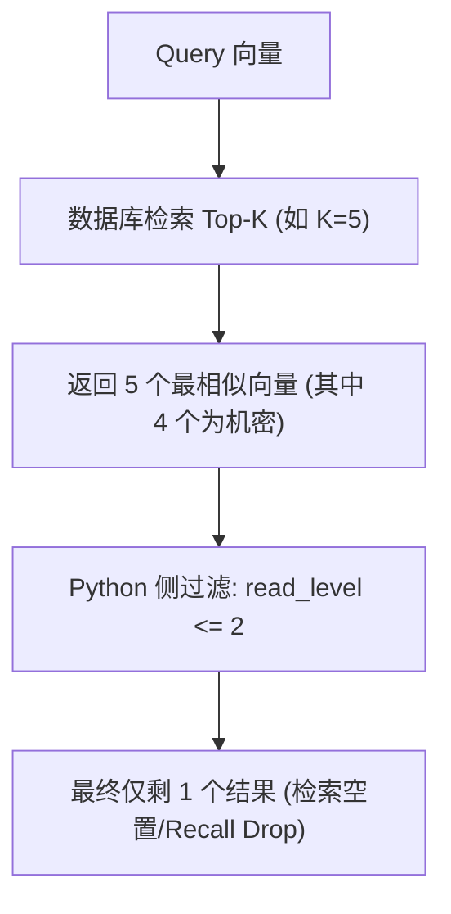
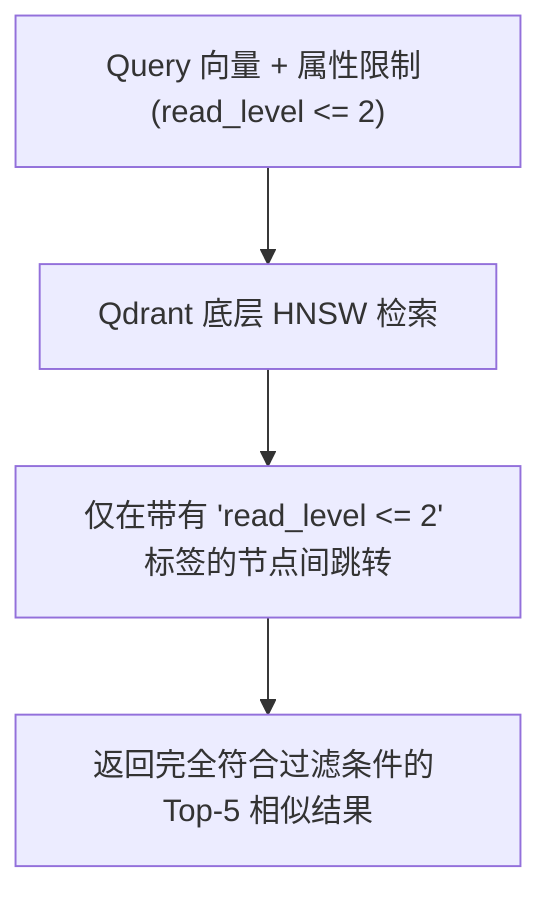

# Day 38 — 相似度检索与元数据联合过滤 (Metadata Filtering)

> **本日在 "AI 研究助手" 项目中的定位**：在实际生产中，知识库并不只服务单一用户。用户存在“权限等级”（如管理员、普通员工），文档也存在“类别域”（如财务、安全、公共）。本日学习的元数据过滤技术，能够保证 Agent 在进行检索时既不会产生“权限越界”，又能将检索结果数量死死锁定在期望的 Top-K 上。

---

## 一、业务场景：多租户权限控制下的知识检索困境

### 1.1 系统痛点量化
在一个多用户协作的 Agent 系统中，不同用户有不同的文档访问级别（`read_level`）。
* **安全文档 A**：语义与用户问题极其相关，但其 `read_level = 3`（机密）。
* **当前用户**：其访问级别仅为 `read_level = 2`（普通）。
* **系统要求**：系统必须召回最相关的 **5** 篇当前用户有权阅读的文档。

若采用不当的过滤模式，系统会遭遇以下尴尬境地：

| 过滤方案 | 实现机制 | 召回结果数 | 查询耗时 | 安全隐患 / 痛点 |
|---|---|---|---|---|
| **不作过滤** | 暴力直接检索向量 | 5 (可能包含机密文档) | 极低 | ❌ **越权漏洞**：普通用户获取到了机密文档内容 |
| **Post-Filtering (后过滤)** | 先检索出 Top-5，再在 Python 侧按 `read_level <= 2` 过滤 | **0 ~ 2** (严重不足) | 极低 | ❌ **检索空置 (Recall Drop)**：因为 Top-5 全是机密文档，过滤后结果为空，导致 Agent 拿不到上下文 |
| **Pre-Filtering (前过滤)** | 在向量数据库底层将 HNSW 与元数据索引结合，只在符合条件的节点间检索 | **5** (完全满足) | 极低 | ✅ **安全且完整**：在保证权限隔离的同时，精准返回 5 条结果 |

---

## 二、过滤流向对比：Post-Filtering vs Pre-Filtering

### 2.1 Post-Filtering (后过滤) 机制与痛点
后过滤本质上是将“相似度检索”与“属性过滤”作为两个孤立的阶段。由于数据库在检索向量时对属性“睁眼瞎”，因此极易导致结果被过滤后数量不足。



### 2.2 Pre-Filtering (前过滤) 机制
前过滤将元数据条件直接作为向量数据库图检索（如 HNSW）的剪枝约束。在沿着高维图跳转时，算法仅考虑那些符合过滤条件的节点。



---

## 三、Qdrant 的 Payload 过滤与复合条件配置

在 Qdrant 中，元数据被存储在 **Payload（负载）** 字典中。Qdrant 支持在 Payload 的字段上创建索引（Payload Index），使前过滤达到和普通关系型数据库索引相同的检索效率。

### 3.1 核心过滤条件类型
Qdrant 提供了丰富的匹配条件（`Filter` / `Condition`）：
1. **`Match` (精确匹配)**：例如字段等于特定值，或者数组中包含某元素。
2. **`Range` (范围过滤)**：常用于数字或时间戳字段的范围比较（如 `gt`、`lt`、`gte`、`lte`）。
3. **`IsEmpty` / `IsNull` (空值判定)**：判定字段是否存在或为空。

### 3.2 复合条件结构关系
多个条件可以通过布尔逻辑进行拼装：
* **`must`**：所有的条件必须同时满足（相当于逻辑 `AND`）。
* **`must_not`**：所有的条件都不能满足（相当于逻辑 `NOT`）。
* **`should`**：至少满足其中一个条件（相当于逻辑 `OR`）。

---

## 四、Qdrant 底层联合检索配置 (伪代码)

在调用最新的 `query_points` 接口时，将 `query_filter` 参数直接传入，数据库即可在底层执行 Pre-Filtering：

```python
from qdrant_client import QdrantClient
from qdrant_client.models import Filter, FieldCondition, MatchValue, Range

client = QdrantClient(url="http://127.0.0.1:6333")

# 构建 Pre-filtering 复合过滤条件
# 条件：类别必须是 'security'，且阅读级别必须 <= 2
pre_filter = Filter(
    must=[
        FieldCondition(key="category", match=MatchValue(value="security")),
        FieldCondition(key="read_level", range=Range(lte=2))
    ]
)

# 执行 Pre-Filtering ANN 检索
results = client.query_points(
    collection_name="agent_documents",
    query=[0.1] * 1536,  # Query 向量
    query_filter=pre_filter,
    limit=5
)
```

---

## 五、Pre-Filtering 与 Post-Filtering 技术选型决策速查

| 评估维度 | Post-Filtering (后过滤) | Pre-Filtering (前过滤) |
|---|---|---|
| **开发复杂度** | 简单（纯 Python `list comprehension` 即可） | 略高（需要学习向量数据库的 Filter DSL 语法） |
| **检索结果数量 (SLA)** | ❌ 无法保证（极易因为过滤条件苛刻导致返回 0 结果） | ✅ 100% 保证（只要库中满足条件的向量足够） |
| **大集合查询性能** | ❌ 差（若要获得足量结果，需在 Python 中发起多次拉取） | ✅ 极佳（由向量数据库底层 C++ 级索引树剪枝完成） |
| **内存/磁盘开销** | 极低（无额外索引） | 略高（需要在元数据字段上额外创建 Payload 索引） |
| **首选场景** | 仅用于极小数据集（如几百条）或过滤极宽松场景 | **生产级多租户、多属性控制 Agent 系统的绝对首选** |
