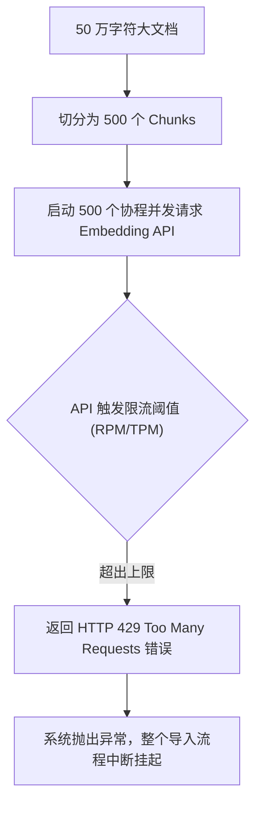
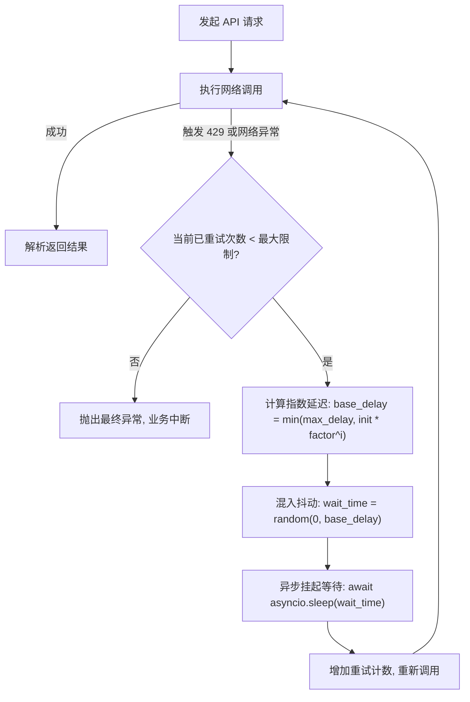

# Day 39 — 分批向量化、批量插入与大模型限流 (Rate Limit) 自适应保护

> **本日在 "AI 研究助手" 项目中的定位**：在大文件冷启动数据同步或海量语料清洗时，系统面临高频网络 I/O 交互。大模型服务商对 API 的 RPM (每分钟请求数) 与 TPM (每分钟 Token 数) 限制是生产环境阻断任务的头号杀手。本日学习的高并发速率控制与自适应指数退避，是保障 Agent 数据流水线 100% 成功率的核心基石。

---

## 一、业务场景：海量文本向量化同步中的 API 频繁崩溃

### 1.1 系统痛点与 429 阻断
当把一部 50 万字符的技术文档切分为 500 个 Chunks，如果直接发起暴力并发请求大模型的 Embedding 接口：



由于常规开发者的 API 限制极低（例如 3 RPM 或 5 RPM），暴力并发会导致超过 95% 的请求瞬间被拦截，报错堆栈中会抛出 `HTTP 429 (Too Many Requests)` 或 `Rate Limit Exceeded`，导致导入链路直接溃败。

### 1.2 并发与限流治理核心要点
要实现工业级稳定导入，必须双管齐下：
1. **主动限流 (Concurrency Control)**：在客户端主动控制最大并发数，使用 `asyncio.Semaphore` 信号量限制同一时刻正在网络通信的协程上限。
2. **被动防御 (Adaptive Backoff Retry)**：当偶发网络波动或瞬时突破 TPM 触发 429 时，不应当崩溃退出，而是应当挂起该任务，等待退避延迟后重新发起请求。

---

## 二、自适应指数退避与随机抖动 (Exponential Backoff with Jitter)

简单的固定延迟重试（如“每次失败都等待 1 秒”）在分布式系统或高并发请求下存在严重的**群聚效应 (Thundering Herd Problem / 惊群效应)**：所有失败的客户端会在同一时间戳同时发起第二次请求，从而再次击穿 API 限制。

为此，我们必须使用**带随机抖动的指数退避算法**。

### 2.1 数学公式与延迟计算
在第 $i$ 次重试时（$i$ 从 0 开始），等待延迟时间 $t_{wait}$ 计算如下：

1. **纯指数延迟 (Exponential Backoff)**：
   $$t_{base\_delay} = \min(t_{max}, t_{initial} \times \text{factor}^i)$$
   随着失败次数增加，等待时间呈指数级拉长，给服务器腾出恢复带宽。

2. **混入随机抖动 (Full Jitter)**：
   $$t_{wait} = \text{random}(0, t_{base\_delay})$$
   通过引入 `0` 到当前退避上限之间的随机数，将原本整齐划一的并发客户端重试波峰，在时间轴上物理“抹平”和分散。

---

## 三、退避重试控制流流向 (Mermaid 流程图)



---

## 四、客户端主动控制并发与退避伪代码

下面的伪代码展示了利用 `asyncio.Semaphore` 限制并发，并配合退避机制的核心实现框架：

```python
import asyncio
import random

# 创建并发信号量，硬卡控同一时刻最大并发网络连接为 3
sem = asyncio.Semaphore(3)

async def request_with_backoff_demo(text: str, max_retries: int = 5):
    initial_delay = 1.0
    factor = 2.0
    
    # 信号量主动卡控并发上限
    async with sem:
        for i in range(max_retries):
            try:
                # 执行网络请求
                return await call_embedding_api(text)
            except Exception as e:
                if i == max_retries - 1:
                    raise e
                # 指数退避与抖动计算
                base_delay = min(10.0, initial_delay * (factor ** i))
                wait_time = random.uniform(0, base_delay)
                print(f"请求失败: {e}，正在执行第 {i+1} 次重试，等待 {wait_time:.2f} 秒...")
                await asyncio.sleep(wait_time)
```

---

## 五、自适应并发治理选型对比

| 优化维度 | 暴力无限并发 | 简单固定重试 | 信号量并发控速 | 信号量 + 指数退避抖动 |
|---|---|---|---|---|
| **API 限流触发率** | ❌ 极高 (100% 击穿) | ❌ 高 (重试依然会产生惊群) | ⚠️ 中 (控制在安全 RPM 内，但无法防 TPM 突破) | ✅ 极低 |
| **异常恢复能力** | ❌ 无 (抛出异常程序崩溃) | ⚠️ 差 (依然大面积 429) | ❌ 无 | ✅ 极佳 (网络瞬断、限流自愈) |
| **导入吞吐时效性** | ❌ 极差 (频繁中断，整体进度为零) | ⚠️ 中 | ✅ 良好 | ✅ 极佳 (以最高安全速率推进) |
| **生产级适用性** | ❌ 严禁使用 | ❌ 严禁使用 | ⚠️ 勉强可用（配置困难） | **✅ 生产级标准底座首选** |
