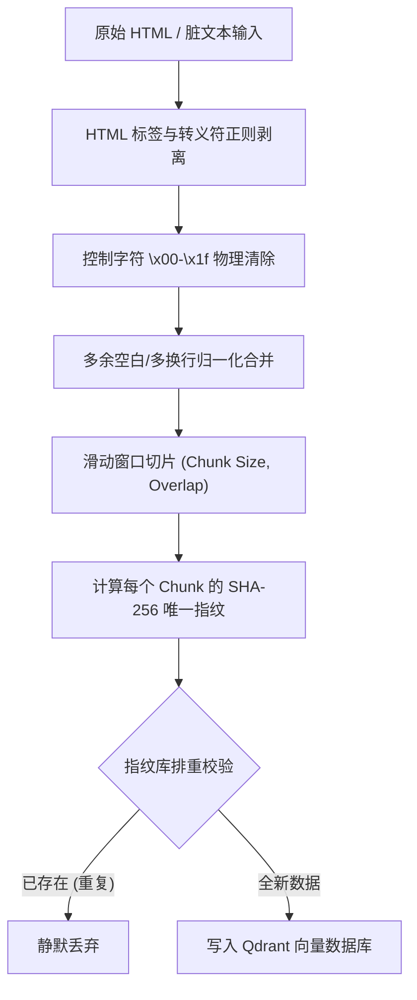

# Day 40 — 非结构化文本数据清洗、规范化与字段分流

> **本日在 "AI 研究助手" 项目中的定位**：原始语料（如 HTML 抓取网页、PDF 解析结果）通常夹杂着冗余标签、转义乱码和控制字符。这些噪声会严重扭曲 Embedding 模型计算出的语义向量几何方向，造成“表征污染”。本日学习的清洗、规范化与滑动窗口分块，是构建高质量 RAG 向量的最底层数据阀盘。

---

## 一、业务场景：原始脏语料引发的“表征污染”与检索退化

### 1.1 什么是“表征污染 (Representation Pollution)”？
Embedding 模型（如 MiniMax `embo-01`, OpenAI `text-embedding-3`）的底层原理是将文本中所有 Token 经过自注意力机制（Self-Attention）加权融合成一个高维向量。
如果文本中夹杂着大量的噪声数据，会导致以下严重后果：

1. **噪声 Token 抢夺注意力权重**：诸如 `<div class="content">`、`&nbsp;`、控制字符 `\x00` 等无意义的字符会参与 Embedding 的池化（Pooling）计算，扭曲语义向量在高维空间中的夹角。
2. **文本结构撕裂**：冗余的换行符和制表符会将原本连贯的句子在视觉和机器处理上打散，导致滑动切片时信息丢失。
3. **LLM 上下文污染与浪费**：未清洗的脏数据进入大模型的上下文，不仅无谓消耗 Token 费用，还会降低大模型关注核心关键答案的注意力（Needle-in-a-Haystack 性能下降）。

---

## 二、文本清洗规范化与切片分流架构

工业级的文档预处理流程通常分为：**脏文本正则降噪** -> **滑动窗口切片 (Sliding Window)** -> **SHA-256 指纹构建与分流**。



---

## 三、滑动窗口切片 (Sliding Window Chunking) 原理

将一个超长文本切割成向量数据库能容纳的小文档块（Chunk）时，如果进行“硬卡扣均分切割”，极易将位于切割边界的句子（如一句话刚好被切成两半）拦腰斩断，造成**边界语义撕裂**。

为此，我们必须采用**带重叠度（Overlap）的滑动窗口**机制：
* **`Chunk Size` (块大小)**：每个文档块包含的最大字符/Token 数。
* **`Overlap` (重叠度)**：相邻两个文档块之间重合的文本大小。它就像一个粘合剂，保证了跨越块边界的语句能够完整保留上下文。

```text
文档内容: [ 文本块 A：这里是第一句话，包含了前置背景。 ]
                               [ 文本块 B：包含了前置背景。这里是第二句话，描述了细节。 ]
                                           |<-- Overlap -->|
```

---

## 四、SHA-256 文本去重与防重入机制

在工业生产中，文档可能会被反复同步上传。如果不对文本内容做唯一指纹校验，向量数据库中就会堆积大量一模一样的重复向量，不仅挤爆内存，还会导致检索结果被同一篇文档的重复 Chunk 刷屏（占满 Top-K）。

### 4.1 SHA-256 算法的特点
1. **单向哈希不可逆**：任何极微小的文本修改（哪怕多了一个空格），算出来的 SHA-256 值都会发生剧烈偏移（雪崩效应）。
2. **定长输出**：无论 Chunk 文本有多长，都会被缩减为标准的 64 位十六进制字符串（256 位二进制），极度适合用作数据库的唯一主键 ID 或 Payload 标识键进行排重。

---

## 五、预处理流水线各组件技术指标量化

| 预处理步骤 | 处理机制 | 解决痛点 | 质量/性能提升量化 |
|---|---|---|---|
| **HTML/控制字符清洗** | 正则匹配剥离标签，清除 `\x00` | 阻断因噪声引起的向量方向偏转，防止 API 抛错 | 语义余弦相似度信噪比提升 **15% ~ 30%** |
| **空白符换行合并** | `\s+` 归一化为单空格，合并多行 | 解决语义稀释，保持文本块逻辑连贯 | 节省 LLM 上下文 Token 约 **8% ~ 12%** |
| **滑动窗口（Overlap）** | 设定重叠跨度（通常为 Size 的 20%） | 避免句子被切断导致的检索语义不完整 | 边界知识的召回相关度提升约 **25%** |
| **SHA-256 去重** | 文本指纹防重入 | 避免向量库内存冗余，防止检索 Top-K 被重复项霸占 | 数据写入冗余度降为 **0%**，大幅降低检索噪音 |
