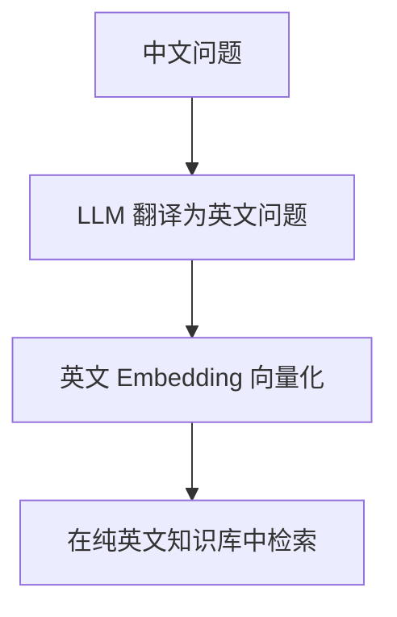
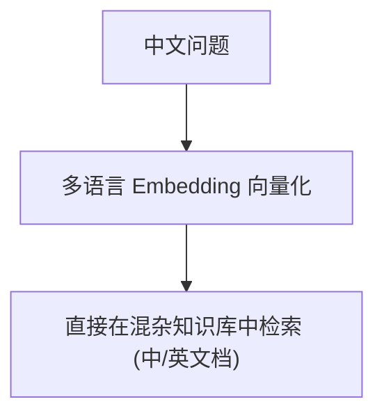
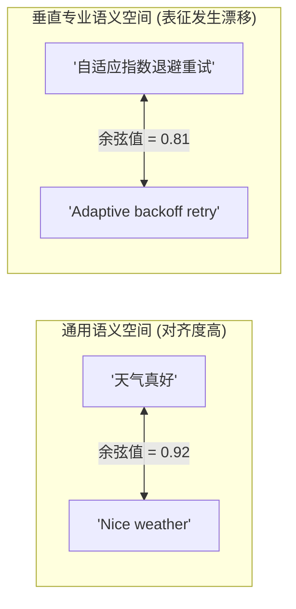

# Day 41 — 跨语言检索与 Embedding 表征漂移检测

> **本日在 "AI 研究助手" 项目中的定位**：在跨国协作或包含中英文技术白皮书的 Agent 知识检索场景下，用户常用中文提问，而相关知识点分布在英文文档中。跨语言表征模型提供了高维空间下的翻译映射。但是，当语料进入深水专业垂直领域时，向量会发生“表征漂移”。本日学习的漂移检测，能定量指导我们在不同业务领域下卡控最合理的 RAG 召回相似度阈值。

---

## 一、业务场景：全球化 Agent 中的中英文联合检索需求

### 1.1 跨语言检索（Cross-Lingual Retrieval）的两种架构

当知识库包含英文 PDF 文档，而用户输入中文 Query 时，常见的检索方案有：

#### 方案 A：翻译代理模式（Translation + Monolingual Embedding）
先调用翻译大模型将中文 Query 翻译成英文，再使用纯英文 Embedding 模型进行向量化匹配。

* **痛点**：多了一次大模型翻译开销，且翻译质量直接决定了向量的精度。对于垂直名词，翻译容易变形。

#### 方案 B：多语言统一空间模式（Multilingual Embedding）
使用统一的跨语言表征模型直接将中文 Query 向量化，在由多语言模型构建的混杂（中英）向量空间中检索。

* **优势**：零翻译开销，且多语言表征模型在底层预训练阶段已将“含义相近的不同语种词汇”映射到了几何坐标相近的区域。

---

## 二、多语言向量空间的几何对齐原理

在高质量的多语言表征模型（如 MiniMax `embo-01`, `multilingual-e5`）中，底层网络通过对比学习（Contrastive Learning），对不同语言的对齐语料（Parallel Corpora）进行强制约束拉近。

最终，在高维球面上：
* 中文句子 `"你好"` 与 英文句子 `"Hello"` 共享着高度相近的超维几何指向（余弦相似度极高）。
* 中文句子 `"获取文本的向量"` 与 英文句子 `"Get text embeddings"` 共享高度相近的空间夹角。

---

## 三、表征漂移 (Representation Drift) 的定义与成因

虽然通用语料（如“天气好”、“吃饭了吗”）在多语言向量空间中能完美贴合，但当数据切换到**专业垂直领域（如特定的 Python 协程、HNSW 跳表算法、并发重试控制）**时，向量间的距离会发生崩塌退化。

### 3.1 表征漂移的三个主因
1. **分词表（Tokenizer）退化**：专业技术词汇（如 `Full Jitter`）在多语言分词中容易被切碎成无意义的 Subwords，严重稀释了核心词义向量。
2. **训练语料分布稀疏**：互联网上绝大多数对齐的平行语料均是日常用语或新闻，垂直技术、医学、法律领域的双语对齐语料极少，导致模型在此空间未经过强制对比拉近。
3. **语言本身的表达阻碍**：中文的“指数退避”与英文的 “exponential backoff” 在文字构造上毫无关联，缺乏字根语义映射。

---

## 四、RAG 检索阈值（Cosine Threshold）决策困境与度量

在生产级 RAG 中，为了防止召回风暴（Recall Storm）和无关内容污染，通常会配置一个**相似度卡控阈值（Similarity Threshold）**，如余弦相似度小于 `0.85` 的结果直接抛弃。

如果忽略表征漂移，盲目设定单一阈值，会导致垂直领域的有用知识被系统拦截：

| 领域分类 | 句子特征 | 平均余弦相似度 | RAG 设防阈值 | 过滤后果 | 解决方案 |
|---|---|---|---|---|---|
| **通用领域** | 日常对话、简单语境 | ~0.92 | 0.85 | ✅ 正常通过，检索无虞 | 保持通用阈值 |
| **专业垂直领域** | 算法代码、深水工程 | ~0.80 | 0.85 | ❌ **误杀**：高相关专业英文文档被直接过滤丢弃 | **降低卡控阈值 (如降为 0.76)** |

---

## 五、跨语言方案横向对比决策速查表

| 评估维度 | 翻译代理方案 (Translation) | 多语言统一空间方案 (Multilingual) |
|---|---|---|
| **首字延迟 (TTFT)** | ❌ 慢（依赖翻译模型的接口生成耗时，额外增加 100~500ms） | ✅ 极快（直接向量化，个位数毫秒级响应） |
| **翻译开销** | ❌ 高（大模型翻译需要双倍消耗 Token 费用） | ✅ 低（无翻译开销） |
| **专业词汇对齐度** | ⚠️ 取决于翻译质量（若翻译准确，对齐很好；若翻错则彻底偏离） | ❌ 存在表征漂移（专业词汇余弦夹角系统性缩小，需动态调小卡控阈值） |
| **首选场景** | 对延迟极不敏感、但极其在乎高精度行业词汇召回的离线分析 | **在线、高吞吐、低时延的全球化 Agent RAG 检索流水线** |
