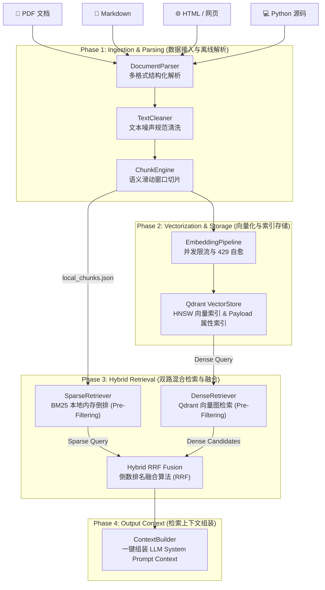
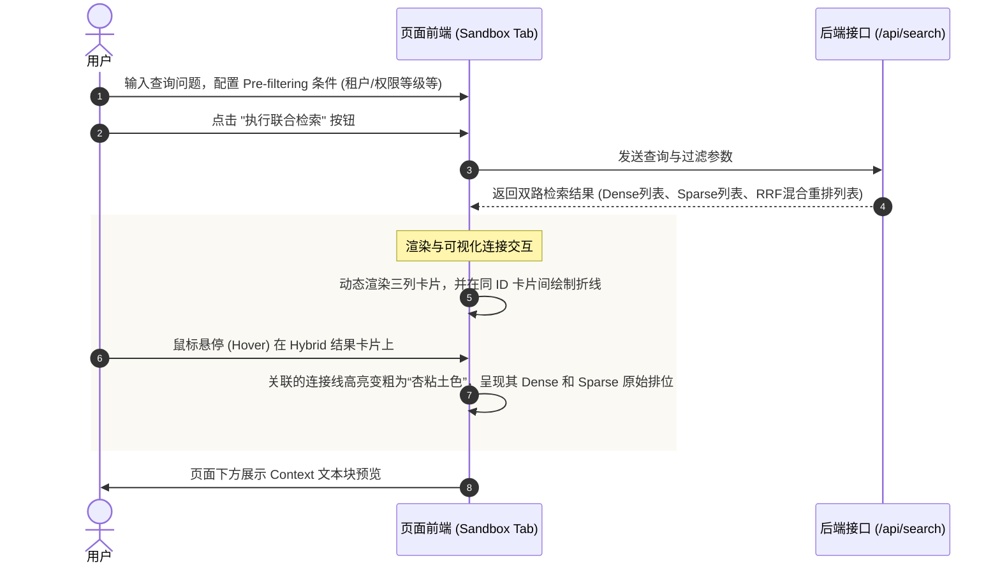

# AI Research Assistant Knowledge Engine (AI 研究助手知识引擎)

本项目是 Week 6 的综合实战交付物。它从一个简单的“向量数据库 Demo”升级为了一个具备生产级能力的 **RAG 知识接入与相似度检索基础设施**。覆盖了数据工程、大模型向量表征、搜索引擎技术和后端多租户隔离等多维度工程实践。

---

## 🌟 核心特性

1. **多格式文档解析器 (DocumentParser)**：支持对 PDF (基于 PyMuPDF)、Markdown、HTML、TXT 以及 Python 源代码的智能提取，并保留其标题级别及层级结构。
2. **文本规范化清洗管道 (TextCleaner)**：过滤 HTML 标签、不可见系统控制字符、合并冗余空行，并输出 `noise_ratio` 指标。
3. **双重全局去重 (SHA-256)**：生成 Chunk 级别唯一哈希值，跳过重复内容，减少大模型 Embedding 调用开销并防止向量库冗余。
4. **自适应并发限流与自愈 (EmbeddingPipeline)**：引入信号量并发调度机制防止厂商 429 报错，并配备“指数退避与随机抖动（Jitter）”重试装饰器。
5. **多租户数据隔离与 Pre-Filtering (QdrantVectorStore)**：物理创建 HNSW 检索索引，自动为 `category`、`user_id`、`permission_level` 和时间构建 Payload 过滤索引，实现底层 HNSW 联合查询过滤，防止 Recall Drop。
6. **本地倒排稀疏检索 (SparseRetriever)**：基于 BM25 算法快速建立内存关键词检索索引，并实现了与 Qdrant 对应的本地 Pre-Filtering 前置内存过滤。
7. **双路混合检索与 RRF 融合 (RetrievalService)**：将向量相似度与关键词检索相结合，运用 RRF 算法进行结果交叉排序，归一量纲，输出全局最优解。
8. **检索评估与压测 (Evaluator & Benchmark)**：提供 Recall@K、Precision@K、MRR 和 NDCG 指标测试；并发压力测试测量 Import/Write TPS、QPS 及 P50/P95/P99 时延。

---

## 🏗️ 系统架构图



---

## 📁 项目物理结构目录树

本工程采用高度模块化、高内聚低耦合的自底向上（Bottom-Up）架构进行组装：

```text
weekly/w06_embedding_and_vector_db/project/
├── docker-compose.yml       # 本地 Qdrant 数据库单节点部署配置文件
├── start_rag_dashboard.sh   # 一键连通性校验、数据热导入与 Dashboard 启动脚本
├── main.py                  # CLI 命令行入口（装配积木墙：无业务逻辑，负责生命周期调度）
├── app.py                   # FastAPI Web API 服务端（封装所有微引擎供可视化面板调用）
├── models.py                # 数据契约层（Pydantic 实体模型定义）
├── document_parser.py       # Phase 1：多格式结构化解析器（PDF, Markdown, HTML, py）
├── text_cleaner.py          # Phase 1：文本正则规范化清洗管道（含去噪率指标）
├── chunk_engine.py          # Phase 1：滑动窗口 Token 切片引擎与全局去重（SHA-256）
├── sparse_retriever.py      # Phase 1：本地 BM25 稀疏检索微引擎（支持 Pre-Filtering）
├── evaluator.py             # Phase 1：学术级检索质量离线评估引擎（Recall, Precision, MRR, NDCG）
├── embedding_pipeline.py    # Phase 2：并发限流大模型向量化流水线（并发限额、指数退避自愈）
├── vector_store.py          # Phase 2：Qdrant 向量数据库存储与联合属性 Payload 索引构建
├── retrieval_service.py     # Phase 3：联合检索与 RRF 融合重排服务（两路排名融合与 Pre-Filtering）
├── benchmark.py             # Phase 3：全链路并发时延与 Ingestion 写吞吐压力测试引擎
├── templates/
│   └── index.html           # Phase 5：Dashboard 极简 UI 单页面（SVG 排名融合连线动效）
├── test_data/               # 离线与黄金评估测试语料目录
│   ├── eval_dataset.json    # 标定的 5 组黄金检索评估数据集
│   ├── local_chunks.json    # 持久化的 Chunk 数据池（用于秒级倒排冷启动）
│   ├── sample.md            # Markdown 示例文档
│   ├── sample.html          # HTML 示例文档
│   └── sample.txt           # TXT 示例文档
└── tests/                   # 100% 绿灯覆盖的单元测试套件目录
    ├── test_document_parser.py
    ├── test_text_cleaner.py
    ├── test_chunk_engine.py
    ├── test_sparse_retriever.py
    ├── test_evaluator.py
    ├── test_embedding_pipeline.py
    ├── test_vector_store.py
    ├── test_retrieval_service.py
    ├── test_benchmark.py
    └── test_ui_api.py       # 新增：Web APIs 接口单元测试
```

---

## 🚀 快速启动指南

### 1. 安装依赖

确保在虚拟环境下安装了所有必需的软件依赖包：
```bash
pip install qdrant-client rank_bm25 jieba pymupdf numpy pydantic httpx pytest pytest-asyncio
```

### 2. 启动本地 Qdrant 数据库

利用 Docker Compose 一键拉起 Qdrant 实例：
```bash
# 进入工程目录
cd weekly/w06_embedding_and_vector_db/project/
docker compose up -d
```
启动后可访问 `http://localhost:6333/dashboard` 观察向量数据库的控制面板。

### 3. 一键导入测试知识数据

运行 `ingest` 子命令对 `test_data` 文件夹内的示例异构文档进行解析、分块、向量化写入 Qdrant，并持久化到本地：
```bash
python -m weekly.w06_embedding_and_vector_db.project.main ingest --dir weekly/w06_embedding_and_vector_db/project/test_data/
```

### 4. 交互式混合检索 REPL

启动检索终端，支持按策略查询（`dense` / `sparse` / `hybrid`）。您还可以在交互中动态输入租户隔离 ID 或修改阅读权限级别，观察前置过滤（Pre-Filtering）结果的变动：
```bash
python -m weekly.w06_embedding_and_vector_db.project.main search --strategy hybrid --top-k 5
```

### 5. 运行检索质量指标评估

使用标定的黄金数据集运行评估命令，横向测算三种检索模式在学术/技术提问下的 Recall、Precision、MRR 与 NDCG 差距：
```bash
python -m weekly.w06_embedding_and_vector_db.project.main eval --dataset weekly/w06_embedding_and_vector_db/project/test_data/eval_dataset.json -k 5
```

### 6. 全链路并发压力测试

对冷启动 Ingest 通道和并发 Query 通道发起模拟测试。为了避免产生大模型接口资费开销，默认启用了 mock 模式，您也可以指定真实 API 进行评估：
```bash
# 模拟向量接口压测 (推荐，零成本)
python -m weekly.w06_embedding_and_vector_db.project.main bench --num-chunks 500 --num-queries 50 --concurrency 5

# 对真实 MiniMax API 接口压力测试
python -m weekly.w06_embedding_and_vector_db.project.main bench --num-chunks 200 --num-queries 20 --real-embedding
```

### 7. 启动可视化控制看板

本引擎提供了一套像素级精美的单网页可视化控制面板，可一键在本地启动：
```bash
python -m weekly.w06_embedding_and_vector_db.project.main ui --port 8000
```
或者，您也可以直接运行我们为您编写的**一键启动与数据导入** Shell 脚本（该脚本会自动验证您本地已运行的 Qdrant 数据库连通性、执行默认离线 Ingest 数据导入，并自动在浏览器中弹出控制台页面）：
```bash
./weekly/w06_embedding_and_vector_db/project/start_rag_dashboard.sh
```

启动后，系统会自动在浏览器中打开 `http://127.0.0.1:8000` 并展现：
*   **Ingestion 流水线监视舱**：支持拖拽上传并高亮显示 `解析->清洗->分块->向量化->入库` 的节点流转进度。
*   **排位融合贝塞尔连线图**：展示 Dense、Sparse 通道结果如何以 RRF 算法合并排序，悬浮即可高亮关联项。
*   **黄金集 Recall 折线评估**。
*   **QPS 吞吐率及 P50/P95/P99 时延指标仪表盘**。

---

## 🖥️ 可视化控制看板设计与交互流程 (Dashboard Design & Interaction Flow)

本项目提供了一个采用 **Warm Intellectual Minimalism (温润知性极简主义)** 风格设计的 RAG 系统可观测性与调试控制面板。该 Dashboard 用于将黑盒的 RAG 检索与接入流程直观化呈现给开发者。

### 1. 页面模块结构划分
页面采用单页应用 (SPA) 设计，分为三个主要的 Tab 功能板块：
*   **检索沙盒 (Retrieval Sandbox)**：用于直观测试双路检索与 RRF 融合效果，配合 SVG 连线进行排位对应关系的可视化。
*   **数据导入 (Data Ingestion)**：文档上传与微引擎 Ingestion 管道各阶段的进度监视器。
*   **质量评估 & 压测 (Observability Metrics & Bench)**：包括离线黄金集评测指标对比舱、全链路并发性能压力测试舱。

---

### 2. 三大核心交互流程

#### 流程一：检索沙盒 (Hybrid 混合检索与 RRF 可视化)
*   **配置过滤**：用户在左侧面板中配置元数据过滤条件（`user_id` 租户隔离、`max_permission_level` 权限控制、检索模式等），并在顶部输入框中输入查询问题（例如 `"Attention mechanism parameters"`）。
*   **请求与渲染**：点击“执行联合检索”后，前端发送异步请求到后端 `/api/search`。后端返回检索结果后，前端动态渲染三列卡片：`Dense 检索列表` | `Sparse (BM25) 检索列表` | `Hybrid RRF 融合列表`。
*   **可视化排位连线 (交互亮点)**：页面底层的 SVG 画布层（`#connection-overlay`）会自动在三列中**属于相同 `chunk_id` 的卡片之间绘制连接线**。当用户的鼠标悬停 (Hover) 在 Hybrid 列某张卡片上时，与之连接的线会高亮变粗为**杏粘土色 (Active Path)**，直观地呈现该文档在 Dense 和 Sparse 中的各自原始排位，展示 RRF 算法的融合逻辑。
*   **Prompt 预览**：在下方自动展开 `RAG Context Prompt Builder Preview` 模块，显示组装后准备发给 LLM 的 System Prompt 上下文。



#### 流程二：数据导入 (Ingestion 状态机节点监视)
*   **文档上传**：用户拖拽文档（支持 .pdf, .md, .html, .txt, .py 等）到虚线框 `drop-zone` 中，页面展示待上传列表。
*   **流水线进度监视**：点击“启动 Ingestion 流水线”，前端将文件发送给后端 `/api/ingest`，并开启计时器。
*   **状态机节点流转**：页面右侧包含五个依次连接的流水线状态节点：`解析 (Parser)` → `清洗 (Cleaner)` → `分块 (Chunker)` → `向量化 (Embedder)` → `入库 (VectorStore)`。随着后端接口的流式推进，对应节点的指示圈会依次从灰色变为加载动画状态，最终变为绿色打勾，实现可视化的分步状态追踪。

#### 流程三：质量评估与并发压测指标反馈
*   **质量指标评估 (Quality Eval)**：点击“执行指标评估”触发 `/api/evaluate` 请求，后端读取 `eval_dataset.json` 黄金集并运行评测，前端以表格形式对比 Dense、Sparse 和 Hybrid (RRF) 在 `Recall@5`、`Precision@5`、`MRR` 和 `NDCG@5` 四个维度下的指标增益。
*   **全链路并发压测 (Benchmark)**：用户设定压测 Chunk 数、查询样本数、并发协程数后，点击“运行性能压测”触发 `/api/benchmark` 请求。压测完成后前端更新展示 Ingestion/写吞吐率（chunks/s）、并发查询吞吐量（QPS）、平均检索延迟（ms）以及 P50/P95/P99 极端长尾时延指标。

---

## 🧪 自动化测试验证

所有微引擎均配备了严格的单兵作战单元测试，请在项目根目录下运行以验证全链路功能完备性：
```bash
python -m pytest weekly/w06_embedding_and_vector_db/project/tests/ -v
```
报告输出说明 17 个单元测试必须是 100% 通过（PASSED）。
