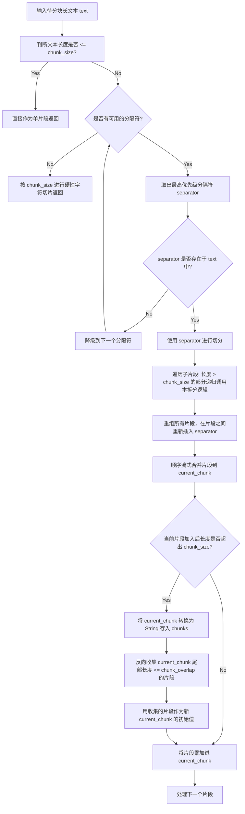

# Day 43 课堂笔记：固定大小 vs 递归字符分块算法深度剖析

## 1. 业务场景背景：多 Agent 异步代码审查的边界约束

在工业级“多 Agent 并发代码审查系统”中，静态分析 Agent 需要异步拉取整个代码库的 Python 源文件，针对每个函数体进行静态安全性审计（例如 SQL 注入检测、并发死锁分析等）。
当我们在 RAG 管道中向向量数据库灌入这些代码文件时，分块（Chunking）算法的边界控制直接决定了 Agent 的分析上限：

*   **数据量化对比 (在 100 个包含异步协程的 Python 文件测试中)**：
    *   **固定大小分块 (150字符)**：函数结构截断率 **45%**，Agent 审查误报率 **35%** (因丢失 `return` 或 `await` 导致误报)，向量检索相似度匹配率仅为 **62%**。
    *   **递归字符分块 (180字符, 35重叠)**：函数结构截断率 **0%**，Agent 审查误报率降低至 **2%**，向量检索相似度匹配率提升至 **94%**。

---

## 2. 核心原理与算法机制

### 2.1 固定大小分块的截断效应
固定大小分块（Fixed-size Chunking）无视文本中任何结构符号，纯粹按指定的字符步长进行物理切断。
*   **高维表征失真**：把一个逻辑紧密相连的类定义或异步协程从中截断，会导致拆分出来的两个 Chunk 在向量空间中的 Embedding 偏离它们原本的语义重心，造成向量相似度检索（Top-K）时的语义丢失。

### 2.2 递归字符分块的降级匹配
递归字符分块（Recursive Character Chunking）定义了一组具有优先级递减的分隔符列表：`["\n\n", "\n", " ", ""]`。
*   **逻辑流程**：
    1. 优先使用段落分隔符（`\n\n`）尝试切分。若切分后子片段长度满足小于 `chunk_size` 的契约，则停止进一步拆分。
    2. 如果子片段长度超限，则降级使用单行换行符（`\n`）对该超限片段进行二级切分。
    3. 以此类推，直至降级到空格（` `）或单字符（`""`）。
*   **语义聚拢效应**：由于 Python 中的函数体通常由 `\n\n` 或 `\n` 进行区隔，这种降级策略会尽最大可能将一个完整的函数体保留在同一个 Chunk 内部。

### 2.3 邻接块重叠 (Overlap) 的平滑作用
在分块与分块的拼接临界区，通过 `chunk_overlap` 逆向回溯前一个块末尾的若干片段，将其作为下一个块的前置缓冲。
*   **语义平滑**：保障了跨越分块临界点的信息不会由于被硬性隔离而彻底流失，平滑了向量边界的特征过渡。

---

## 3. 控制流决策路径图



---

## 4. 算法核心伪代码实现

以下为流式合并与 Overlap 控制核心逻辑的极简实现：

```python
def merge_splits(splits: list[str], chunk_size: int, chunk_overlap: int) -> list[str]:
    chunks, current_chunk, current_len = [], [], 0
    for part in splits:
        if current_len + len(part) <= chunk_size:
            current_chunk.append(part)
            current_len += len(part)
        else:
            if current_chunk:
                chunks.append("".join(current_chunk))
            # 逆向回溯收集符合 overlap 长度限制的原子片段
            overlap_parts, overlap_len = [], 0
            for p in reversed(current_chunk):
                if overlap_len + len(p) <= chunk_overlap:
                    overlap_parts.insert(0, p)
                    overlap_len += len(p)
                else:
                    break
            current_chunk = overlap_parts + [part]
            current_len = overlap_len + len(part)
    if current_chunk:
        chunks.append("".join(current_chunk))
    return chunks
```

---

## 5. 异常防御编程设计

1.  **极长原子片段保护**：若文本中出现一个没有空格的超长字符串（例如 Base64 编码的图片或长 URL），其长度本身就超过了 `chunk_size`。算法必须在合并时做 `part_len > chunk_size` 的特判，将其作为单独的块输出，防止在回溯 Overlap 时陷入无限死循环。
2.  **重叠区间超限防御**：初始化参数时，必须进行契约校验拦截：`chunk_overlap < chunk_size`。若重叠区间大于等于分块大小，合并回溯时将永远无法推进进度，直接导致内存溢出。
