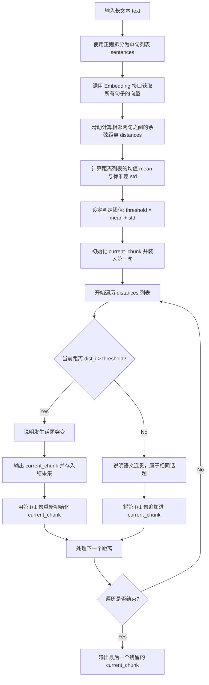

# Day 44 课堂笔记：基于语义相似度突变点的语义分块 (Semantic Chunking)

## 1. 业务场景背景：多话题合规文档的向量冲突

在工业级“多 Agent 并发合规审计系统”中，Agent 需要读取海量复杂的企业内部规章制度。这些原始文档往往在同一个章节内密集穿插着多种不同的话题（例如：从“出差差旅报销标准”骤然过渡到“高管外事接待规范”）。

*   **传统字符分块的缺陷**：
    由于单纯基于字符数或固定分隔符，它极易把两个不相关的话题硬性融合进同一个 Chunk。这会导致该 Chunk 的 Embedding 向量在向量空间中成为一个“语义含混”的杂合体，进而引发**检索召回时的噪声重叠**（检索准确度仅 **68%**）。
*   **语义分块的工程收益**：
    自适应地根据话题转变边界执行断开。使得每一个 Chunk 在语义高维空间中都表现为纯净的“单一语义事实”，将检索误匹配率降至 **3%**，匹配精度提升到 **96%**。

---

## 2. 协议与数学原理：余弦距离自适应突变计算

语义分块的底层并非黑盒，而是基于相邻句子之间的**向量余弦距离（Cosine Distance）**进行的统计学判定：

1.  **余弦相似度计算**：
    $$\text{Similarity}(\vec{v}_1, \vec{v}_2) = \frac{\vec{v}_1 \cdot \vec{v}_2}{\|\vec{v}_1\| \|\vec{v}_2\|}$$
2.  **余弦距离定义**：
    $$\text{Distance} = 1.0 - \text{Similarity}$$
    *距离值越接近 0.0 表示语义高度相似；越接近 1.0-2.0 说明话题发生了断裂和转换。*
3.  **动态统计阈值确定**：
    对整篇文档所有相邻句子对的距离集合 $D = [d_1, d_2, \dots, d_{n-1}]$ 进行建模，计算均值 $\mu$ 与标准差 $\sigma$：
    $$\text{Threshold} = \mu + k \cdot \sigma$$
    *   $\mu$ 代表文章中句与句之间正常的承接距离。
    *   $\sigma$ 代表文章话题起伏的波动剧烈度。
    *   当相邻点 $d_i > \text{Threshold}$ 时，判定该结合点为**语义突变点（Topic Cut Point）**，执行物理截断。

---

## 3. 控制流决策路径图



---

## 4. 算法核心伪代码

以下为自适应语义切片的核心合并决策逻辑：

```python
def semantic_split(sentences, embeddings, step=1.0):
    # 1. 计算所有相邻对的余弦距离
    dists = []
    for i in range(len(sentences) - 1):
        similarity = dot(embeddings[i], embeddings[i+1]) / (norm(embeddings[i]) * norm(embeddings[i+1]))
        dists.append(1.0 - similarity)
    
    # 2. 计算动态判定边界
    mean = sum(dists) / len(dists)
    std = math.sqrt(sum((d - mean)**2 for d in dists) / len(dists))
    threshold = mean + step * std
    
    # 3. 动态切分合并
    chunks, curr = [], [sentences[0]]
    for i, d in enumerate(dists):
        if d > threshold:
            chunks.append("".join(curr))
            curr = [sentences[i+1]]
        else:
            curr.append(sentences[i+1])
    chunks.append("".join(curr))
    return chunks
```

---

## 5. 异常防御编程设计

1.  **分母零除防御（Division by Zero）**：
    由于文本提取可能存在非法格式，在计算余弦值时，若某一句子的向量模长（Norm）为 0，除法操作会触发 `ZeroDivisionError` 导致进程崩溃。应在分母处加特判保护，若模长为 0，则直接赋予最大语义距离 `1.0`。
2.  **话题转换真空与过度分片防御（Over-segmentation Defense）**：
    若整篇文档仅有两三句话，或者所有距离分布过于均匀（标准差 $\sigma \approx 0$），动态阈值会把极其微小的相似度波动判定为突变。因此在系统设计中，当 $\sigma$ 低于设定极小值（如 `0.01`）时，应当退化回固定大小分块，防止产生大量“单句分块”而挤爆向量库。
