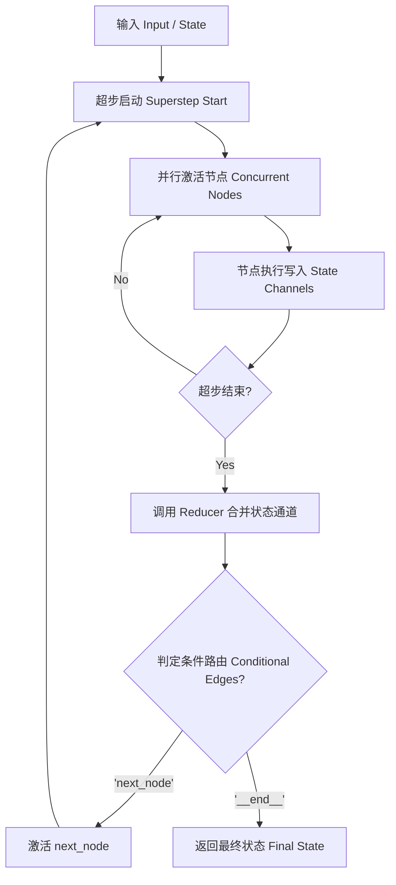
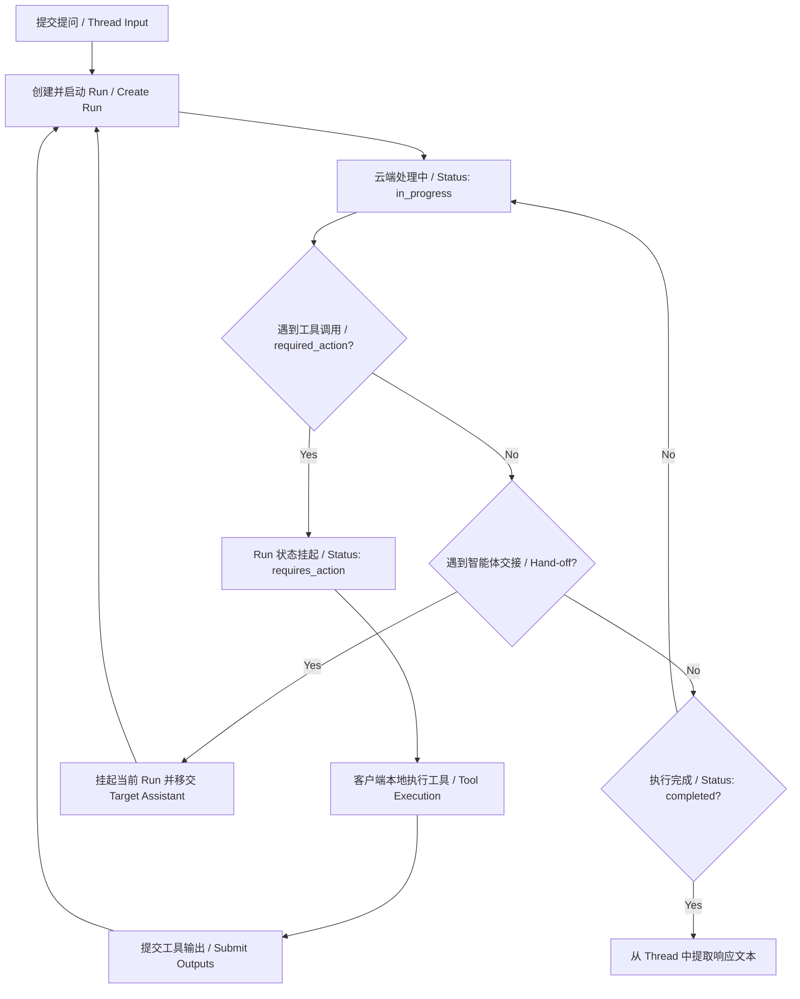
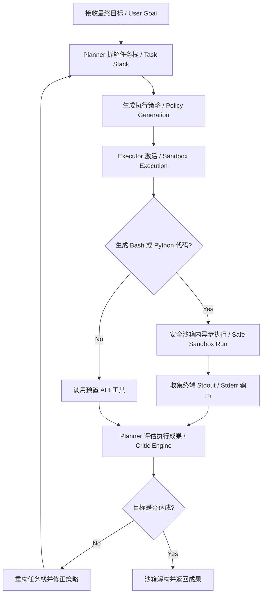
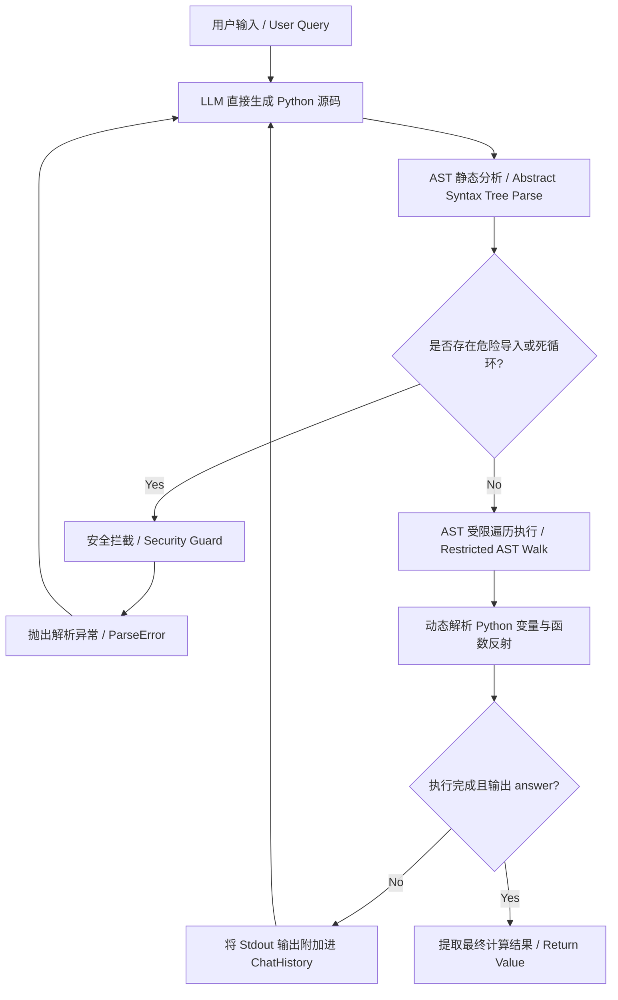

# 主流 Agent 开源框架深度对比与核心源码调度剖析

本剖析旨在探讨不同 Agent 框架在控制流、状态传递与调度机制上的本质区别，帮助工程师在面对企业级复杂决策与自动化执行场景时，能够做出严谨的技术选型。

---

## 1. 多维对比矩阵

| 维度 / 指标 | LangGraph | OpenAI Agents SDK | OpenManus | smolagents |
| :--- | :--- | :--- | :--- | :--- |
| **设计哲学** | 基于图拓扑结构 (Nodes & Edges) 的有状态循环控制流编排 | 基于线程与会话驱动的事件响应式 Agent 抽象层 | 独立沙箱化的端到端全自主目标拆解与任务执行系统 | 采用代码输出 (Code-as-action) 的受限 Python 解释器架构 |
| **控制流迁移机制** | 基于 Pregel 异步超步模型的图迁移与条件路由跳转 | 基于会话 Thread 挂起、Required Action 唤醒与 Hand-off 移交 | 主 Planner 与子 Executor 协同调度，基于物理沙箱状态的流转 | 顺序式代码执行循环 (Code-Execution Loop)，由解释器控制出口 |
| **状态容器设计** | 通过 Channels 和 Reducers 实现高度自定义的线程安全状态合并 (State) | 基于云端托管的 Threads 会话上下文以及 Run Steps 历史记录 | 基于文件系统及内存数据库的任务队列和 Planner 全局状态 | 内存内的本地 ChatHistory 与 AgentState，生命周期局限在当前 Run |
| **工具调度方式** | 图节点中显式执行工具，或使用 pre-built tools 节点路由 | 云端定义 Function Tool，由网关在 Run 中产生 `requires_action` 等待回调 | 动态生成 Bash 或 Python 脚本在沙箱内异步并发执行 | 模型直接生成 Python 源码，由解释器本地反射调用对应 Python 函数 |
| **安全沙箱边界** | 依赖开发者自定义运行环境，本身不提供进程级别隔离保护 | 托管在 OpenAI 云端沙箱中，本地通过 API 网关进行安全数据传输 | 强依赖物理沙箱（如 Docker 实例或本地虚拟机），物理隔离高危命令 | 自带基于 AST (抽象语法树) 静态分析与受限作用域的 Python 解释器 |
| **核心适用场景** | 包含复杂人工介入（Human-in-the-loop）的确定性循环决策流 | 轻量级、无本地高危环境依赖的云托管多智能体协作 | 需要频繁执行 shell 交互、全自动项目生成的重型开发 Agent | 需要精确控制计算过程、高频调用 Python 标准库的轻量级单智能体 |

---

## 2. 物理流转图谱

### 2.1 LangGraph 物理流转图谱
LangGraph 底层基于 Pregel 异步超步模型。每个超步内并发执行节点，并在超步结束时通过 Reducer 合并状态更新：



### 2.2 OpenAI Agents SDK 物理流转图谱
OpenAI Agents SDK 基于云端托管的 Run Loop 机制。大模型在需要执行工具时会将 Run 状态置为“挂起”，等待客户端上报执行结果后重新激活：



### 2.3 OpenManus 物理流转图谱
OpenManus 采用主 Planner（决策大脑）与 Executor（物理执行）的双层架构，在高度隔离的物理沙箱中运行：



### 2.4 smolagents 物理流转图谱
smolagents 核心为 CodeAgent。模型直接输出纯 Python 源码，框架利用受限解释器对 AST 进行静态分析并控制执行作用域：



---

## 3. 核心控制与调度本质剖析

### 3.1 LangGraph 的 Pregel 超步模型
*   **控制与调度本质**：
    LangGraph 摆脱了大模型单纯的“生成即执行”局限，将控制流交还给底层的确定性图拓扑。它的调度算法完全基于 Pregel 模型：
    *   每一个超步（Superstep）包含了一次节点并发激活。节点之间不能直接进行数据交互，它们只能通过共享的全局状态（State）和通道（Channels）来读写数据。
    *   在两个超步之间，系统会隐式触发 **Reducer** 函数。如果多个并发节点对同一个状态属性进行了写入，Reducer 负责进行冲突消解和合并（例如，实现日志的并发追加或列表的聚合），这从软件工程层面上彻底消除了竞态条件（Race Conditions）。

### 3.2 OpenAI Agents SDK 的事件流挂起与移交
*   **控制与调度本质**：
    该 SDK 的调度本质上是**网关事件响应机制**：
    *   客户端发起的 Run 实际上是在云端执行的一个状态机。在执行过程中，大模型如果判断出需要调用工具，状态机便会就地“挂起（Suspension）”。
    *   客户端必须监听 API 事件流，一旦侦测到 `requires_action` 状态，必须在本地反射运行对应的 Function 代码，并将输出结果发送回云端。此时云端状态机被唤醒，Run 重回 `in_progress` 状态继续迭代。
    *   `Hand-off`（交接）则是通过修改 Thread 上绑定的 Active Assistant 实例，终止当前 Agent 的 Run 循环，并在相同的 Thread 下为 Target Agent 发起新的 Run。

### 3.3 OpenManus 的物理沙箱生命周期管理
*   **控制与调度本质**：
    OpenManus 侧重于解决模型生成代码在主机运行时的**越权与污染痛点**：
    *   调度中心维护了一个全局的决策批评引擎（Critic Engine）。Planner 拆解出任务后，Executor 将所有的写文件、执行 Shell、安装依赖包的操作物理限制在 Docker 容器或受限的虚拟机内。
    *   通过流式监听沙箱容器的 Stdout 和 Stderr 输出来实时反馈执行状态。由于拥有强隔离的物理环境，大模型可以直接被允许执行 `rm -rf` 等高危脚本而不危害宿主机，这也是端到端自主 Agent（如 Manus）能稳定运行在本地的前置防线。

### 3.4 smolagents 的受限 Python 解释器
*   **控制与调度本质**：
    smolagents 的核心调度基于 **AST 静态安全评估**：
    *   不同于直接调用 `exec()` 或 `eval()` 执行不可信代码，smolagents 内部手写了一个受限的 Python 解释器。
    *   它首先使用标准库 `ast` 将模型生成的代码解析为抽象语法树。在遍历语法树时，解释器显式限制了允许导入的包白名单（默认只允许 `math`、`time` 等无害标准库），并禁用了双下划线（如 `__import__`、`__subclasses__`）的反射操作，以防止沙箱逃逸。
    *   它在内存中为解释器维护了一个虚拟的本地变量作用域字典，仅允许模型在受控的内存区域执行算法和工具反射，保障了在不依赖重型 Docker 环境下的高安全性。

---

## 4. 工程决策与架构选型指南

在构建工业级 Agent 应用时，技术架构的选型应遵循以下工程边界决策：

```
                              [开始 Agent 架构选型]
                                       |
                   是否需要绝对的“人介入(Human-in-the-loop)”与图拓扑控制？
                                      / \
                                (是) /   \ (否)
                                    /     \
                             [LangGraph]   模型是否需要直接编写并执行 Python 算法？
                                                   / \
                                             (是) /   \ (否)
                                                 /     \
                                           [smolagents] 是否需要在本地执行 Bash/物理安装？
                                                              / \
                                                        (是) /   \ (否)
                                                            /     \
                                                      [OpenManus] [OpenAI Agents SDK]
```

1.  **选择 LangGraph 的边界**：
    当您的业务流中包含严苛的确定性分支（例如：“代码审计不通过必须回滚到第2步”、“必须有人工点击审批后才能继续执行”），或者需要设计复杂的线程安全多租户状态回滚时。
2.  **选择 smolagents 的边界**：
    当您需要 Agent 执行密集的数学计算、数据处理，且大模型频繁需要调用 Python 标准库处理本地变量，同时您希望规避由于启动轻量级 Docker 产生的数百毫秒容器冷启动时延时。
3.  **选择 OpenManus 的边界**：
    当您的 Agent 目标是完成“帮我把这个 Github 仓库下载下来，在本地编译成 Electron 安装包”这种端到端、高度不确定、且必须依赖完整 Linux 系统环境、网络下载与 shell 执行的高复杂度任务时。
4.  **选择 OpenAI Agents SDK 的边界**：
    当您的企业应用需要快速上线，希望所有状态管理、会话历史与多智能体交接（Hand-off）完全托管在可靠的云端，且不希望维护任何本地复杂沙箱环境或本地解释器时。
