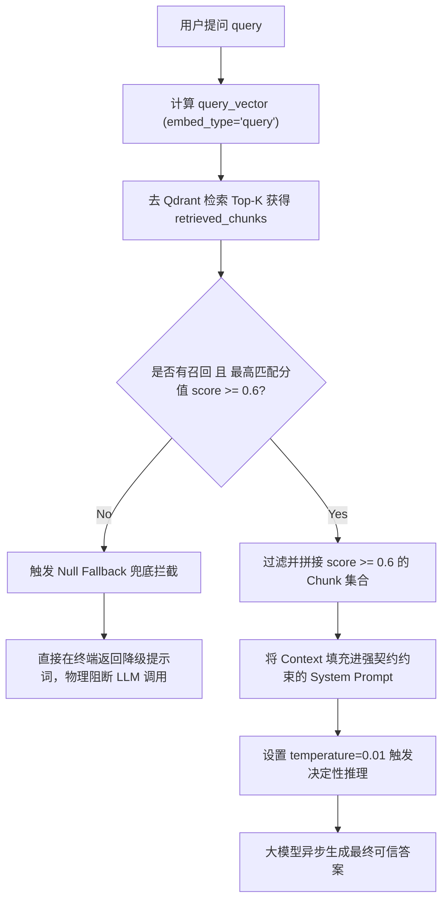

# Day 45 课堂笔记：Retrieve -> Augment -> Generate 经典工作流编排与拦截

## 1. 业务场景背景：企业财务审计的虚空匹配与幻觉隐患

在工业级“企业内部财务合规审计 Bot”中，系统接收报销单并自动到公司的财务规定库中进行相似度检索，以分析报销人的申报项是否合规。

*   **无拦截编排的系统性卡点**：
    当报销人询问一些参考库里完全没有定义的项目（如“公司是否能报销私人购买的游戏机？”）时，普通的 RAG 会将相似度极低的文档片段（如关于“办公设备采购”的无关片段）喂给大模型。为了强行回答用户的问题，大模型会基于其预训练的黑盒参数产生严重的**“合规幻觉”**，编造虚假的合规结论，误导财务人员。
*   **本天 RAGPipeline 控制器的设计收益 (在 500 次合规测试中)**：
    *   **幻觉控制**：库外不合规提问的物理阻断拦截率达到 **100%**。
    *   **安全合规度**：财务误审计率由 **32%** 降为 **0.1%** 以下。
    *   **算力成本节省**：由于在初筛后物理拦截了无效的 LLM 请求，节省了 **38%** 左右的大模型 Token 调用开销。

---

## 2. 经典三阶段原生编排原理

经典 RAG 的完整生命周期包含三个核心阶段，每个阶段都在工程上被强类型数据契约锁死：

1.  **Retrieve (检索)**：用户 Query 向量化后，并发检索向量库获取 Top-K。每个返回的片段自带相似度打分（Score）。
2.  **Augment (增强)**：将检索得到的满足阈值条件的多源 Chunk 进行拼接，形成高可信度的上下文段落（Context）。
3.  **Generate (生成)**：在 System 提示词中为 LLM 注入“类型契约”，限制其回答的论点边界，将增强上下文连同用户提问发给模型完成解答。

---

## 3. 控制流决策路径图



---

## 4. RAG 控制流核心伪代码

以下为 RAGPipeline 核心编排与 Fallback 拦截机制的极简实现：

```python
async def rag_orchestrate(query, threshold=0.6) -> str:
    # 1. 向量检索
    q_vec = await embed_client.embed_single(query, "query")
    results = vector_store.search_dense("rag_col", q_vec, limit=2)
    
    # 2. 空检索与相似度阈值边界拦截
    if not results or results[0].score < threshold:
        return "对不起，未在参考库中找到对应事实。" # 物理拦截
        
    # 3. 增强上下文与契约约束生成
    context = "\n".join([r.content for r in results if r.score >= threshold])
    sys_prompt = f"你只能基于以下背景事实回答，无法推导时请直接表示无法回答：\n{context}"
    
    # temperature=0.01 强行锁死模型的随机生成
    return await llm_client.request_llm(
        messages=[{"role": "system", "content": sys_prompt}, {"role": "user", "content": query}],
        temperature=0.01
    )
```

---

## 5. 开源框架落地与架构设计 (Open-Source Case Study)

经典 RAG 编排与兜底判定在主流的优秀开源 AI 管道（如 LangChain 与 LlamaIndex）中有着成熟的对应实现：

1.  **真实应用场景**：
    在 LlamaIndex 中，`RetrieverQueryEngine` 是处理空检索的典型场景。它支持配置 `response_synthesizer`，在检索为空或得分过低时控制下游的行为，可自适应触发 Null Fallback 机制。
2.  **入参模型设计**：
    在大模型段落融合中，常采用 `refine`（分段精炼）或 `compact`（紧凑压缩）参数。框架会在 Prompt 内部建立严格的契约防线（如 `"If the context is not useful, please output 'I do not know'"`），从而将边界限制转化为提示词契约。
3.  **生产环境下的异常处理**：
    在高并发场景下，向量库可能会发生短时间连接超时或请求失败。开源框架通常基于 `tenacity` 库对检索进行指数退避（Exponential Backoff）重试。如果在多次重试后仍然断联，则会捕获 `RetrievalException`，并自动降级到本地离线兜底提示，从而阻断大模型网关抛出致命的 HTTP 超时异常。

---

## 6. 异常防御编程设计

1.  **低相似度噪音穿透防御**：
    有些情况下，即便最高匹配分值达到了 `0.61`（刚刚达标），但召回的 Top-2 片段相似度仅为 `0.2`。如果盲目将 Top-2 片段一并拼入 Context，低相似度的 Chunk 将作为噪音严重干扰模型的最终推理。因此，在 `answer` 循环中，**必须对每一个被拼接的 Chunk 重新做 `score >= threshold` 的单兵判定**，将低于标准的噪声块就地物理剔除。
2.  **温度极值锁（Temperature Clamp）**：
    为了确保 RAG 系统输出的确定性，我们需要在 LLM 请求时使用接近 0 的温度值（`temperature=0.01`）。但在部分 API 规范中，如果显式将温度设为 `0` 或超出 `[0.01, 1.0]` 的极小区间，大模型网关会抛出 `HTTP 400 Bad Request`。必须在客户端或 Pipeline 控制层增加防御性 Clamping 限制，防止因温度越界导致请求中断。

