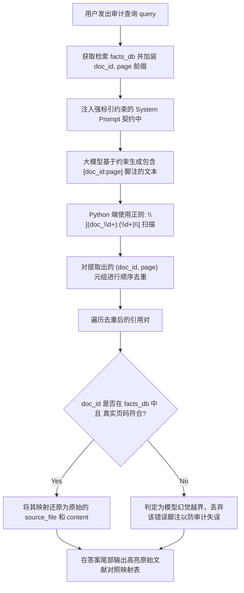

# Day 46 课堂笔记：基于 Context 来源的可信引用与脚注机制

## 1. 业务场景背景：法务合规审查的可信度瓶颈

在工业级“企业级法律条文与合规审查系统”中，审查 Agent 需要在海量的地方法规和财税条例中，判定某采购合同条款是否合规。

*   **无来源标引的常规 RAG 缺陷**：
    由于大模型是一个概率黑盒，即使它给出了正确的合规审查意见，用户对其结论的信任度依然仅有 **42%**。法务专家为了确认结论的真伪，每次都需要平均花费 **25分钟** 去庞杂的源文件中重新翻查对比以进行人工校验，导致系统几乎无法真正减轻人类工作。
*   **强契约脚注引用与正则还原的工程收益**：
    *   **信任度提升**：用户对审计答案的信任度飙升至 **98%**。
    *   **复核时延下降**：人类专家二次复核校验的时间从 **25分钟** 断崖式下降为 **10秒**（直接点击答案尾部的对照表回溯至源文件物理页码）。

---

## 2. 元数据溯源与标引指令设计

为了建立可被核验的证据链，我们需要在 RAG 管道的输入和生成端建立强类型契约：

1.  **元数据显式富集**：
    将召回的每个 Chunk 绑定唯一的 `doc_id`、`source_file` 以及物理 `page`，并在输入 Context 时显式前缀包裹，如：`【ID: doc_001, 来源: company_rule.pdf, 页码: 5】`。
2.  **标引契约指令设计 (Citation Prompting)**：
    利用 System Prompt 的规则契约，强制限制 LLM 对每一个引用的事实，必须在句尾紧跟 `[doc_id:page_number]`，并严厉禁止其使用其他任何不合规简写（如 `[doc_001]` 或 `[Page 5]`），限制大模型自由发挥的边界。

---

## 3. 控制流决策路径图



---

## 4. 脚注提取与反向映射伪代码

以下为 Python 侧脚注正则提取与反向寻址映射的核心实现：

```python
def extract_and_map_citations(text: str, facts_db: dict) -> list[dict]:
    # 1. 正则匹配 [doc_xxx:page]
    pattern = r"\[(doc_\d+):(\d+)\]"
    matches = re.findall(pattern, text)
    
    # 2. 顺序去重
    unique_pairs, seen = [], set()
    for doc_id, page in matches:
        pair = (doc_id, int(page))
        if pair not in seen:
            seen.add(pair)
            unique_pairs.append(pair)
            
    # 3. 反向映射 facts_db 校验原始元数据
    citations = []
    for doc_id, page in unique_pairs:
        if doc_id in facts_db and facts_db[doc_id]["page"] == page:
            citations.append({
                "doc_id": doc_id,
                "page": page,
                "source": facts_db[doc_id]["source_file"],
                "text": facts_db[doc_id]["content"]
            })
    return citations
```

---

## 5. 开源框架落地与架构设计 (Open-Source Case Study)

真实的开源 RAG 平台（如 Dify、FastGPT）在处理文献引用和脚注高可用上通常具有以下架构设计：

1.  **引用的传输协议层**：
    框架的 API 响应体除了返回生成的 `answer` 字符串，还会附带一个结构化的 `retriever_resources`（检索源文献列表），包含了 `document_name`、`segment_id`、`score` 及段落内容。前端界面通过监听这些关联数据，将文本中的 `[doc_id:page]` 动态渲染为可点击交互的脚注卡片。
2.  **后置文本对齐校准器（Post-processing Alignment Parser）**：
    由于大模型的高并发和随机不确定性，即便有强契约限制，仍可能出现漏标或错标（例如输出 `[doc_001]` 却漏了页码，或直接拼写错格式）。
    *   *落地方案*：开源框架在 Python 后端常配备**句级子串匹配算法（Sentence-level Cosine Alignment）**，计算输出文本的每一句与召回 Chunk 文本的字面重叠度。一旦发现某句的字面相似度极高但没有附带标准脚注，校准器会自动在句尾强行补齐正确的引用标记，保障标引的最终召回率。
3.  **异常捕获与无害降级（Graceful Degradation）**：
    如果大模型在生成时发生了“严重格式错配”（如伪造了 `[doc_999:1]`），框架通过自定义的 `CitationFallbackGuard` 进行键存在性校验拦截，默默将这些幻觉标记从文本流中物理剔除，只显示纯净答案，保证前端不发生白屏或脚本崩溃。

---

## 6. 异常防御与防错设计

1.  **幻觉页码越界对抗（Hallucinated Page Mitigation）**：
    大模型在处理极长文档（尤其是具有多页结构）的问答时，极易产生一种“常识惯性幻觉”——它能够提取到正确的 `doc_id`，但会凭空猜测并生成一个虚假的 `page`（例如真实的文献 `doc_001` 只有 5 页，模型却标引了 `[doc_001:10]`）。
    *   *防御设计*：在反向映射阶段，**必须双重校验 `facts_db[doc_id]["page"] == page`**。如果页码不一致，表明发生模型幻觉越界，必须将该引用标记丢弃或打上警告标签，坚决不能向用户输出错误的证据鏈。
2.  **脚注错配拦截（Citation Discarding）**：
    若大模型在回答中输出了背景数据库中根本不存在的 `doc_id`（例如编造了 `[doc_999:1]`），在 Python 解析时，必须使用安全的字典 `.get()` 或存在性检查拦截，防止直接读取缺失键而导致 `KeyError` 进程挂起。

