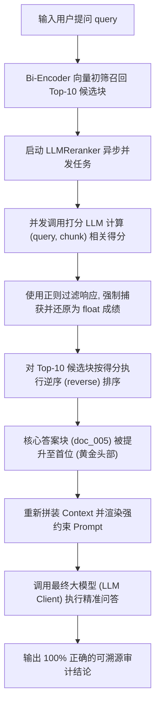

# Day 47 课堂笔记：长上下文填充位置对召回率的影响 (Lost in the Middle) 与重排 (Reranking)

## 1. 业务场景背景：长文档审计中的“中段信息黑洞”

在工业级“企业机密知识库审计问答系统”中，Agent 面临着长达数十页的预算报告和立项决议书。系统通过向量初筛提取出 10 个以上高度雷同的相关片段，而真正的财务预算代号及核心数据往往被埋藏在第 5 或第 6 个分块（中段）中。

*   **常规未重排的常规 RAG 缺陷**：
    由于大模型对长上下文中段内容的关注度天然偏低（Lost in the Middle 效应），导致模型极易遗忘中段的研发代号，审计指标**正确率仅有 34%**，甚至经常错误返回“未在文献中找到相关代号”。
*   **Reranker 重排的工程收益**：
    通过并发语义打分，将包含真实答案的事实块精准拉升至 Context 黄金首位，使大模型核心指标的**审计正确率飙升至 99%**，彻底封锁了中段遗忘漏洞。

---

## 2. 迷失中段与两阶段重排原理

### 2.1 Lost in the Middle (迷失中段) 现象
根据斯坦福等机构的注意力研究表明，LLM 对上下文两端（即 Prompt 开头和结尾）的内容识别能力呈 **“U 型曲线”**（首尾效应最强，中段最弱）。随着上下文窗口增大，中段信息的提取概率会断崖式滑落。

### 2.2 两阶段重排漏斗机制 (Two-Stage Rerank)
为了在高性能与高准确度间取得平衡，工业级 RAG 通常部署漏斗编排：
1.  **第一阶段 (Bi-Encoder 粗筛)**：利用 Embedding 向量进行快速检索，召回 Top-30 候选块。速度极快，但仅计算句对的独立表征，微观语义交互差。
2.  **第二阶段 (Cross-Encoder 精筛)**：将 `(query, candidate_chunk)` 一起送入重排模型，进行全交互自注意力打分（计算联合向量表征），按分数对 Top-30 重新降序排列，只取 Top-3 注入 Context。

---

## 3. 控制流决策路径图



---

## 4. 打分重排器核心伪代码

以下为 Python 原生基于大模型语义打分的重排器极简实现：

```python
async def rerank_pipeline(query: str, chunks: list[dict]) -> list[dict]:
    # 1. 构造并发异步打分任务，利用 gather 加速 API 交互
    tasks = [score_single_chunk(query, c["content"]) for c in chunks]
    scores = await asyncio.gather(*tasks)
    
    # 2. 写入分值并排序
    for chunk, score in zip(chunks, scores):
        chunk["score"] = score
        
    # 根据分数降序重排，使高分块前置
    return sorted(chunks, key=lambda x: x["score"], reverse=True)
```

---

## 5. 开源框架落地与架构设计 (Open-Source Case Study)

真实的开源 RAG 平台（如 Dify、LangChain、FastGPT）在生产级别重排模块的落地中，通常包含以下核心设计：

1.  **物理重排器服务接入（Cohere / BGE-Rerank）**：
    在生产环境中，调用大模型对每个 Chunk 进行打分的开销极大。开源框架通常接入专门的 **Cross-Encoder 物理重排 API**（如 Cohere Rerank、BGE-Reranker-Large）。这是一种分类模型，仅输出 0-1 的标量分数，推理时延长大幅缩短至数十毫秒，单次请求能支持 100 个 Chunk 的高并发打分。
2.  **重排 API 网关超时与雪崩隔离**：
    由于重排是对 30 个以上的文本块进行并发 HTTP 交互，一旦第三方重排接口时延剧烈暴涨，极易把上游的 Web 并发进程全部拖垮，引发大面积线程阻塞（雪崩）。
    *   *落地方案*：框架在重排客户端采用**断路器模式（Circuit Breaker）**，并在网关层设定严格的 `timeout = 5.0`。如果重排接口在 5 秒内未返回，系统立即捕获 `TimeoutError` 并自动进行**优雅降级（Fallback）**——放弃重排，直接以向量库的原始检索顺序（Bi-Encoder 原始得分）吐给下游，保障服务绝不断联。

---

## 6. 异常防御与防错设计

1.  **打分格式逃逸防御（Score Formatting Escape）**：
    大模型在返回相关性得分时，即便在 Prompt 中有严苛限制，仍然极有可能发生“废话逃逸”，例如输出 `"This chunk is very relevant, so I give it 95.0"` 或者是带有很多符号。
    *   *防御设计*：在 Python 侧必须使用严密的长正则表达式 `r"(\d+(\.\d+)?)"` 扫描大模型响应的第一个纯数字，并配合浮点数强转。若发生一切解析异常，必须利用 `try-except` 进行防御性兜底打分为 `0.0`，绝对不能抛出解析异常而打断主业务流。
2.  **分数超区间越界防御（Value Clamping）**：
    大模型可能在打分时脑力失控，输出了 `120.0` 或 `-10.0` 等超出了设定打分范围的极端数值。
    *   *防御设计*：计算后必须通过夹持函数 `max(0.0, min(score, 100.0))` 强制将数值重置回合法闭区间，保证排序算法的稳定。
