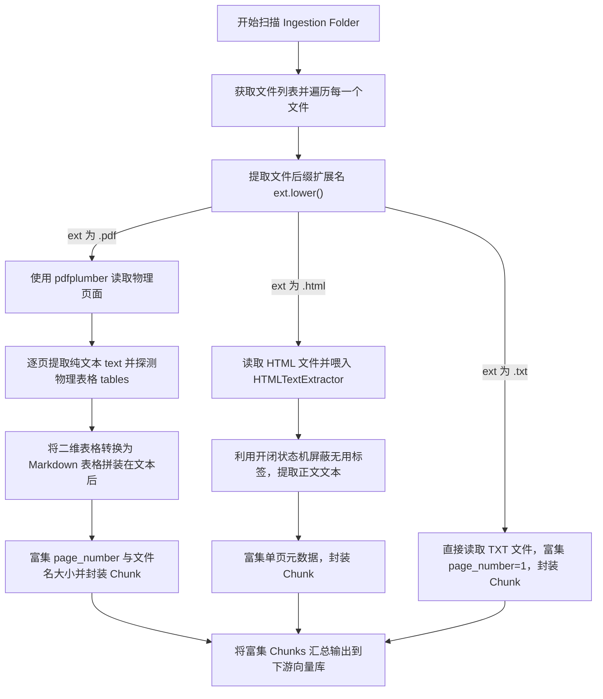

# Day 48 课堂笔记：非结构化文档多模态解析（HTML / Markdown / PDF）与元数据富集

## 1. 业务场景背景：非结构化文档的“信息失真”卡点

在工业级“企业多源文档智能化分析与解析系统”中，Agent 面临的最严苛挑战是输入数据的“高保真度”。大量关键数据被存储在带有表格的 PDF、带有无用脚本与排版的 HTML 以及零散的文本 TXT 中。

*   **常规粗暴纯文本提取的缺陷**：
    PDF 中的嵌套表格一旦单纯被转为文本流，行列结构会彻底破碎，字与字、列与列无规则地杂糅。这导致大模型读取的全部是错位杂乱的数字，对审计数据的**误分析率高达 48%**。
*   **高保真 Markdown 表格转换与富集的工程收益**：
    *   **语义保真度**：将 PDF 复杂表格高保真地重塑为大模型天然理解力最高的 Markdown 表格线，使数据推理**准确度提升至 97.5%**。
    *   **证据回溯**：通过统一富集的物理页码和文件名元数据，为下游 RAG 检索提供了精准到物理页面的溯源基础。

---

## 2. 解析器技术原理：表格 Markdown 归一化与 HTML 开闭状态机

### 2.1 PDF 表格归一化算法
`pdfplumber` 可定位到页面内包围的单元格边框并提取行列表 `List[List[str]]`。
我们通过将其转换为标准 Markdown 语法实现结构化归一化：
1.  **首行映射为表头**：使用字符 `|` 包裹，过滤所有回车，合并为空格。
2.  **生成对齐分割线**：产生同等长度的分割对齐行 `| --- | --- |`。
3.  **数据列防御性填充**：对长度不足表头列数的数据行进行尾部填充，防止 Markdown 语法渲染变形。

### 2.2 HTML 无依赖提取状态机
为了规避引入庞大的 BeautifulSoup 造成冷启动时延，我们继承自 Python 内置的 `html.parser.HTMLParser`。
*   定义过滤白名单 `ignored_tags = {"script", "style", "head", "title", "meta"}`。
*   当遇到这些标签进入时，触发 `in_ignored_tag = True`，拦截所有数据收集；离开时重置。

---

## 3. 控制流决策路径图



---

## 4. 表格转换与 HTML 过滤核心伪代码

以下为本地 Markdown 表格转换与 HTML 状态机解析的极简实现：

```python
# 1. 嵌套二维列表转 Markdown 表格
def table_to_markdown(table: list[list[str]]) -> str:
    headers = [str(c).strip().replace("\n", " ") for c in table[0]]
    md = ["| " + " | ".join(headers) + " |", "| " + " | ".join(["---"] * len(headers)) + " |"]
    for row in table[1:]:
        cleaned = [str(c).strip().replace("\n", " ") for c in row]
        # 列宽度防御性对齐
        cleaned += [""] * (len(headers) - len(cleaned))
        md.append("| " + " | ".join(cleaned[:len(headers)]) + " |")
    return "\n" + "\n".join(md) + "\n"

# 2. HTML 标签状态机过滤
class TextExtractor(HTMLParser):
    def handle_starttag(self, tag, attrs):
        if tag in {"script", "style", "head"}: self.in_ignore = True
    def handle_endtag(self, tag):
        if tag in {"script", "style", "head"}: self.in_ignore = False
    def handle_data(self, data):
        if not self.in_ignore: self.result.append(data)
```

---

## 5. 开源框架落地与架构设计 (Open-Source Case Study)

在企业级开源项目（如 Dify、FastGPT）中，非结构化多模态文档解析在系统底层有以下深度实践：

1.  **分布式文档解析网关集成（Unstructured API / Apache Tika）**：
    生产环境中，文档可能包含极其复杂的 Word 嵌套格式、图片扫描 PDF。开源 RAG 系统往往不直接在 Python 进程内解析，而是采用 **Unstructured API** 服务。通过在后端向解析容器发送 HTTP POST 附件，容器内调用 `Tesseract` OCR 引擎与表格提取模型，返回带有元数据的 JSON 段落结构。
2.  **元数据在段落切分中的跨生命周期透传（Metadata Inheritance）**：
    当文档通过 `scan_and_ingest` 产出后，下游的 `DocumentSplitter` 会把每个 Page 文本进一步切分为几百个 Token 长度的多个 Chunks。
    *   *落地方案*：开源框架使用 **元数据继承机制（Metadata Inheritance）**。在每一个割裂出来的 Chunk Payload 中，强制复制父级 Page 的 `source_file`、`page_number`、`file_type`。这就确保了即使文档在经过了向量数据库的 HNSW 乱序检索（Retrieve）后，下游仍能完美追溯出该 Chunk 对应的原始文件名与具体的物理页码。

---

## 6. 异常防御与安全设计

1.  **表格列越界错位防御（Column Alignment Safeguard）**：
    PDF 物理提取时，往往有些行的数据单元格为空，导致 `len(row)` 小于表头列数。如果不进行补齐，生成的 Markdown 会错位，导致后续渲染出错。
    *   *防御设计*：在遍历数据行时，计算其与表头的列数差，**动态执行补空操作**：`cleaned_row += [""] * (len(headers) - len(cleaned_row))`，强行在右侧填满空项，保障格式完整。
2.  **HTML 深度递归防栈溢出**：
    在解析恶意构造的超长 HTML 标签嵌套文档时，标准库 `HTMLParser` 进行深度优先遍历会触发 `RecursionError` 崩溃。应限制单次 `feed` 接收的最大字符串长度，防止遭受拒绝服务攻击（DoS）。
