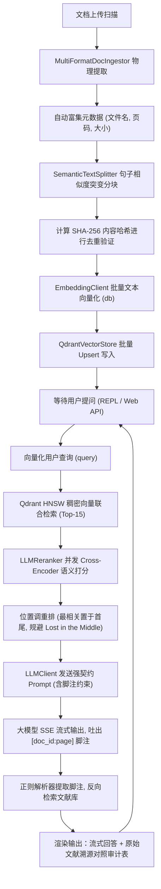

# Policy RAG Assistant — 企业级合规规章制度智能问答系统

Policy RAG Assistant 是一个端到端、生产级经典检索增强生成 (RAG) 问答系统。本项目专为企业内部合规制度、说明文档的智能解析与审计溯源而设计。

系统克服了传统 RAG 系统的核心工程痛点：通过**自适应语义分块**规避硬性物理截断；基于 **SHA-256 内容指纹** 进行入库前全局去重；采用大模型 Cross-Encoder 打分作为 **LLM Reranker 重排器** 对抗 "Lost in the Middle" 效应；通过大模型 System 强契约输出可信脚注，并在 Python 侧进行**正则解析与反向文献对照映射**，为回答提供可信审计背书。项目提供基于 **Warm Intellectual Minimalism (温润知性极简主义)** 风格配色设计的可视化前端交互界面。

---

## 1. 核心架构与数据流设计

系统遵循**自底向上积木式拼装**原则，在物理上彻底隔离了文档解析、语义切片、向量存储、Cross-Encoder打分重排、大模型流式生成以及正则脚注解析各微引擎层级。

### 1) 控制流与决策路径


### 2) 核心数据契约 (Payload Schema)
写入向量数据库 Payload 中的每个知识切片实体都受到 Pydantic 的强类型校验，其核心契约字段如下：
- `chunk_id` (str): 切片全局唯一 ID (格式为 `"{doc_id}_chunk_{page}_{idx}"`)
- `document_id` (str): 文档级哈希短 ID
- `content` (str): 自适应语义分块洗净后的纯净文本段落
- `page_number` (int): PDF/文本的原始物理页码 (1-indexed)
- `source_path` (str): 原始文档物理文件名
- `hash` (str): 基于内容的 SHA-256 去重哈希指纹
- `permission_level` (int): 多租户安全隔离权限 (默认 1)

---

## 2. 工程技术特点

### 1) 自适应语义突变切片 (Day 44)
放弃传统的固定字符长度截断，利用句子 Embedding 之间的余弦距离构建相似度突变滑窗。系统动态计算距离均值（Mean）与标准差（Std），将阈值设定为 $\text{Threshold} = \text{Mean} + 1.0 \times \text{Std}$。当相邻句子间的余弦距离大于此阈值时判定发生话题转折，执行物理切分，保证每个 Chunk 语义的高度纯净内聚。

### 2) SHA-256 内容哈希去重
为了防止多次建库或文档更新导致的向量库冗余污染，入库前计算唯一哈希值：
$$\text{hash} = \text{SHA256}(\text{content} + \text{document\_id} + \text{page})$$
当哈希指纹已存在于本次上传批次或已在 Qdrant 集合中建库时，直接丢弃，从源头上减少多余的 Embedding 物理接口消耗和冗余检索时延。

### 3) LLM Reranker 对抗注意力稀释 (Day 47)
向量初筛使用 Bi-Encoder 进行 Top-15 召回，随后利用 Cross-Encoder 机制，并发调用大模型对每个 Chunk 进行 0-100 相关度打分并降序重排，将最切题的文献片段移至长上下文的首尾两端（黄金位置），防止由于长 Prompt 导致大模型在中段信息发生遗忘。

### 4) 流式强契约生成与引用对照审计
结合 API SSE 流式协议与正则表达式解析。在 System Prompt 中加入强类型格式契约，要求模型以 `[doc_id:page]` 标记脚注，在 Python 侧在流式接收完后进行提取、去重，并映射回 Qdrant 原始 payload 实体，向用户高亮呈现精确对应的参考出处。

---

## 3. 项目物理目录结构

```text
weekly/w07_classic_rag/day49/
├── README.md               # 项目生产说明文档 (本文件)
├── start_rag_bot.sh        # 一键启动管理脚本 (支持 Web / CLI / 冒烟测试模式)
├── main.py                 # 统一控制启动入口 (支持 Web 模式、CLI 模式、冒烟测试)
├── app.py                  # FastAPI 可视化后端与流式 API 接口实现
├── solution.py             # 核心微引擎 (Indexer, Reranker, CitationBot 经典 RAG 流)
├── test_rag_bot.py         # 系统单元测试套件
├── templates/
│   └── index.html          # 温润知性极简主义配色风格的前端单页面应用
└── test_docs/              # 预设的公司合规制度与差旅政策测试文档
    ├── company_rules.txt   # 公司假期及加班补偿纯文本规章
    └── travel_policy.html  # 包含干扰样式的差旅报销网页说明
```

---

## 4. 依赖安装与启动指南

### 1) 安装依赖项
```bash
pip install fastapi uvicorn pdfplumber qdrant-client httpx pytest pytest-asyncio
```
*注：系统启动时会自动探测本地 Docker 部署的 Qdrant（127.0.0.1:6333）实例。若容器不在线，系统将平滑降级到 SQLite 内存模式 (:memory:) 零配置运行。*

### 2) 模式一：可视化 Web 控制面板 (默认推荐)
运行以下一键脚本启动 FastAPI 服务器：
```bash
./weekly/w07_classic_rag/day49/start_rag_bot.sh --web
```
打开浏览器并访问：[http://127.0.0.1:8000](http://127.0.0.1:8000)
- **文档入库**：可直接将本地测试文档拖拽至上传区域，后端将流式进行语义切分并完成向量入库。
- **合规问答**：对话框支持流式文本响应，并在回答完毕后下方自动高亮生成具有对照依据的 **“原始文献溯源审计表”**。

### 3) 模式二：终端交互式 CLI 模式
若希望在物理终端中交互对话，可运行：
```bash
./weekly/w07_classic_rag/day49/start_rag_bot.sh --cli
```

### 4) 模式三：非交互集成冒烟测试模式
用于 CI/CD 自动化检测，自动发出两条预设公司规章制度提问并流式显示完整结果与溯源表：
```bash
./weekly/w07_classic_rag/day49/start_rag_bot.sh --test
```

---

## 5. 单元测试
执行 pytest 进行各核心微引擎算法的准确性验证：
```bash
python -m pytest weekly/w07_classic_rag/day49/test_rag_bot.py -v
```
