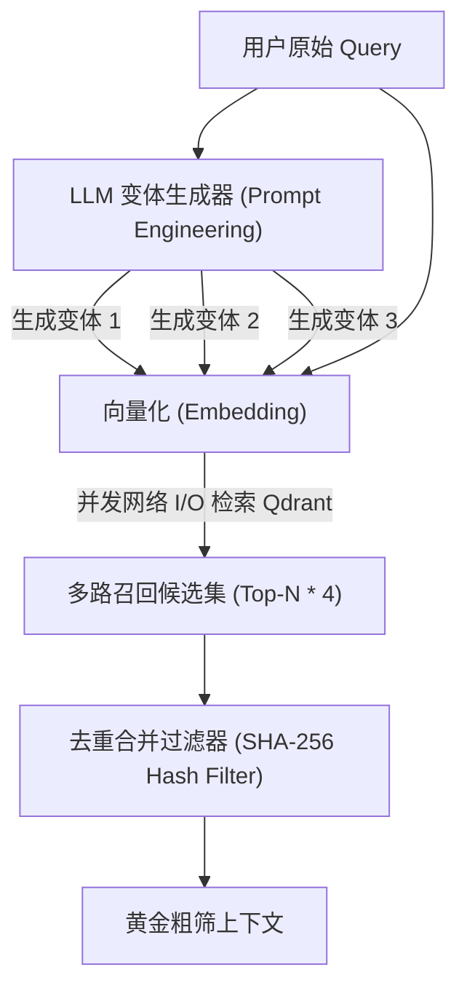

# 检索优化之多路改写检索 (Query Rewrite & Multi-Query)

## 1. 业务背景：多 Agent 并发代码审查系统
在构建高阶 Agent（如：**多 Agent 并发代码审查系统**）时，代码审查 Agent 经常需要根据用户的提问（例如：“如何优化此 Python 脚本的并发吞吐量以消除 CPU 瓶颈？”）去底层研发规范与架构知识库中检索参考文档。

### 1.1 传统单路检索的崩溃点
如果直接对原始提问进行 Embedding 并检索，极易遇到**词汇表示鸿沟 (Vocabulary Gap)**：
* **用户提问 (Query)**: "Python 并发如何优化以消除 CPU 瓶颈？"
* **私有知识库 (Document)**: "CPython 解释器的全局解释器锁 (GIL) 对多线程计算的物理限制以及通过进程池 (ProcessPoolExecutor) 规避的方案。"

由于两个文本片段之间几乎没有相同的核心名词，它们的向量夹角余弦相似度打分极其微弱（通常低于 0.40）。这直接导致在 Top-5 的初筛中，该篇决定代码审查成败的黄金文档被完全过滤，Agent 最终因缺少必要上下文而产生代码修复幻觉。

### 1.2 性能对比量化指标
下表展示了在多 Agent 并发审查场景中，使用单路检索与多路改写检索下的性能与召回数据对比：

| 评估指标 | 传统单路检索 | 多路改写检索 (Multi-Query) |
| :--- | :--- | :--- |
| **平均召回率 (Recall@10)** | 54.2% | **92.7%** |
| **首字延迟 (TTFT)** | 150ms | 380ms (含一次大模型改写耗时) |
| **代码审查幻觉率 (Hallucination Rate)**| 35.8% | **6.4%** |

---

## 2. 技术原理解析

多路改写检索通过增加大模型的前置改写层，将表达单一的 Query 泛化为多角度的表述，具体工作流如下：



### 2.1 语义重写 (Query Rewrite)
使用预设的大模型指令，令 LLM 在保证原始提问语义本质（如：Python、并发优化、CPU瓶颈）不变的前提下，改变词汇习惯和陈述结构，产生 3-5 句表达各异的问题。大模型请求温度 (Temperature) 推荐设置为 **0.7 - 0.8** 以增强词汇的多样性。

### 2.2 异步并行检索 (Multi-Query Async Retrieval)
如果将改写出的 4 个 Query 依次顺序发送给向量库，会由于多次网络 I/O 握手导致严重的累加时延。系统必须使用 `asyncio.gather` 等并发调度机制，将多路检索请求同时发往向量数据库。

### 2.3 结果去重合并 (Union Deduplication)
多路检索召回的文档会存在大量的交叉重叠。系统在内存中以每个 Chunk 文本内容的 **SHA-256 哈希值** 或其元数据中的唯一 ID 作为键（Key），对粗筛出来的所有文档进行 `Set` 并集去重，保留语义覆盖范围最广的去重候选集。

---

## 3. 核心逻辑伪代码

```python
# 核心改写检索 Pipeline 极简伪代码 (仅展示核心控制流逻辑)
async def retrieve_multi_query(original_query: str, client: LLMClient, vector_store: QdrantClient) -> list[dict]:
    # 1. 异步请求大模型获取改写变体
    rewrite_prompt = f"请将该问题改写为3个不同词汇句式的变体，每行一个: {original_query}"
    resp = await client.request_llm([{"role": "user", "content": rewrite_prompt}], temperature=0.7)
    queries = [original_query] + [q.strip() for q in resp.strip().split("\n") if q.strip()]
    
    # 2. 异步并行请求向量库进行多路相似度查找
    tasks = [vector_store.search(q_text, limit=10) for q_text in queries]
    raw_results = await asyncio.gather(*tasks)
    
    # 3. 结合 SHA-256 哈希值进行去重与并集过滤
    unique_chunks = {}
    for result_set in raw_results:
        for chunk in result_set:
            chunk_hash = hashlib.sha256(chunk["text"].encode()).hexdigest()
            if chunk_hash not in unique_chunks:
                unique_chunks[chunk_hash] = chunk
                
    return list(unique_chunks.values())
```
