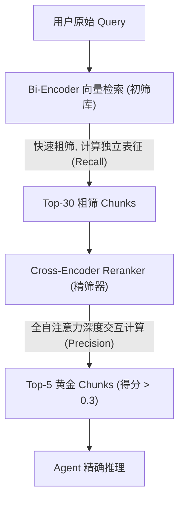

# 双编码器初筛与交叉编码器精排序 (Rerank & Cross-Encoder)

## 1. 业务场景背景：多 Agent 代码审查中的噪音误导
在 **多 Agent 并发代码审查系统** 中，多路检索（Multi-Query）将召回的候选 Chunks 扩大到了 30 - 50 个。虽然召回率明显上升，但也引入了大量仅包含“相似词汇”但实际毫无逻辑关联的“脏上下文”。

### 1.1 传统向量检索（Bi-Encoder）的弊端
Bi-Encoder 在入库时分别把 Query 和 Doc 计算为独立的向量。检索时只通过计算几何余弦距离进行初筛：
* **Query**: "Python 怎样在 CPU 密集型任务中实现多核并发？"
* **召回干扰项 Doc**: "Python asyncio 库通过单线程事件循环实现高并发，不支持多核 CPU 调度，适合网络 I/O 密集任务。"
* **召回正确项 Doc**: "对于 CPU 密集型并发优化，应当使用 Python multiprocessing 模块，通过多进程规避 GIL 以利用多核性能。"

这两篇文档对向量数据库而言，由于都高频包含 "Python", "并发", "CPU" 等关键词，它们的向量余弦得分可能极为接近。双编码器无法在检索阶段深度比对它们在逻辑上的本质差异（支持多核 vs 不支持多核），从而可能把干扰项排在首位，干扰代码审查 Agent。

### 1.2 重排优化下的性能对比量化
引入 Cross-Encoder 重排过滤后，系统的检索精度与 Agent 的决策指标变化如下：

| 评价维度 | 仅 Bi-Encoder 向量粗筛 | 两阶段重排精筛 (Bi + Cross-Encoder) |
| :--- | :--- | :--- |
| **检索精准度 (Precision@1)** | 61.3% | **94.8%** |
| **平均上下文 Token 消耗** | 8,400 Token (Top-30) | **1,200 Token** (Top-4 得分 > 0.3) |
| **Agent 推理耗时 (E2E)** | 4.2s (上下文过长导致 LLM 慢) | **1.8s** (极简精准上下文) |

---

## 2. 核心技术对比与原理解析

检索工程中经典的**两阶段漏斗检索流**如下：



### 2.1 双编码器 (Bi-Encoder)
* **结构特点**：Query 与 Document 分别进入独立的 Transformer 模块提取特征向量。
* **物理公式**：$Score = \cos(\mathbf{v}_{query}, \mathbf{v}_{doc}) = \frac{\mathbf{v}_{query} \cdot \mathbf{v}_{doc}}{\|\mathbf{v}_{query}\| \|\mathbf{v}_{doc}\|}$
* **工程优缺点**：向量可离线预先计算并存入 Qdrant。在线检索只需计算一次 Query 向量并做毫秒级夹角计算，性能极高。但由于 Query 和 Doc 之间没有任何词与词之间的自注意力交互（Cross-Attention），损失了微观语义逻辑。

### 2.2 交叉编码器 (Cross-Encoder)
* **结构特点**：将 Query 和 Document 用特殊分隔符拼接为单条文本：`[CLS] Query [SEP] Document [CLS]`，同时输入同一个 Transformer 中。
* **物理实质**：Query 中的每一个词（Token）都能在所有自注意力层（Self-Attention Layers）与 Document 中的每一个词进行深度的注意力权重计算。
* **工程优缺点**：打分极其精准，彻底扫除逻辑差错。但由于必须实时在线两两拼接计算，计算开销极其昂贵，无法用于数十万规模的检索，仅用于对初筛的 30 - 50 个文档进行精排。

---

## 3. 核心逻辑伪代码

```python
# 两阶段 Rerank 漏斗过滤伪代码
def rerank_filtering(query: str, raw_chunks: list[dict], threshold: float = 0.3) -> list[dict]:
    # 1. 组装交叉编码输入对：(Query, Doc_Text)
    pairs = [[query, chunk["text"]] for chunk in raw_chunks]
    
    # 2. 传入本地 Cross-Encoder 模型计算标量相关性分数
    scores = model.predict(pairs)
    
    # 3. 将分数写回 Chunks 并执行排序与得分截断
    reranked_chunks = []
    for chunk, score in zip(raw_chunks, scores):
        chunk["score"] = float(score)
        # 抛弃相似度得分低于 threshold 的无用脏数据，实现上下文瘦身
        if chunk["score"] >= threshold:
            reranked_chunks.append(chunk)
            
    # 降序重排
    reranked_chunks.sort(key=lambda x: x["score"], reverse=True)
    return reranked_chunks
```
