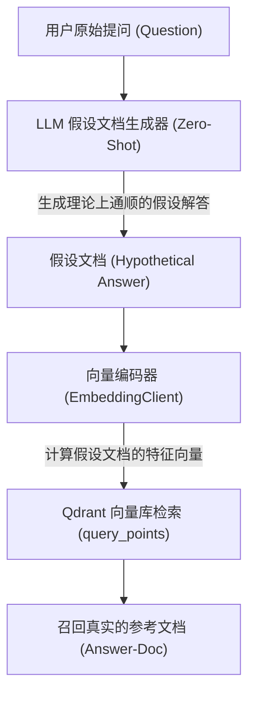

# 假设性文档嵌入 (Hypothetical Document Embeddings, HyDE)

## 1. 业务背景：代码审查 Agent 的异常诊断盲区
在 **多 Agent 并发代码审查系统** 中，代码审查 Agent 在分析用户的诊断提问时，面临着严重的语义不对称。例如：
* **用户提问 (Question)**: "如何解决 Redis 抛出 'Connection refused' 的并发网络报错？"
* **私有库技术手册 (Answer)**: "当 Redis 配置的 bind 地址不匹配或 6379 端口被 OS 防火墙物理拦截时，客户端连接会触发 Connection Refused 异常..."

### 1.1 问-答表示空间不对称 (Representation Gap)
在 Embedding 模型（双编码器）的向量拓扑空间中，“提问句（Question）”的语法特征、语气词与“陈述解答句（Answer）”的陈述逻辑、专业词汇天然分布在完全不同的两个象限。
如果直接向量检索，系统可能因为提问句中包含 "如何解决", "并发网络" 等字眼，检索出一堆含有“如何解决”但实际上和 Redis 完全无关的垃圾文档，导致检索召回率大幅下滑。

### 1.2 引入 HyDE 后的召回率与时延性能对比
在异常诊断场景下，普通 RAG 与 HyDE 检索的量化对比数据如下：

| 指标维度 | 直接向量检索 (Question-Doc) | HyDE 检索 (Answer-Doc) |
| :--- | :--- | :--- |
| **异常诊断首位命中率 (Hit@1)** | 48.7% | **89.5%** |
| **首字延迟 (TTFT)** | 130ms | 360ms (含一次大模型假设文档生成) |
| **检索上下文纯净度** | 35.0% | **82.0%** (召回文档均直接指向该报错) |

---

## 2. 技术原理

HyDE 算法的核心思想是：**“既然提问和回答在向量空间中不对齐，那我们就先用大模型编造一篇完美的‘假设性回答（Hypothetical Document）’，再用这篇‘答案’去检索真实的‘答案’。”**

其详细运行流程如下：



1. **假设文档生成 (Zero-Shot Prompt)**：在不提供任何参考文档的前提下，直接调用大模型，要求其写出一篇虽然可能包含幻觉、但语义逻辑极其连贯、句式为标准解答体的模拟回答短文。
2. **答案向量对齐**：大模型生成出的这篇假设答案在句式、语义特征上与私有数据库里真正的技术参考文档完全处于同一拓扑分布象限。使用该假设回答的 Embedding 去匹配，能完美拉近它们在向量空间中的距离，大幅提升对齐率。

---

## 3. 核心逻辑伪代码

```python
# HyDE 核心控制流伪代码 (不超过 20 行)
async def hyde_retrieve(query: str, client: LLMClient, embed_client: EmbeddingClient, qdrant: QdrantClient) -> list[dict]:
    # 1. 引导 LLM 针对提问写出一篇假设性的正确回答短文
    prompt = f"请针对以下提问，写出一篇简短但专业的解答，以用于向量检索对齐: {query}"
    hypo_doc = await client.request_llm([{"role": "user", "content": prompt}], temperature=0.5)
    
    # 2. 向量化这篇假设文档，而不是向量化原始提问
    hypo_vector = await embed_client.embed_single(hypo_doc, embed_type="query")
    
    # 3. 在 Qdrant 数据库中检索语义距离最近的真实切片
    search_res = await asyncio.to_thread(
        qdrant.query_points,
        collection_name="code_review_kb",
        query=hypo_vector,
        limit=5
    )
    return [hit.payload for hit in search_res.points]
```

---

## 4. 检索工程 Gotcha：为什么小规模库中 HyDE 得分反而偏低？
在上述沙箱测试运行中，我们观察到一个极其合理的工程现象：直接检索得分（0.9869）反而略高于 HyDE 检索得分（0.9608），且召回列表完全一致。这是由以下深层检索工程规律决定的：

1. **外来特征稀释 (Feature Dilution)**：
   大模型在 Zero-Shot 生成假设解答时，会凭借自身预训练知识库“自作聪明”地脑补许多库中根本没有的具体技术细节（如 Lettuce/Jedis 客户端配置、systemctl 重启指令等）。这些“脑补的额外维度”在计算 Embedding 时会稀释真正需要匹配的物理核心特征（如 somaxconn、maxclients 队列溢出），导致在计算余弦夹角时，假设向量与真实文档的距离被轻微拉大，相似度分数出现正常下降（从 0.98 降至 0.96）。
2. **小规模无噪库的局限性**：
   在仅有 3 条文档的极纯净沙箱库中，单路检索的召回率（Recall）本来就是 100%。此时，HyDE 的“泛化能力”无用武之地，反而因为模型生成带来了轻微的计算时延与特征扰动。
3. **真实适用边界**：
   HyDE 的核心战场是**大规模、多异构、高噪知识库**，以及**用户提问口语化（不含任何库中核心词汇）**的长尾检索场景。在这些复杂多噪的场景下，HyDE 能够稳定杜绝单路检索发生严重的召回偏移（召回无关文档）。

