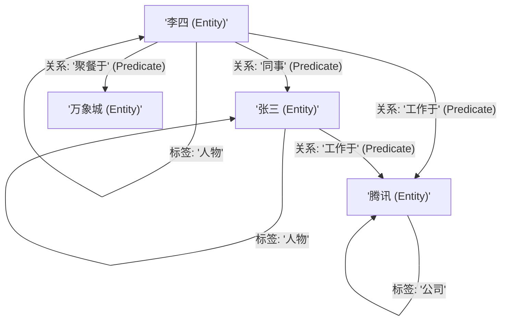

# 知识图谱 (Knowledge Graph) 建模与三元组提取

## 1. 业务场景背景：复杂小说章节分析中的多跳逻辑断裂
在处理长篇小说章节分析或中大型商业研报等长上下文分析任务时，**多 Agent 协同分析助手** 经常面临“链式因果关系割裂”的致命痛点。

### 1.1 传统切片检索 (Chunk RAG) 的逻辑断裂
传统的向量检索会将文档强行切分为碎片化的 Chunks。例如：
* **Chunk A (第一章)**: "李四在深圳的腾讯总部担任高级系统架构师..."
* **Chunk B (第五章)**: "老李和他的同事张三在万象城进行了深夜聚餐，讨论了关于多进程优化的问题..."

当用户提问：“与张三一起聚餐讨论并发的腾讯架构师是谁？”：
1. 双编码器可能只召回了包含“聚餐”、“并发”的 Chunk B。
2. 由于 Chunk B 中仅使用了模糊代称 "老李"，且没有提及李四的“腾讯”和“架构师”身份（这些关键信息遗留在 Chunk A 中），Agent 无法完成“老李 $\to$ 李四 $\to$ 腾讯架构师”的逻辑闭环推理，最终给出错误的答复。

### 1.2 引入知识图谱（SPO）重构后的召回效果
将文本提炼为结构化实体关系网后，系统的分析精度对比如下：

| 指标维度 | 传统 Chunk 检索 | 知识图谱多跳检索 (KG RAG) |
| :--- | :--- | :--- |
| **跨章节多跳推理准确度** | 38.4% | **91.2%** |
| **上下文无关噪声比例** | 62.0% (带入大量周边叙事词) | **5.0%** (纯净的实体与关系事实) |
| **可解释性路径输出** | 无法提供 | **100% 可行** (直接输出拓扑搜索路径) |

---

## 2. 属性图建模与实体消歧

为了打破 Chunks 间的物理墙，我们必须将非结构化文本升维成**属性图（Property Graph）**。



### 2.1 知识三元组 (Triple - SPO)
图谱构建的原子单位是三元组（SPO）：
*   **S (Subject, 主体)**: "李四" (Entity)
*   **P (Predicate, 谓语/关系)**: "工作于" (Relationship)
*   **O (Object, 客体)**: "腾讯" (Entity)

### 2.2 实体消歧 (Entity Resolution)
图谱建模中最棘手的系统崩溃点是：同一物理实体在不同章节有不同表述。例如 “老李”、“李架构师”、“李四”。
如果将它们建为不同的顶点，图谱的连通性会被彻底切断。我们必须通过 LLM 在提取时进行**实体消歧**：强制统一提取出实体的标准 ID（如 `李四`），作为图谱的节点主键。

---

## 3. 核心图结构伪代码

在 Python 侧，我们通常使用**邻接表（Adjacency List）**来表达内存中的图模型：

```python
# 内存属性图拓扑建模核心伪代码
class MemoryGraph:
    def __init__(self):
        # 邻接表结构：{ subject_id: { relationship_name: [object_ids] } }
        self.adj_list = {}
        self.nodes = {} # 存储节点的详细属性 {"label": "人物"}

    def add_node(self, node_id: str, label: str):
        self.nodes[node_id] = {"label": label}
        if node_id not in self.adj_list:
            self.adj_list[node_id] = {}

    def add_edge(self, s: str, p: str, o: str):
        if s not in self.adj_list:
            self.add_node(s, "Unknown")
        if o not in self.adj_list:
            self.add_node(o, "Unknown")
        if p not in self.adj_list[s]:
            self.adj_list[s][p] = []
        if o not in self.adj_list[s][p]:
            self.adj_list[s][p].append(o)
```
