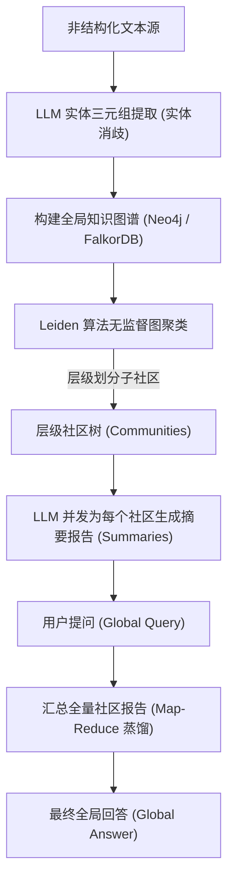

# 微软 GraphRAG 框架机制分析与社区版实践

## 1. 业务背景：大型企业文档库的宏观全局推理痛点
在传统的知识库问答中，**多 Agent 宏观分析助手** 面临着从“海量文档”中抽离“全局概括（Global Summarization）”的巨大瓶颈。

### 1.1 局部与全局检索的工程对比 (Local vs Global)
在工业级检索系统中，这两种检索范式的底层设计、数据流向以及使用场景存在本质性差异：

| 评估维度 | Local Search (局部/微观检索) | Global Search (全局/宏观推理) |
| :--- | :--- | :--- |
| **查询问题示例** | "李四和张三接头的具体时间和地点是什么？" | "分析该犯罪团伙的组织架构演变及主要犯罪手段？" |
| **底层实现机制** | 基于查询向量，检索最相关的 Chunks 或图谱中的一阶/二阶邻域实体（Node-Vector + Ego-Graph）。 | 依托 Leiden 算法对全图自动聚类，并发汇总各社区报告（Community Summaries）进行二次蒸馏。 |
| **首字延迟 (TTFT)** | **极低** (100ms - 200ms) | **高** (数秒，因需要并发聚类总结) |
| **Token 消耗成本** | 低 (仅消费召回的几千 Token) | 高 (一次查询可能消费数十万 Token) |

---

## 2. 微软 GraphRAG 核心机制

微软开源的 **GraphRAG**（基于图的全局检索增强生成）提供了一种突破性的“先聚类、再总结、后汇总”的架构：



### 2.1 Leiden 社区发现算法 (Leiden Clustering)
知识图谱构建完毕后，图中的节点往往非常密集。**Leiden 算法** 是一种无监督图聚类算法，它在模块度（Modularity）优化的基础上，将连线极其紧密、具有高度语义内聚性的实体自动划分进同一个“社区”（Community）。

### 2.2 Leiden 社区报告层级 (Map-Reduce 模式)
1. **Community Summary (Map 阶段)**：对划分出的每个小社区，让大模型读取该社区内所有的实体、关系和属性，为其编写一篇结构化的《社区主题报告》。
2. **Global Aggregation (Reduce 阶段)**：当用户发起全局提问时，系统直接将这些预先生成好的《社区主题报告》作为上下文喂给大模型（不再需要读取成千上万个割裂的 Chunks），通过 Map-Reduce 的方式多线程过滤并拼接，输出权威的全局性回答。

---

## 3. 核心全局检索伪代码

```python
# GraphRAG 全局检索 Map-Reduce 核心控制流伪代码 (不超过 20 行)
async def global_search(query: str, community_summaries: list[dict], client: LLMClient) -> str:
    # 1. Map 阶段：为每个社区报告评估其与用户提问的关联度，并输出局部解答
    async def process_summary(comm: dict):
        prompt = f"根据以下社区总结，分析对问题的部分回答: {comm['report']}\n问题: {query}"
        return await client.request_llm([{"role": "user", "content": prompt}], temperature=0.1)
    
    # 并发调度所有社区总结
    intermediate_answers = await asyncio.gather(*[process_summary(c) for c in community_summaries])
    
    # 2. Reduce 阶段：将所有中间解答汇总并进行高保真蒸馏合并
    reduce_prompt = f"汇总以下各社区的部分分析，给出一份权威的全局解答:\n" + "\n".join(intermediate_answers)
    final_answer = await client.request_llm([{"role": "user", "content": reduce_prompt}], temperature=0.2)
    return final_answer
```

---

## 4. 检索深度解密：Global Search 是否真的只读 Summary？
在真实的微软 GraphRAG 检索流水线中，图谱实体边与社区摘要报告（Summary）在不同检索模式下的流向存在物理设计上的隔离：

### 4.1 Global Search 的极轻量设计：只读 Summary
*   **设计本质**：Global Search 解决的是大规模知识库的**“宏观推理与概括”**。为了避免实时遍历几万个节点导致大模型上下文（Context）瞬间崩溃，系统在**离线建库阶段**便让大模型读取每个社区内的全部实体、属性与边关系，压缩生成了一份高信息密度的《社区摘要报告》。
*   **在线检索流向**：
    1. 用户提问 $\to$ Map 阶段并发调取各社区预存的 Summary。
    2. 大模型仅读取 Summary 文本提炼局部答案（**图数据库在线访问次数为 0**）。
    3. Reduce 阶段将局部答案融合为最终报告。

### 4.2 Local Search 的深挖设计：Summary + 底层实体有向边
当用户提问微观细节问题（如：“与张三一起聚餐讨论并发的腾讯架构师是谁？”）时，系统运行 Local Search：
1.  **向量定位**：计算提问 Embedding，在图数据库中向量检索并定位到具体的关键节点（如 `张三`）。
2.  **深向遍历 (Deep Drill)**：以该节点为起点，实时在底层图数据库执行 Cypher 查询，抓取其一阶、二阶的**邻接实体、关系边以及边属性**。
3.  **融合装配**：最终送入大模型的上下文是：`[相关文本 Chunks] + [实时拉取的局部子图实体关系拓扑] + [该实体关联的 Community Summary]`。
4.  **在 Local 模式下，系统同时消费了局部图实体边和宏观社区 Summary。**

### 4.3 Leiden 层级树 (Hierarchical Communities) 在检索中的选择机制
Leiden 聚类算法产生的是树状的多级社区：
*   **Level 0 (根社区)**：极度宏观，全图仅有 1~2 个超大社区。
*   **Level 1 / Level 2 (子社区)**：逐步细化为更小的技术主题话题。
在 Global Search 中，用户可通过配置 `Community Level`，选择读取相应层级的 Summary 进行 Map-Reduce 检索，以此适应粗粒度（Broad）或细粒度（Detailed）的全局问题，而**始终不需要实时遍历底层的实体节点**。

