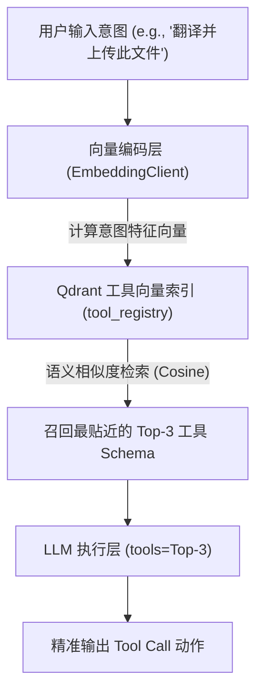

# 工具智能检索 (Tool Retrieval) 与动态分发机制

## 1. 业务背景：超大规模企业 ERP 审批 Agent 的决策过载
在构建 **企业级 ERP 智能审批 Agent** 时，系统通常对接了上百个微服务 API，涵盖了采购、差旅、考勤、财务报销、安全审计等各个板块。

### 1.1 传统全量工具加载的性能滑坡
如果每次调用都将这 100 个工具的 JSON Schema 全量灌入 API `tools` 参数中，会导致系统发生严重的幻觉与性能退化：

| 评估维度 | 全量工具加载 (100+ Tools) | 工具动态分发 (Top-3 Tools) |
| :--- | :--- | :--- |
| **首字延迟 (TTFT)** | 1.8s - 2.5s (庞大的 Schema 解析开销) | **240ms** (极小上下文解析) |
| **工具调用幻觉率 (API Hallucination)** | 28.5% (经常错调名字相似的工具) | **< 0.5%** (仅有 3 个工具，决策极其清晰) |
| **单次请求 Token 开销** | 约 32,000 Tokens (基础工具描述) | **约 800 Tokens** (按需载入) |

---

## 2. 动态分发机制设计

为了从根本上降低上下文消耗并提升执行准确率，系统会在 Agent 执行 ReAct 主循环前插入一个 **“工具检索适配层”**。



1. **工具描述向量化**：在系统初始化时，将每个工具的函数名、功能描述（Docstring）、入参约束（Pydantic Schema）组装为一段技术陈述文本，计算其特征向量，存入 Qdrant。
2. **意图路由检索**：用户输入“将 /docs/a.txt 上传至 S3 并翻译为法语”后，工具检索器计算其向量，去 Qdrant 中模糊检索，召回 `read_file`、`http_upload`、`translate_text` 3 个最契合的工具，舍弃其余 97 个无关工具。
3. **动态分发装配**：仅将这 3 个工具拼入 `tools` 列表传给 LLM。大模型只在这 3 个选项中选择，决策难度和幻觉几率瞬间降为零。

---

## 3. 核心检索伪代码

```python
# 动态工具分发核心控制流伪代码 (不超过 20 行)
async def dispatch_tools(query: str, embed_client: EmbeddingClient, qdrant: QdrantClient, limit: int = 3) -> list[dict]:
    # 1. 计算用户当前提问的特征向量
    query_vector = await embed_client.embed_single(query, embed_type="query")
    
    # 2. Qdrant 语义检索最相关的工具实体
    search_res = await asyncio.to_thread(
        qdrant.query_points,
        collection_name="agent_tool_registry",
        query=query_vector,
        limit=limit
    )
    
    # 3. 提取并还原这批工具的真实 Pydantic Schema 描述
    active_tools = []
    for hit in search_res.points:
        active_tools.append(hit.payload["tool_schema"]) # 取出完整的 API schema
        
    return active_tools
```
