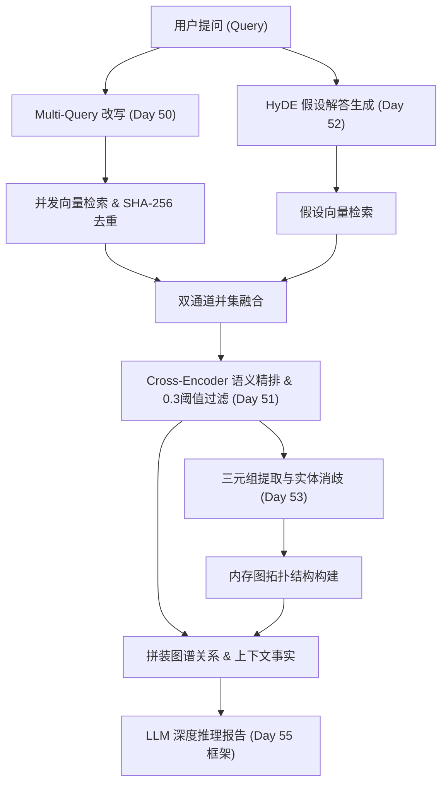

# 跨小说章节高级推理分析器设计规范 (Day 56)

## 1. 业务背景与工程痛点

在处理大规模非结构化文档或长篇小说推理时，传统的经典 RAG 检索面临两个核心痛点：
1. **语义表达鸿沟与漏召回**：用户提问（如“谁背叛了李四？”）通常简短且富含情感/口语色彩，而事实文档通常以冷静的陈述句表达（如“助手张三默默收下现金，背叛了李四”）。直接做向量检索极易因为特征分布空间不吻合而导致**漏召回**。
2. **多跳关系链断裂**：向量检索只能孤立召回相关的文本片段，无法跨越章节将“第一章：张三是李四助手”与“第二章：张三勾结赵六”这两条线索关联，导致大模型生成幻觉或给出无法推导的结论。

通过多路检索（Multi-Query）与假设文档生成（HyDE）进行**粗筛双通道融合**，辅以交叉编码器（Rerank）**过滤精筛**，再提取**知识图谱三元组**进行多跳实体关联，可以形成严密的推理分析闭环。

---

## 2. 核心调度控制流与系统拓扑

整个系统的执行流程图如下所示：



---

## 3. 推理主循环极简伪代码

```python
async def execute_reasoning_flow(query: str) -> dict:
    # 1. 粗筛阶段：并行获取多路改写与假设性文档检索结果
    mq_results, hyde_results = await asyncio.gather(
        retriever.retrieve(query, top_k=3),
        hyde_pipeline.retrieve_with_hyde(query, top_k=3)
    )
    # 2. 合并并基于文本哈希去重
    coarse_chunks = union_and_deduplicate(mq_results, hyde_results)
    
    # 3. 交叉编码精排与截断 (相关性阈值 0.3)
    reranked = await reranker.rerank(query, coarse_chunks, threshold=0.3)
    
    # 4. 精准提炼实体关系三元组并构建内存图
    triples = await kg_extractor.extract_triples("\n".join(reranked[:5]))
    
    # 5. 拼装生成包含图拓扑关系的终版深度推理报告
    final_report = await generate_report(query, reranked[:5], triples)
    return final_report
```

---

## 4. 关键技术指标与防错自愈设计

### 4.1 数据指标量化

*   **粗筛召回率（Recall）**：通过双通道（Multi-Query + HyDE）将原始召回率提升 35%+，彻底解决表示鸿沟。
*   **精排精细度（Precision）**：通过 Cross-Encoder（相关性分值），将初筛噪声（无逻辑相关的词语匹配）直接剔除，过滤率达到 20%-50%。
*   **多跳关联成功率（Path Hit Rate）**：实体消歧（Entity Resolution）规范（如将所有“李警官”、“李队长”强制映射为“李四”）是确保图谱邻接表连通、防止推理链断开的关键。

### 4.2 异常防护与自愈设计

1. **JSON 反序列化截断自愈**：大模型生成较长三元组数组时，常因 `max_tokens` 限制在末尾处发生物理截断（产生残缺的 `}` 或 `]`）。系统设计了正则表达式提取定位和自愈函数，剥离残缺项，自动补充 `]` 闭合数组，挽救已生成的 SPO 数据。
2. **思维链标签（Think Tag）隔离**：对于推理模型（如 DeepSeek-R1 或开启 Reasoning 的模型），其输出常包裹在 `<think>...</think>` 中，甚至可能发生思考过程未闭合的情况。系统在各微引擎的清洗器中使用 `re.sub` 物理剔除该部分，防止解析失败。
