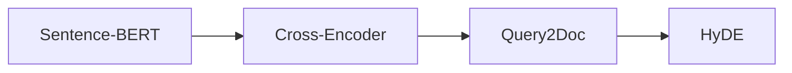
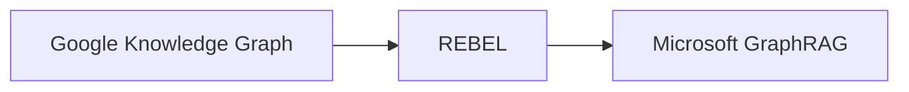
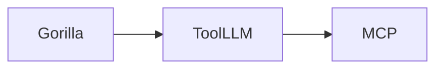
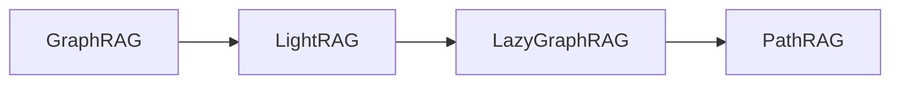
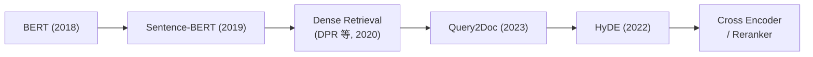
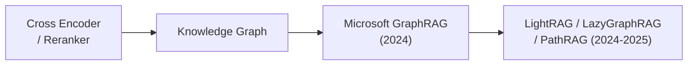
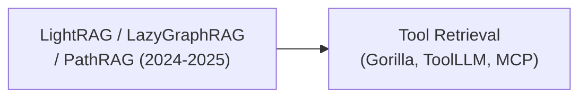

# 📚 Week 8 推荐论文与技术报告清单

> [!NOTE]
> 本文档整理了 **Week 8（Day 50 ~ Day 55）** 讲解过程中涉及的 **10+ 篇值得重点阅读的论文/技术报告**。这些文献构成了现代高级检索（Advanced Retrieval）、图检索增强生成（GraphRAG）以及工具检索（Tool Retrieval）的理论与实践基石。

---

## 📋 论文梯队与推荐指数

### 🌟 第一梯队（⭐⭐⭐⭐⭐ 必读）
*这几篇构成了现代 RAG、GraphRAG 和 Tool Retrieval 的理论基础，建议完整阅读。*

| 论文/技术报告 | 发表年份 | 推荐指数 | 核心价值与必读原因 |
| :--- | :--- | :--- | :--- |
| [Query2Doc: Query Expansion with Large Language Models](#query2doc) | 2023 | ⭐⭐⭐⭐⭐ | Query Rewrite、Multi-Query 的理论基础，Day50 的核心论文。 |
| [HyDE: Precise Zero-Shot Dense Retrieval without Relevance Labels](#hyde) | 2022 | ⭐⭐⭐⭐⭐ | HyDE 的提出者，Day52 的核心论文。 |
| [From Local to Global: A GraphRAG Approach to Query-Focused Summarization](#from-local-to-global) | 2024 | ⭐⭐⭐⭐⭐ | 微软 GraphRAG 奠基论文，Week8 最重要的一篇。 |
| [The Google Knowledge Graph: Things, Not Strings](#google-knowledge-graph) | 2012 | ⭐⭐⭐⭐⭐ | 理解 Knowledge Graph 思想的起点。 |

---

### 🌟 第二梯队（⭐⭐⭐⭐ 非常推荐）
*这些论文更多关注图构建（Graph Construction）、重排序（Rerank）和工具使用（Tool Use）。*

| 论文/技术报告 | 发表年份 | 推荐指数 | 对应课程 / 核心内容 |
| :--- | :--- | :--- | :--- |
| [Sentence-BERT: Sentence Embeddings using Siamese BERT-Networks](#sentence-bert) | 2019 | ⭐⭐⭐⭐ | Dense Retrieval 与 Bi-Encoder 的基础，Day51。 |
| [Cross-Encoders for Sentence Pair Scoring](#cross-encoders) | 2019~2020 | ⭐⭐⭐⭐ | Cross Encoder / Reranker 理论基础，Day51。 |
| [REBEL: Relation Extraction By End-to-end Language Generation](#rebel) | 2021 | ⭐⭐⭐⭐ | LLM 三元组抽取的重要工作，Day53。 |
| [Gorilla: Large Language Model Connected with Massive APIs](#gorilla) | 2023 | ⭐⭐⭐⭐ | Tool Retrieval、API Selection 的经典论文，Day55。 |
| [ToolLLM: Facilitating Large Language Models to Master 16000+ APIs](#toolllm) | 2023 | ⭐⭐⭐⭐ | Tool Use 与 Tool Planning 的代表工作，Day55。 |

---

### 🌟 第三梯队（⭐⭐⭐ 前沿扩展）
*这些属于近两年的 GraphRAG 演进与优化方向。*

| 论文/技术报告 | 发表年份 | 推荐指数 | 作用与演进方向 |
| :--- | :--- | :--- | :--- |
| [LightRAG](#lightrag) | 2024 | ⭐⭐⭐ | GraphRAG 的轻量化实现。 |
| [LazyGraphRAG](#lazygraphrag) | 2025 | ⭐⭐⭐ | Query 驱动的动态图构建。 |
| [PathRAG](#pathrag) | 2025 | ⭐⭐⭐ | Graph Path 推理，提高推理可解释性。 |

---

### 🌟 技术规范（建议阅读）
*这一项严格来说不是学术论文，而是工业界协作的协议规范。*

| 名称 | 发表年份 | 为什么值得看 |
| :--- | :--- | :--- |
| [Model Context Protocol (MCP) Specification](#mcp) | 2024 | 理解未来 Tool Registry、Tool Retrieval、Agent Tool 标准化的基础。 |

---

## 🔍 论文核心主题与摘要 (Themes & Summaries)

以下为每篇文献的检索/学习核心主题与学术精简摘要：

### <a id="query2doc"></a>Query2Doc: Query Expansion with Large Language Models
* **论文主题**：基于大语言模型的生成式查询扩展（Query Expansion）机制。
* **核心摘要 (Summary)**：
  传统检索系统由于用户输入的 Query 过于简短且缺乏上下文，容易导致“词表不匹配”（Vocabulary Mismatch）及漏召回痛点。Query2Doc 提出了一种创新的 Query Expansion 框架：通过设计简单的 Few-shot Prompts，引导大模型先根据原始 Query 生成一段“假设性的相关文档（Passage）”，然后将原始 Query 与该模拟生成的 Passage 进行拼接合并，以此来极大丰富查询向量的语义表达，再进入向量库进行检索。实验表明，该方法显著提升了密集检索（Dense Retrieval）和稀疏检索（BM25）的召回率上限，为高级 RAG 中 Multi-Query / Query Rewrite 提供了理论基础。

### <a id="hyde"></a>HyDE: Precise Zero-Shot Dense Retrieval without Relevance Labels
* **论文主题**：无监督/零样本的假设性文档嵌入检索（Hypothetical Document Embeddings）。
* **核心摘要 (Summary)**：
  传统的稠密检索依赖于 Question-to-Passage 的不对称语义对齐，但在无相关性标注数据时，问题与答案在向量空间中的分布差异会导致匹配度骤降。HyDE（假设性文档嵌入）反其道而行之：它首先利用大模型针对用户 Query 生成一篇“假设性文档”（尽管该文档可能包含幻觉或部分错误，但在语义和格式上与正确答案极为接近），然后利用 Encoder 将该假设文档转化为 Embedding，用此向量去库里搜索真实文档。由于实现了 Passage-to-Passage（文档对文档）的对称语义匹配，该算法在零样本稠密检索上表现出极其强大的泛化与召回能力。

### <a id="from-local-to-global"></a>From Local to Global: A GraphRAG Approach to Query-Focused Summarization
* **论文主题**：基于知识图谱社区检测的全局性查询检索增强生成。
* **核心摘要 (Summary)**：
  微软提出的 GraphRAG 框架，旨在解决传统 RAG 无法处理“全局总结性问题”（如：分析整本小说的主题、识别多文档中的核心风险）的缺陷。该方法在数据准备阶段利用 LLM 自动提取文档中的实体与关系，构建全局知识图谱，并使用莱顿算法（Leiden）将图划分为多层级的社区（Communities），然后并发地为每个社区生成摘要报告。在查询阶段，它支持两种模式：**Local Search**（结合实体邻居节点进行微观局部推理）和 **Global Search**（自底向上聚合高层级的社区报告进行宏观全局总结）。这开辟了 RAG 在全局与局部多粒度推理的新范式。

### <a id="google-knowledge-graph"></a>The Google Knowledge Graph: Things, Not Strings
* **论文主题**：谷歌知识图谱的提出与实体建模理念。
* **核心摘要 (Summary)**：
  这是谷歌在 2012 年发布的关于“知识图谱（Knowledge Graph）”概念的开山技术宣言。其核心思想是让搜索引擎理解“Things, Not Strings”（是现实世界的具体实体和关系，而非单纯的字符匹配）。通过将人、地点、事物及其相互关联连接在一个庞大的语义网络中，使搜索引擎具备对真实世界的认知能力。该思想是现代一切图数据库建模（Property Graph）以及 GraphRAG 知识网络结构和三元组建模的起点。

### <a id="sentence-bert"></a>Sentence-BERT: Sentence Embeddings using Siamese BERT-Networks
* **论文主题**：基于孪生/三元组网络架构的高效句子语义表示。
* **核心摘要 (Summary)**：
  传统的 BERT 模型若要计算两个句子的相似度，必须将它们拼接共同输入网络中（Cross-Encoder 范式），其时间复杂度为 $O(N^2)$，在需要检索成千上万个句子时完全不具可行性。SBERT（Sentence-BERT）修改了 BERT 的微调结构，采用孪生网络（Siamese Network）分别将两个句子映射为固定维度的向量表示，在最后计算余弦相似度或进行简单汇聚（Bi-Encoder 范式）。这种方式可以在毫秒内完成数十万句子的相似度比对，奠定了现代 Dense Retrieval（稠密检索）与 Embedding 模型的基础。

### <a id="cross-encoders"></a>Cross-Encoders for Sentence Pair Scoring (SBERT 系列工作)
* **论文主题**：基于交叉编码器的句子对打分与高精度重排序。
* **核心摘要 (Summary)**：
  与 SBERT（Bi-Encoder）将句子分别编码不同，Cross-Encoder 在编码阶段就将 Query 和 Document 通过拼接一次性输入到同一个 Transformer 架构中，使 Query 中每个 Token 都可以与 Document 中的每个 Token 进行全局 Self-Attention 交互。虽然这会带来巨大的计算开销，不适用于初筛，但其捕获微观语义交互的能力使得相似度打分极其精准。本研究奠定了现代 RAG 中“Bi-Encoder 粗筛（Top-100）+ Cross-Encoder 重排序（Rerank, Top-5）”的两阶段检索架构。

### <a id="rebel"></a>REBEL: Relation Extraction By End-to-end Language Generation
* **论文主题**：基于端到端语言生成的关系三元组提取模型。
* **核心摘要 (Summary)**：
  传统的关系提取模型通常采用“分步式”（即先识别实体，再进行分类器关系判断），这会导致误差链累积。REBEL 创新性地将关系提取任务转换为一个“序列生成（Sequence-to-Sequence）”任务。它使用自回归的预训练 BART 模型，直接生成包含主-谓-宾三元组以及关系的结构化文本标记。该技术展示了如何通过语言生成模型实现高效的端到端关系与实体提取，是现代 GraphRAG 中自动化三元组建模、LLM 实体抽取的核心演进机制之一。

### <a id="gorilla"></a>Gorilla: Large Language Model Connected with Massive APIs
* **论文主题**：专为高精度 API 调用与检索微调的大模型。
* **核心摘要 (Summary)**：
  在 Agent 使用工具时，大模型经常会由于对 API 说明理解不足而调用错误的参数，或者产生“幻觉 API”。Gorilla 通过在海量 API 库（包括 HuggingFace、TorchHub、TensorFlowHub 等）的 JSON 规范上微调 LLaMA，使大模型具备了生成极其精准的工具调用（Tool Calls）的能力。同时，它引入了检索感知（Retrieval-Aware）训练，使得 Gorilla 可以与专门的 API 检索器进行闭环配合，支持根据不断更新的 API 文档库动态调用最合适的工具，是 Agent Tool Retrieval 的代表作。

### <a id="toolllm"></a>ToolLLM: Facilitating Large Language Models to Master 16000+ APIs
* **论文主题**：超大规模 API 工具调用与规划的开源框架。
* **核心摘要 (Summary)**：
  为了让大模型在现实世界中真正充当通用 Agent，必须支持数万个甚至更多 API 的检索与协作。ToolLLM 建立了一个包含 16000+ 真实 API 的生态集 ToolBench。该论文提出了两项核心技术：**Tool Retriever**（通过语义召回用户指令匹配的 API）和 **ToolEval**（基于 LLM 的 API 调用评估）。此外，它提出了 **DFSDT (Depth-First Search Decision Tree)** 决策树算法，使 LLM 可以通过类似于树搜索的机制进行多工具组合规划、试错、回溯与容错，大幅提升了 Agent 在复杂任务下的规划成功率。

### <a id="lightrag"></a>LightRAG: Quick and Extremely Cheap Retrieval-Augmented Generation
* **论文主题**：轻量级、低计算成本且支持增量更新的 GraphRAG。
* **核心摘要 (Summary)**：
  微软 GraphRAG 虽强，但其预先构建莱顿社区、预生成社区总结的开销极其高昂，难以应用于高动态数据流中。LightRAG 提出了一种“轻量级且快速”的解决方案，将向量表征与图谱结构在同一语义空间进行对齐。它的核心贡献是提出了**双层级检索架构**：Low-Level 负责提取图谱局部微观实体关系，High-Level 负责汇总宏观语义概念。同时，LightRAG 支持轻量化的图谱**增量动态更新**，无需完全重跑索引，极大地减少了现实世界中的索引更新成本和运行开销。

### <a id="lazygraphrag"></a>LazyGraphRAG: Query-Driven Dynamic Graph Construction for Retrieval-Augmented Generation
* **论文主题**：查询驱动的低延迟、动态延迟建图的 GraphRAG。
* **核心摘要 (Summary)**：
  针对传统 GraphRAG 面临的“冷启动”高计算成本难题，微软开发的 LazyGraphRAG 采用了“延迟（Lazy）计算”的设计哲学。它不再做昂贵的全库实体提取、关系建图和社区预摘要总结，而是将 LLM 的深度提炼延后到“查询阶段（Query Time）”。系统会首先在平面向量上进行快速召回，接着沿着召回节点的局部关系邻域进行动态按需深化扩展（Iterative Deepening Search），并且引入了平衡检索精度与消耗的“可调相关性预算”。此设计使建图和索引成本骤降到传统 GraphRAG 的 0.1%，让 GraphRAG 的生产部署落地门槛大幅降低。

### <a id="pathrag"></a>PathRAG: Pruning Graph-based Retrieval Augmented Generation with Relational Paths
* **论文主题**：基于关系路径剪枝与多步推理路径的 GraphRAG。
* **核心摘要 (Summary)**：
  PathRAG 针对目前图检索中召回信息杂乱、无关连通节点造成上下文噪音和 Token 浪费的缺陷，提出了一种基于关系路径（Relational Paths）的新型 RAG 模型。它将文档碎片构建为关系图，并引入了“最大流剪枝算法”，只保留对推理决策最关键的一条或几条“黄金关系路径（Gold Paths）”。之后，它将这些剪枝出的路径直接转换为具备强因果逻辑的“文字推理链条”喂给大模型。这不仅实际减少了 Token 开销，更将复杂多步推理（Multi-hop QA）的准确率与可解释性提升到了新的高度。

### <a id="mcp"></a>Model Context Protocol (MCP) Specification
* **报告主题**：大模型与异构上下文/工具交互的通用接口协议规范。
* **核心摘要 (Summary)**：
  Anthropic 于 2024 年提出的 MCP 是为了解决大模型与各种异构工具、上下文源（如数据库、本地文件、API、外部服务）之间连接割裂的痛点。MCP 类似于开发领域的 LSP（Language Server Protocol），定义了一个统一的双向通信协议：模型（客户端）通过标准的接口去向不同的 MCP 服务器注册、发现、检索和调用 Tools、Resources、Prompts。该协议为现代 Agent 的 Tool Standardization（工具标准化描述）和 Dynamic Tool Retrieval 提供了统一规范。

---

## 🗺️ 学习路线与阅读顺序

为了帮助你更好地消化 Week 8 的理论体系，建议按照以下**知识依赖关系**而非课程顺序进行阅读：

### 1. 第一阶段：理解检索演进 (Retrieval)



*   **逻辑链路**：
    ```mermaid
    graph LR
        DR["Dense Retrieval"] --> MQ["Multi Query"] --> HY["HyDE"] --> RR["Rerank"]
    ```
    *这四篇共同构成现代 RAG 的高级检索与精排重拟理论基础。*

### 2. 第二阶段：理解知识图谱 (Knowledge Graph)



*   **逻辑链路**：
    ```mermaid
    graph LR
        KG["Knowledge Graph"] --> EE["Entity Extraction"] --> GR["GraphRAG"]
    ```

### 3. 第三阶段：理解 Agent 工具调用 (Agent)



*   **逻辑链路**：
    ```mermaid
    graph LR
        TS["Tool Selection"] --> TP["Tool Planning"] --> TS2["Tool Standardization"]
    ```

### 4. 第四阶段：理解最新发展 (2024-2025)


*这部分主要帮助你追踪 GraphRAG 领域的前沿演进方向。*

---

## 🎯 精华极简版（时间有限必读 5 篇）

如果时间有限，请优先阅读以下五篇最核心的研究：

| 排名 | 论文/技术报告 | 核心推荐原因 |
| :--- | :--- | :--- |
| ① | **From Local to Global: A GraphRAG Approach to Query-Focused Summarization** | 整个 Week 8 的核心，奠定了 GraphRAG 的研究热潮。 |
| ② | **HyDE: Precise Zero-Shot Dense Retrieval without Relevance Labels** | 突破了传统 Question-Answer 检索的瓶颈，已成为高级 RAG 的标准技术。 |
| ③ | **Query2Doc: Query Expansion with Large Language Models** | 奠定了 Multi-Query 和 Query Rewrite 的理论与实践基础。 |
| ④ | **Sentence-BERT: Sentence Embeddings using Siamese BERT-Networks** | 奠定了双塔（Bi-Encoder）稠密检索与 Embedding 匹配的核心范式。 |
| ⑤ | **Gorilla: Large Language Model Connected with Massive APIs** | Tool Retrieval 与 Agent 工具检索的开山/代表性工作。 |

---

## 💡 导师补充建议：技术演进主线

在阅读上述文献时，建议你将它们串联成一条**技术继承与演进路线**。为保证页面排版美观并适配各种屏幕，我们将其按不同技术阶段分段并换行展示：

#### 📍 第一阶段：检索技术演化 (Retrieval Evolution)


⬇️ *承接：重排序之后，引入图谱关联以支撑全局概览推理*

#### 📍 第二阶段：图谱建模与 GraphRAG 演进 (GraphRAG Paradigm)


⬇️ *承接：从检索、图推理，进一步扩展到大规模 Agent 工具的高效分发*

#### 📍 第三阶段：工具智能检索与规范化 (Agent Tool Dispatching)


> [!TIP]
> 沿着这条路线，你可以清晰地观察到技术如何从 **“单一语义向量匹配”** 走向 **“生成式查询扩展”**，再到 **“实体关系图谱建模”**，最终融入 **“Agent 动态工具分发系统”**。这是目前工业界高级 Agent 架构设计的核心技术演进路径。
