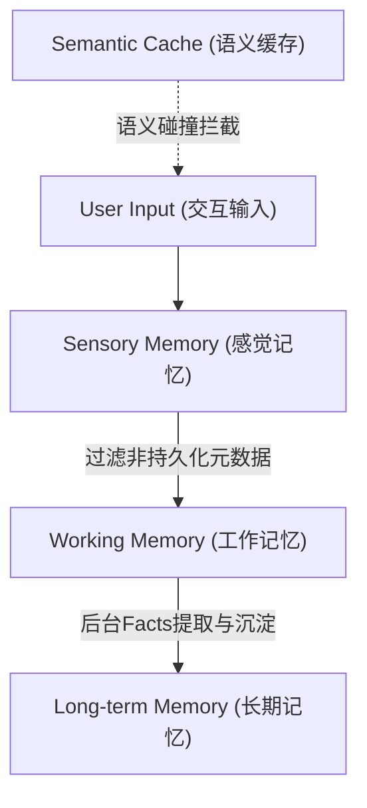

# Day 57: 多层级记忆引擎架构与类型契约设计

## 一、 业务场景与物理限制 (Problem)

在处理高并发、长会话的 Agent 交互时，系统面临着两个核心瓶颈：
1. **Context Window 物理上限与膨胀开销**：LLM 的上下文窗口是昂贵的系统资源。如果无差别地将历史会话中的所有瞬时元数据（例如 API 延迟、Token 消耗、中间步骤日志）塞入 Context，不仅会导致严重的网络 IO 延迟（TTFT 增加），还会使推理费用呈指数级上升。
2. **状态瞬时丢失（State Loss）**：无分层记忆的 Agent 缺乏持久化状态机。一旦服务重启或 Session 重构，用户在前序会话中明确表达的**长期实体偏好**（如技术栈选型、安全凭证要求）将瞬间化为乌有，严重破坏个性化体验。

为了解决上述问题，系统必须建立与人类记忆模型相似的**分层记忆架构**，将瞬时、短期与长期状态在逻辑与物理上进行彻底隔离。

---

## 二、 分层记忆系统架构 (Architecture)

### 1. 记忆层级划分
现代记忆工程（Memory Engineering）将 Agent 状态信息流转划分为三个清晰的生命周期层次：



*   **感觉记忆 (Sensory Memory)**：在单次 API 请求响应周期内存在的临时上下文（如推理耗时、中间状态标记），完成交互后即被物理擦除，无持久化与向量化价值。
*   **工作/短期记忆 (Working Memory)**：在当前会话（Session）生命周期内保持活跃的消息堆栈。其直接作为 LLM 的提示词上下文（Context Window），并基于 Token 滑动窗口进行动态管理。
*   **长期记忆 (Long-term Memory)**：跨越会话周期的结构化 Facts 与实体偏好。它存储于持久化数据库（关系型或向量型）中，支持通过用户 ID 隔离以及语义检索召回。
*   **语义缓存 (Semantic Cache)**：前置过滤层，基于向量相似度缓存历史 LLM 推理响应。若当前 Query 命中缓存，则直接短路返回，避免重复推理。

---

## 三、 内存状态契约设计 (Protocol Design)

在 Python 中，为了保障多层级记忆组件的高度可插拔性与类型安全，我们使用 `typing.Protocol` 声明类型契约，解耦具体的存储引擎实现。

### 1. 核心状态契约伪代码 (<= 20 行)
```python
from typing import Protocol, Dict, Any, List, Optional

class ShortTermMemory(Protocol):
    """短期工作记忆契约：定义内存消息堆栈的读写规范"""
    def append(self, message: Dict[str, Any]) -> None: ...
    def get_context(self) -> List[Dict[str, Any]]: ...
    def clear(self) -> None: ...

class LongTermMemory(Protocol):
    """长期记忆契约：定义实体事实的 CRUD 与向量召回规范"""
    async def save_fact(self, user_id: str, key: str, value: Any) -> bool: ...
    async def recall_facts(self, user_id: str, query: str, limit: int = 5) -> List[Dict[str, Any]]: ...

class SemanticCache(Protocol):
    """语义缓存契约：定义基于相似度检测的缓存读写规范"""
    async def get(self, query: str) -> Optional[str]: ...
    async def set(self, query: str, response: str) -> None: ...
```

---

## 四、 前沿学术论文演进 (Latest Research)

### 1. MemGPT (2023)
*   **核心思想**：借鉴计算机操作系统的虚拟内存管理（Virtual Memory Management），将 LLM Context Window 视为 **L1/L2 缓存 (Main Memory)**，将外部向量库/关系数据库视为 **磁盘 (Disk)**。
*   **运作机制**：LLM 拥有特定的内存操作工具（如 `core_memory_append`、`core_memory_replace`），当感知到工作内存写满时，由模型自己决策将不活跃的信息 Page Out（换出）到磁盘归档，或在需要时 Page In（加载）。

### 2. MemoryOS / LongMem (2025-2026)
*   **核心思想**：实现高时效、流式的分层记忆管理。将人类在大脑海马体与大脑皮层之间的记忆巩固机制（Memory Consolidation）工程化，设计出具有动态权重衰减与多级存储索引的持久 Agent 系统。
