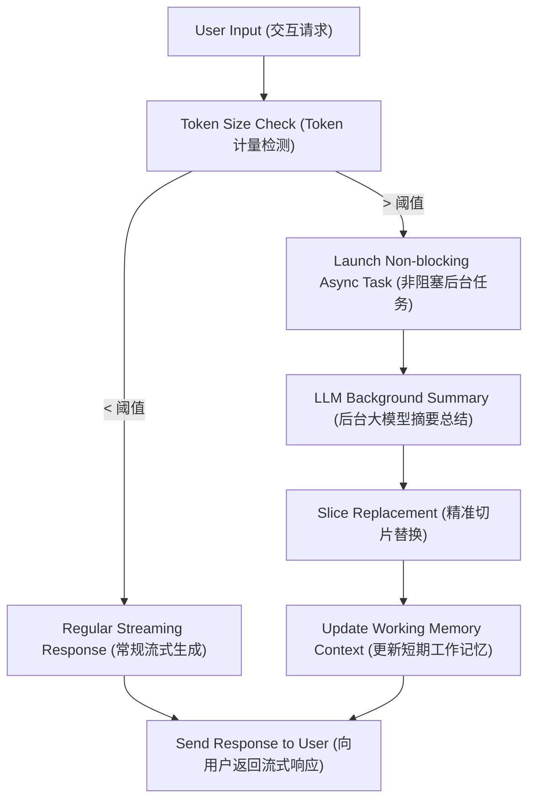

# Day 58: 短期记忆管理：基于滑动窗口与 Token 计量的异步摘要压缩

## 一、 业务场景与物理限制 (Problem)

工作记忆（Working Memory）直接映射为大模型的 Prompt 上下文（Context Window）。在长对话场景下，系统面临着两个核心挑战：
1. **时延与资费呈线性膨胀**：随着交互轮数增加，每次请求包含的 Token 数量线性飙升。这不仅增加了 API 费率，还会导致首字延迟（TTFT）显著退化。
2. **上下文爆窗与信息丢弃冲突**：若无限制保留历史，会超出大模型的最大物理窗口；若采用滑动窗口粗暴丢弃历史，又会导致最初的系统指令（System Prompt）和用户关键偏好（如“我的主开发语言是 Go”）彻底遗失。
3. **同步归约的阻塞时延**：若在主线程检测 Token 溢出并同步请求大模型进行摘要总结，会导致当前会话卡顿数秒，严重降低用户交互体验。

为了解决此冲突，必须在后台引入**非阻塞的异步摘要压缩管道（Asynchronous Summarization）**，并配合**精准切片定位**解决并发时序竞争。

---

## 二、 异步滑窗归约架构 (Architecture)

短期工作记忆的异步滑窗归约流程如下：



---

## 三、 异步归约伪代码 (<= 20 行)

在 Python 中，通过 `asyncio.create_task` 启动非阻塞协程任务，实现后台异步总结与精准上下文拼接：

```python
import asyncio
from typing import List, Dict, Any

class BufferMemoryManager:
    def __init__(self, limit: int = 2000):
        self.messages: List[Dict[str, Any]] = []
        self.limit = limit
        self.summary = ""

    def append_and_check(self, message: Dict[str, Any]):
        self.messages.append(message)
        # 计算当前消息队列的总 Token 数量
        total_tokens = sum(len(msg["content"]) for msg in self.messages)
        if total_tokens > self.limit:
            # 开启非阻塞后台异步归约任务，防止阻塞主交互线程
            asyncio.create_task(self._async_summarize())

    async self._async_summarize(self):
        # 步骤 1: 仅对最老的消息段执行总结，最新消息切片保留
        # 步骤 2: 将所得 Summary 写入 self.summary，并在下一轮拼接中置于 System Header
        ...
```

---

## 四、 核心Gotchas与时序一致性防护 (Gotchas)

1. **时序竞争（Race Condition）与脏覆盖**：
   * **隐患**：当后台总结任务（耗时 2~3 秒）正在运行时，用户又发送了 2 条新消息。如果在总结任务结束时，代码粗暴地用 `self.messages = [Summary] + [NewMessage]` 覆盖全部列表，会把**总结运行期间用户新发的最新消息**物理抹除。
   * **防御方案**：总结时只锁定并截取**发起总结那一刻之前的消息切片**（如前 $N$ 条），在后台任务结束替换时，仅对前 $N$ 条执行替换，保留其余在后台总结期间追加的最新消息。

2. **未处理的后台任务异常 (Unhandled Exception)**：
   * **隐患**：`asyncio.create_task` 启动的协程如果发生网络超时或模型 API 崩溃，异常如果不主动捕获处理，只会在 Event Loop 中报警告，导致后续滑窗压缩功能永久失效。
   * **防御方案**：在协程内部使用 `try...except` 进行异常链传递与状态重设，或为 Task 挂载 `add_done_callback` 执行状态监控与故障降级。
