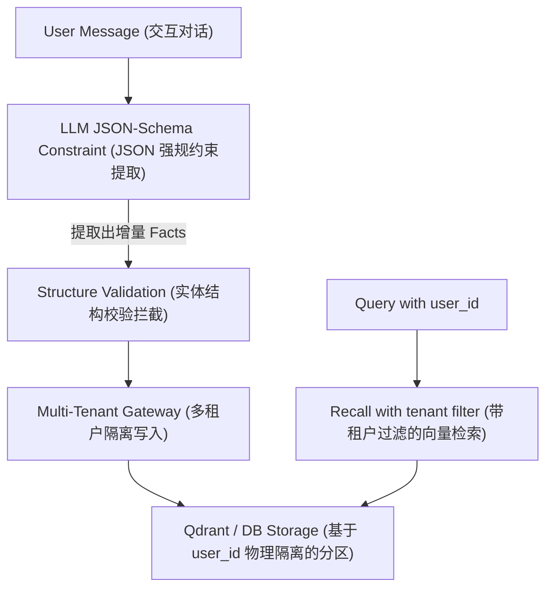

# Day 59: 长期记忆系统：实体级原子 Facts 增量提取与租户隔离

## 一、 业务场景与物理限制 (Problem)

在企业级多用户 Agent 生产环境中，直接将“会话消息列表”或“全局 Summary”作为长期记忆存储会遭遇三大严重缺陷：
1. **记忆稀释与漂移 (Summary Drift)**：随着会话的拉长，全局总结会导致细粒度的实体偏好（例如“用户使用的是 Python 3.11 且需要开启 strict 类型检查”）在多次抽象中被稀释并最终被抹除。
2. **多租户越权读取与数据污染 (Tenant Cross-contamination)**：多用户并发交互时，若缺乏物理隔离与租户校验逻辑，极易导致 A 用户的历史隐私偏好（如安全 Key、个人隐私）被 B 用户的 Query 意外召回，造成重大的数据安全事故。
3. **计算与存储的 Delta 放大**：每次更新会话都要全量重新总结和重写存储，带来了极高昂的大模型 Token 资费与数据库写入开销。

因此，长期记忆必须由全局总结转向**颗粒化、增量式的原子事实提取（Entity-centric Facts Extraction）**，并在数据访问层（DAO）执行严格的**多租户过滤逻辑**。

---

## 二、 实体级长期记忆架构 (Architecture)

实体级 Facts 提取与过滤的 Pipeline 数据流向如下：



---

## 三、 原子事实提取伪代码 (<= 20 行)

在 Python 中，通过 Pydantic 规范 Facts 的数据模型，并让大模型以强类型 JSON 格式输出 Facts：

```python
from pydantic import BaseModel, Field
from typing import List

class FactItem(BaseModel):
    key: str = Field(description="事实的主体键名，如 user_prefer_language")
    value: str = Field(description="事实的具体值描述，如 Python")

class ExtractedFacts(BaseModel):
    facts: List[FactItem]

# 在 Pipeline 中调用大模型强规输出：
# client.request_llm(..., response_format=ExtractedFacts)
# 并在数据存储层基于 user_id 建立分区物理隔离：
# db.insert(user_id=current_user, data=ExtractedFacts.model_dump())
```

---

## 四、 前沿学术论文与工业界演进 (Latest Research)

### 1. Generative Agents (2023)
*   **奠基贡献**：首次在沙盒环境中为 Agent 引入长期人物偏好的检索模型。它通过“相关性、时效性、重要性”三要素对所有记忆片段打分，打分后召回最相关的个人历史，使 Agent 表现出连贯的人格。

### 2. Mem0 (2024-2025)
*   **前沿突破**：Mem0 开创了**“去 Summary 化，聚焦原子 Fact”**的增量式长效记忆机制。
*   它利用 LLM 实时将新对话流抽离为一个个微观的三元组/偏好，并将这些 Fact 写入向量存储。在后续会话中，新提取的 Fact 仅会对已有冲突的 Fact 进行覆盖（如 `likes Java` $\to$ `likes Python`），而非总结全部，大幅降低了计算成本，被现代工业级千人千面 Agent 所广泛采纳。
